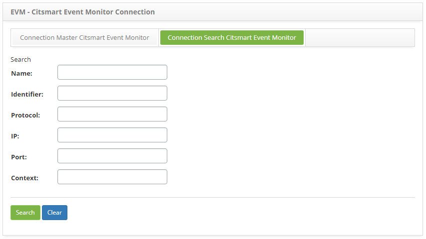
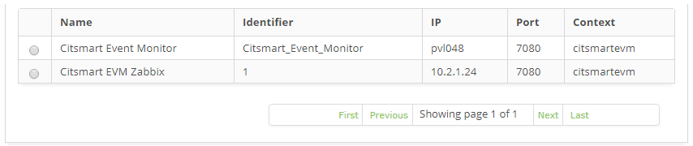
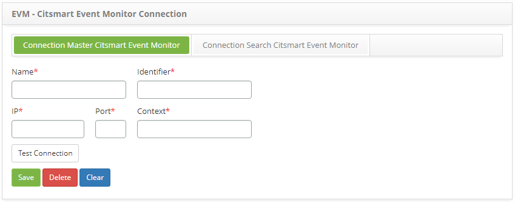

title: CITSmart Event Monitor connection
Description: The goal of this feature is to register all properties related to the CITSmart Event Monitor connection, according to the IP and port where the CITSmart Event Monitor JBoss is installed.

# CITSmart Event Monitor connection

The goal of this feature is to register all properties related to the CITSmart
Event Monitor connection, according to the IP and port where the CITSmart Event
Monitor JBoss is installed.

How to access
-------------

1.  Access the **Event Monitor Connections** feature navigating through the main
    menu **Process Management > Event Management > Event Monitor
    Connections**.

Preconditions
-------------

1.  Not applicable.

Filters
-------

1.  The following filters enable the user to restrict the participation of items
    in the standard feature listing, making it easier to locate the desired
    items as shown in the figure below:

   -   Name;

   -   Identifier;

   -   Protocol;

   -   IP;

   -   Port;

   -   Context.

2.  On the **Event Monitor Connections** screen, click on the **Connection
    Search CITSmart Event Monitor** tab, as shown bellow:

   
   
   **Figure 1 - CITSmart event monitor connection search screen**

3.  Perform a event monitor connection search:

   -   Insert the filters (name, identifier, protocolo, IP address, port and/or
    application context) as needed and click on the *Search*button. Afterwards,
    the CITSmart Event Monitor Connection entry will be displayed according to
    the description provided;

   -   To list all connections, just click directly on the *Search* button, if
    needed.

Items list
----------

1.  The following cadastral fields are available to the user to make it easier
    to identify the desired items in the default listing of the
    functionality: **Name**, **Identifier**, **IP**, **Port** and **Context**.

   
   
   **Figure 2 - CITSmart event monitor connection items list screen**

2.  After searching, select the intended entry. Afterwards, they will be
    redirected to the registry screen displaying the content belonging to the
    selected entry;

3.  To edit a connection entry, just modify the information on the intended
    fields and click on the *Save* button to confirm the changes to the
    database, at which date, time and user will be stored automatically for a
    future audit.

Filling in the registration fields
----------------------------------

1.  Access the feature, afterwards, the risk category entry screen will be
    displayed, as illustrated on the image below:

   
   
   **Figure 3 - CITSmart event monitor connections entry screen**

2.  On the screen, the field are self explanatory. Just place the cursor over
    the intended field and a brief description will be displayed. Therefore,
    only the main information to perform a connection entry will be displayed;

3.  Insert the connection data;

4.  The Identifier fileld corresponds to the “**idCitsmartEventMonitor**”
    property of the properties file “**evm_config.properties**”;

5.  After inserting the connection data, click on the *Test Connection* button
    to test the connection to the CITSmart Event Monitor;

6.  Click on the *Save* the button to confirm the entry, at which date, time and
    user will automatically be stored for a future audit.

!!! tip "About"

    <b>Product/Version:</b> CITSmart | 8.00 &nbsp;&nbsp;
    <b>Updated:</b>09/03/2019 – Anna Martins

