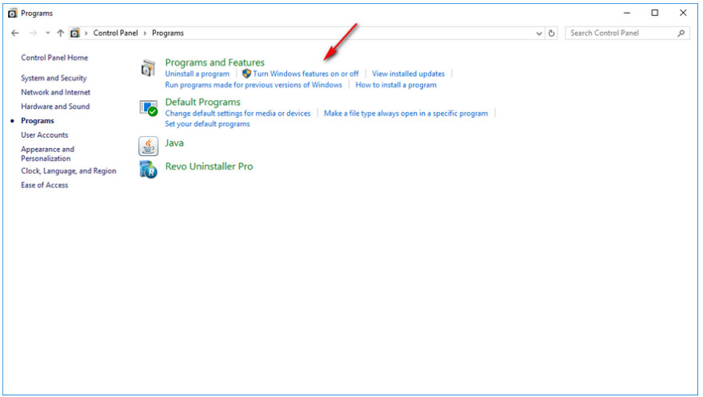
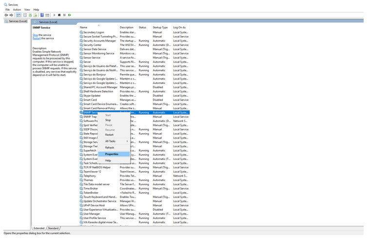
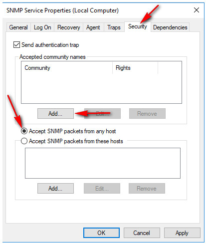
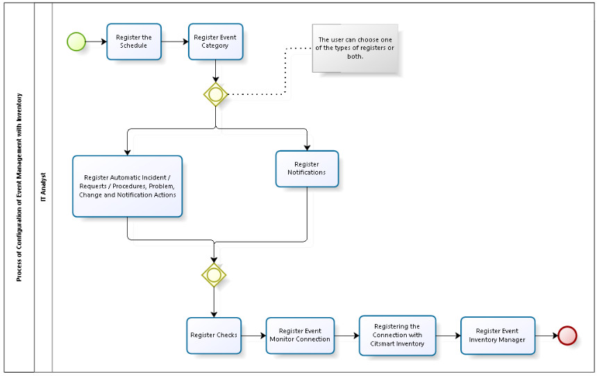
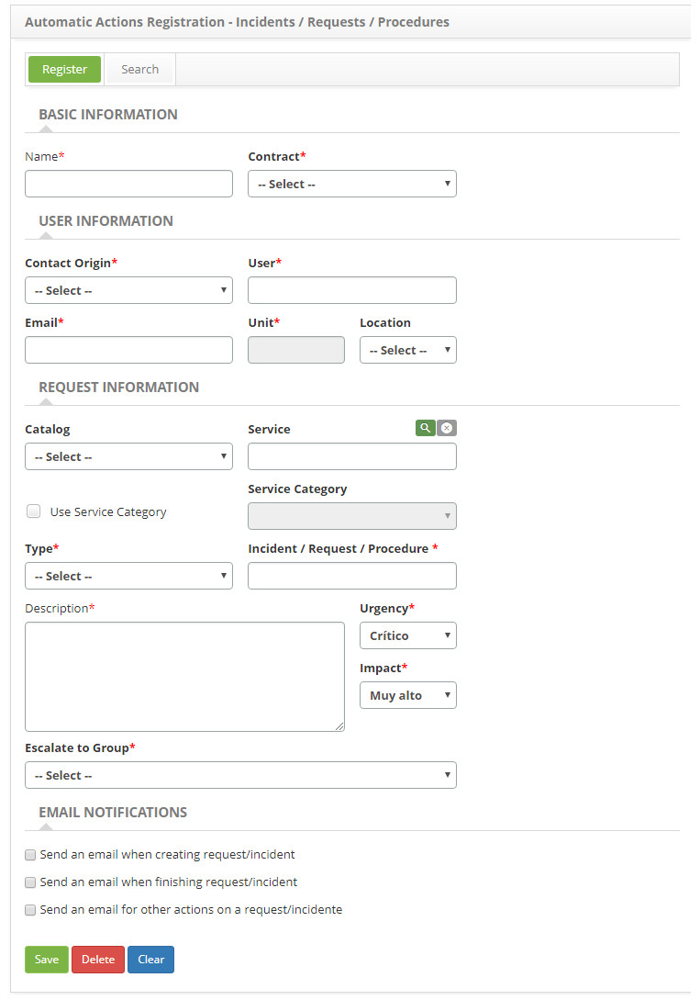
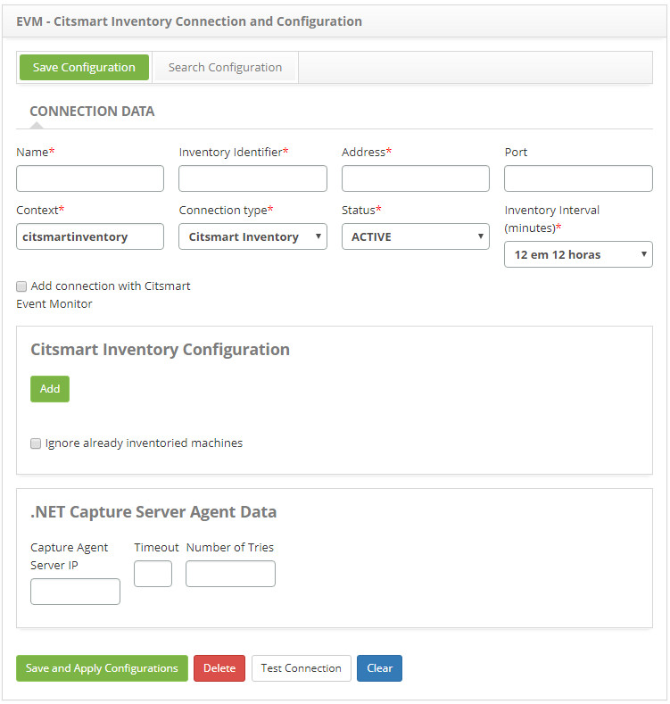

title: EVM component installation guide
Description: This document is intended to provide guidance on installing and configuring the EVM component.

# EVM component installation guide

This document is intended to provide guidance on installing and configuring the EVM component.

According to ITIL, events is a state change that has significance for the
management of a configuration item (IC) or IT service.

Examples of events:

-   A user has logged into the system;

-   A scheduled backup did not occur;

-   The system is being accessed by twice as many users as usual;

-   An unauthorized user has accessed a network location;

-   A system is slower than normal;

-   Excessive connections by mistake to the servicedesk;

-   Any other that has relevance to who is managing the services of you.

Events are typically recognized through notifications created by an IT service,
Configuration Item (CI), or monitoring tool.

The purpose of Event Management is to provide the capability to detect events,
analyze them, and determine appropriate control actions. Event Management is
therefore the basis for monitoring and operational control.

Event Management can be related to other processes, such as Asset Management and
Configuration. Regarding this process, Event Management can help you determine
the asset lifecycle status. For example, an event can be generated to signal
that an asset has been misconfigured, impacting the operation and delivery of
the service. In addition, Event Management can be a rich source of information
for Knowledge Management Systems. For example, performance standards can be
correlated with business activities and used as a basis for future strategic
decisions.

Event management routine
------------------------

Below is the explanatory designing of the Event Management routine:

   
   
   **Figure 1 - Event management routine**

-   **CMDB**: It is a repository of information related to all components of
    CITSmart ITSM. It contains the details of the [configuration (IC)
    items](http://en.wikipedia.org/wiki/Configuration_item) in the IT
    infrastructure.

-   **Citsmart Event Monitor**: Application responsible for capturing the events
    that occur in the IT infrastructure.

-   Citsmart Inventory: Application responsible for performing the asset
    inventory and configuration items on the network and send the obtained data
    to the CITSmart ITSM store in the database.

-   **MongoDB**: Document-oriented database, different from traditional
    databases that follow the relational model. It is [large data
    storage](http://en.wikipedia.org/wiki/Very_large_database)and higher speed.

-   **Nagios**: Network monitoring tool. It can monitor both Hosts and Services,
    alerting when problems occur and also when problems are resolved. Hosts are
    the equipments and the Services are the resources offered by the equipments.

-   **Zabbix**: Monitoring tool for networks, servers and services, designed to
    monitor availability, user experience and quality of services. The Zabbix
    architecture and the flexibility of the modules allow the tool to be used
    for conventional monitoring (on / off), monitoring of application
    performance, user experience analysis and root cause analysis in complex
    environments through the Zabbix server and Rules of correlation.

Operation of event management routine
-------------------------------------

The Event Management routine works as follows:

-   The Citsmart Event Monitor communicates with the monitoring tool (Nagios and
    / or Zabbix) to receive the event information from the network assets and
    send to CITSmart ITSM to trigger the appropriate control actions.

-   Citsmart Inventory collects assets and configuration items from the network
    and communicates with Citsmart Event Monitor to send this information so
    that it can process the rules that have been defined in CITSmart ITSM and
    send event instances, Which are stored in the MongoDB, for the CITSmart ITSM
    to trigger the appropriate actions. In addition, Citsmart Inventory also
    communicates with CITSmart ITSM and passes the captured asset data to the
    registry of configuration items.

!!! note "NOTE"

     The rules used by Citsmart Event Monitor are created by a language called
     EPL (Event Processing Language).

!!! info "IMPORTANT"

     In order for this routine to work perfectly, it is necessary to perform
     all the configuration, correctly, of the inputs of the Event Management
     module in CITSmart ITSM.

Integration of event management module
--------------------------------------

Event Management consists of the following applications:

-   CITSmart ITSM - CMDB and opensource platform of ITSM;

-   Citsmart EVM - Event Management;

-   Citsmart Inventory - Inventory.

!!! info "IMPORTANT"

     Each application must be installed on a separate instance of JBoss.

!!! note "NOTE"

     Instances should be downloaded to CITSMART FTP.

To integrate you must take into account the following points:

-   If you do not have CITSmart Enterprise ITSM installed, in the case of a new
    client, you must install it, and the Citsmart Inventory and Citsmart Event
    Monitor applications.

-   If you already have CITSmart Enterprise ITSM installed, you must update it
    to the latest official version that has Event Management and install the
    Citsmart Inventory and Citsmart Event Monitor applications.

Initial procedures
------------------

CITSMART.NET and SNMP Capture Agent

*CITSMART.NET Capture Agent*: It is a component of the CITSmart solution, which
runs on Windows machines (it is the same component that runs on the Inventory
Collection Server, the difference being that it runs locally with Local System
Account policies - without permissions Access to the network and other
equipment).

*SNMP*: The Simple Network Management Protocol (SNMP) is an application-layer
protocol for typical IP network management that facilitates the exchange of
information between network devices such as cards And computers (switches) and
printers. For SNMP to work in both Windows and Linux environments, you need to
install the components / packages and enable permissions.

The Inventory application captures the data through the SNMP port (161) and / or
the Capture Agent Citsmart.Net (port 7103, developed by Central IT). Initially,
Inventory performs a "ping" command to verify that the machine is active. If you
can perform the command, try to access the SNMP port of the configuration item.
If access to the port is not successful, Inventory tries to access through the
capture agent.

!!! note "NOTE"

    The configurations related to Citsmart Inventory are performed in CITSmart
    ITSM, in the menu ITIL Processes > Event Management > Inventory
    Connections.

Capture Agent Citsmart.Net can be used as a capture "centralizer", to which the
Inventory capture requests for all other machines in a network would be
directed. This is even the most suitable way for networks with a large number of
machines. You can also perform Inventory without the Citsmart.Net Capture Agent.
In this case, it is necessary to configure the "SNMP" service of each machine.
On the other hand, the Capture Agent Citsmart.Net can also be installed
individually on each machine (in this case eliminating the need to configure the
SNMP port of each machine).

If you use Citsmart Inventory to capture events, follow the information about
the CITSMART.NET and SNMP Capture Agent that is contained in the "Inventory
component installation guide" knowledge.

Installing / configuring snmp in the windows environment
--------------------------------------------------------

To install / configure the SNMP service in the Windows environment, proceed as
described below:

1.  Open the Windows features screen **Control Panel > Programs and Features >
    Enable or disable Windows features**;

   
   
   **Figure 2 - Windows resource screen**

2.  Check if the SNMP Protocol feature is active, that is, if it is selected, if
    it is not, select it and click OK to activate the SNMP protocol, as
    indicated in the figure below;

   
   
   **Figure 3 - Windows feature activation screen**

3.  Once this is done, open the Windows services screen to configure SNMP;

   
   
   **Figure 4 - Windows services search**

4.  After opening the Windows services screen, right-click on the SNMP service,
    and then click Properties as shown in the figure below;

   
   
   **Figure 5 - Windows services screen**

5.  The SNMP Service Properties screen will be displayed. Click the Security
    tab, check Accept SNMP packets from any host and click Add to create a new
    community, as indicated in the figure below;

   
   
   **Figure 6 - SNMP service properties screen**

6.  The screen for entering the data for the new community will be displayed.
    Enter the public name for the community and remain with the Read Only option
    for community rights and click Add as indicated in the figure below;

   
   
   **Figure 7 - SNMP service community configuration screen**

7.  Once this is done, the new community will be displayed on the SNMP Service
    Properties screen, as shown in the figure below;

   
   
   **Figure 8 - SNMP service configuration**

8.  To configure the SNMP Service, simply click on the *Ok* button.

Installing / configuring snmp in the linux environment
------------------------------------------------------

To install / configure SNMP in the Linux environment, proceed as described
below:

*Installing SNMP on the CentOS Operating System*

1.  Run the following command to install the net-snmp package:

```sh
yum install -y net-snmp*
```

2.  The following command will back up the original SNMP configuration file:

```sh
cp /etc/snmp/snmpd.conf /etc/snmp/snmpd.conf_original
```

*Configuring the snmpd.conf file*

1.  Edit the file **/etc/snmp/snmpd.conf;**

   There are some basic assumptions when configuring SNMP, they are:

a)  Community configuration

   If this line does not exist you should create it, but if it exists, leave it
   as shown below:

```sh
com2sec notConfigUser  default       public
```

b)  Group setup

   If these lines do not exist you should create them, but if they exist, leave
   them in agreement as shown below:

```sh
group notConfigGroup v1 notConfigUser
```
```sh
group notConfigGroup v2c notConfigUser
```

c)  SNMP tree configuration

   If this line does not exist you should create it, but if it exists, leave it
   as shown below:

```sh
view    systemview           included      .1

```

d)  Group access setup

   If this line does not exist you should create it, but if it exists, leave it
   as shown below:
   
   ```sh
   access notConfigGroup "" any noauth exact systemview none none
   ```

e)  The complete configuration should look similar to the one below:


f)  Restart the SNMP service with the following command:

```sh
/etc/init.d/snmpd restart
```

g)  After restarting SNMP, perform the local test to verify that SNMP is
    running:
    
```sh
snmpwalk -v2c -c public localhost |head
```

h)  The test should return the following result:


Mongodb installation
--------------------

Install MongoDB via the link: <https://www.mongodb.org/>.

For more details on installing and configuring services, check the documentation
through the link:

<https://docs.mongodb.com/manual/administration/install-community/>.

### Application configuration

To perform the integration of the Event Management Module, proceed as follows:

1.  Download JBoss for ITSM Community 6.1.0+ and ITSM Enterprise 7.0.0+:
    jboss-as-7.1.2.Final - CITSmart ITSM;

2.  Download JBoss for Event Monitor: jboss-as-7.1.2.Final - EVM;

3.  Download JBoss for Inventory: jboss-as-7.1.2.Final - Inventory;

4.  Copy the latest versions of Event Management applications (.war extension
    files) into the deployments folder of your JBoss instances;

5.  Change the standalone-full.xml file for the respective instances of Jboss:

The JBoss configuration files are located in the configuration folder of each
JBoss instance, available from CITSMART.

**standalone-full.xml (CITSmart ITSM)**

1.  Change the following section of this file, as indicated below.

```sh
<system-properties>
<property name="org.apache.tomcat.util.http.Parameters.MAX_COUNT" value="2000"/>
<!-- IP of the MongoDB server -->
<property name="mongodb.host" value=""/>
<!-- MongoDB server port -->
<property name="mongodb.port" value="27017"/>
<!-- MongoDB User Login -->
<property name="mongodb.user" value="admin"/>
<!-- MongoDB user password -->
<property name="mongodb.password" value="admin"/>
<!-- Field to inform if EVM Citsmart will be enabled -->
<property name="citsmart.evm.enable" value="false"/>
<!-- Field to inform if Citsmart Inventory will be enabled -->
<property name="citsmart.inventory.enable" value="false"/>
</system-properties>
```

   **standalone-full.xml (Citsmart Inventory)**

2.  Change the following section of this file, as indicated below.

```sh
<system-properties>
<!-- IP of the CTSmart ITSM server -->
<property name="citsmart.host" value=""/>
<!-- ITSM Citsmart server port -->
<property name="citsmart.port" value="8080"/>
<!-- ITSM Citsmart Server Context -->
<property name="citsmart.context" value="citsmart"/>
<!—- CTSmart ITSM User Login -->
<property name="citsmart.login" value=""/>
<!—- CTSmart server user password ITSM -->
<property name="citsmart.password" value=""/>
<!-- IP of the MongoDB server -->
<property name="mongodb.host" value=""/>
<!-- MongoDB server port -->
<property name="mongodb.port" value="27017"/>
<!-- MongoDB User Login -->
<property name="mongodb.user" value="admin"/>
<!-- MongoDB user password -->
<property name="mongodb.password" value="admin"/>
<!-- Citsmart Inventory connection ID-->
<property name="citsmart.inventory.id" value=""/>
<!-- Rhino script directory -->
<property name="rhino.scripts.directory" value=""/>
</system-properties>
```

  **standalone-full.xml (Citsmart Event Monitor)**

3.  Change the following section of this file, as indicated below.

```sh
<system-properties>
<!-- IP of the CTSmart ITSM server -->
<property name="citsmart.host" value=""/>
<!-- ITSM Citsmart server port -->
<property name="citsmart.port" value="8080"/>
<!-- ITSM Citsmart Server Context -->
<property name="citsmart.context" value="citsmart"/>
<!—- CTSmart ITSM User Login -->
<property name="citsmart.login" value=""/>
<!—- CTSmart server user password ITSM -->
<property name="citsmart.password" value=""/>
<!-- IP of the MongoDB server -->
<property name="mongodb.host" value=""/>
<!-- MongoDB server port -->
<property name="mongodb.port" value="27017"/>
<!-- MongoDB User Login -->
<property name="mongodb.user" value="admin"/>
<!-- MongoDB user password -->
<property name="mongodb.password" value="admin"/>
<!-- EVM Cmitmart connection ID -->
<property name="citsmart.evm.id" value=""/>
</system-properties>
```

!!! info "IMPORTANT"

    The settings of each application (CITSmart ITSM, Citsmart EVM and Citsmart
    Inventory) are contained in the standalone-full.xml file.

!!! warning "ATTENTION"

    In the property tag of the above settings <property name="citsmart.login" value=""/>. both in the standalone-full.xml         (Citsmart Inventory) section and in the standalone-full.xml section (Citsmart Event Monitor), on the property "name" the       value that is usually the user's login, since version 7.2.2.0 it's required the context.

Configuration of the event management module
--------------------------------------------


**Figure 9 - Inventory configuration process with Inventory**


**Figure 10 - Event configuration process with Nagios / Zabbix**


**Figure 11 - Process of configuring events with Correlation**


**Figure 12 - Inventory configuration process without Event Management**

Registration settings
---------------------

!!! note "NOTE"

    All settings for Event Management applications must be made in CITSmart
    ITSM.

After the JBoss instances of each application are initialized, access CITSmart
ITSM at the address: http: // \<ip\> [: \<port\>] / citsmart, then do the
settings for the registers mentioned below.

Time registration
-----------------

1.  Access the **ITIL Processes menu > Event Management > Schedule**;

   
   
   **Figure 13 - Time registration**

2.  Record the frequency with which monitoring tools are queried about the
    status of pre-registered configuration items. Example: every 2 minutes;
    Every 40 minutes.

!!! info "IMPORTANT"

    The times are converted into cron expressions.

!!! note "NOTE"

    Using cron expressions, you can create flexible schedules, such as "every
    Tuesday at 3:00 PM".

Occurrence category registration
--------------------------------

1.  In CITSmart ITSM, access the menu **ITIL Processes \> Event Management \>
    Occurrence Category**;

   
   
   **Figure 14 - Event type master**

2.  Record event categories.

!!! note "NOTE"

    Event types allow you to group occurrences of events of the same type.

!!! info "IMPORTANT"

    This registration will be associated with each item in the Citsmart
    Inventory, Nagios or Zabbix event manager registry.

Automatic actions registers - incidents / requests
--------------------------------------------------

1.  Access the **System > Automatic Actions > Incident Actions/Requests/Procedures actions**;

   
   
   **Figure 15 - Incident / Request action register**

2.  Record the incident or request data that will be opened during the execution
    of an action.

Automatic actions registers - problem
-------------------------------------

1.  Access the menu **System > Automatic Actions > Problem Actions**;

   
   
   **Figure 16 - Problem action register**

2.  Record the data of the problem that will be opened during the execution of
    an action.

Automatic actions registers - change
------------------------------------

1.  Access the menu **System > Automatic Actions > Change Actions**;

   
   
   **Figure 17 - Register of shares of change**

2.  Record the change data that will be opened during the execution of an
    action.

Notification action register
----------------------------

1.  Access the **System > Automatic Actions > Notification Actions**;

   
   
   **Figure 18 - Notification action register**

2.  Record the users, groups or e-mails that will be notified during the
    execution of an action.

Automatic action registration
-----------------------------

1.  Access **System > Automatic Actions > Automatic Actions**;

   
   
   **Figure 19 - Automatic action register**

2.  Relate the notification actions or incidents / requests to automatic
    actions.

!!! note "NOTE"

    Automatic actions are associated in the event managers registry. These
    actions will be triggered whenever an event occurs, and should be listed
    according to the event type. Example: WARNING, EXCEPTION, etc.

Citsmart inventory connections registry
---------------------------------------

1.  Access the **ITIL Processes menu \> Event Management \> Inventory
    Connections**;

     
      
    **Figure 20 - Citsmart Inventory connection register**

2.  Record all properties related to the Citsmart Inventory connection,
    according to the IP and port where the JBoss of the Citsmart Inventory is
    installed.

!!! note "NOTE"

     The Inventory Identifier field corresponds to the standalone-full.xml
     citsmart.inventory.id property of the application server where CITSmart
     Inventory is installed.

     The Capture Agent Server IP field refers to the IP of the server where the
     Capture Agent is installed.

Citsmart event monitor connection registration
----------------------------------------------

1.  Access the **ITIL Process menu > Event Management > Event Monitor
    Connections**;

   
   
   **Figure 21 - Connection registration of the Citsmart Event Monitor**

2.  Record all properties related to the connection of the Citsmart Event
    Monitor, according to the IP and port where the JBoss of the Citsmart Event
    Monitor is installed.

Check registration
------------------

1.  Access the **ITIL Processes > Event Management > Check**.

   
   
   **Figure 22 - Check register**

2.  Perform the registration of the Checks that will be used to monitor the
    configuration items.

Inventory event manager registers
---------------------------------

1.  Access the menu **ITIL Processes > Event Management > Inventory Manager**;

   
   
   **Figure 23 - Event manager Inventory**

2.  Register as many managers as needed to monitor the configuration items whose
    statuses will be queried in Citsmart Inventory.

!!! info "IMPORTANT"

    Each inventory manager contains a list of configuration items that are
    associated with their respective checks that are registered in the ITSM
    Citsmart itself.

!!! note "NOTE"

    For each configuration item, an action for warning and / or an action for
    exception is associated.

Monitoring tools registration
-----------------------------

1.  Access the **ITIL Processes > Event Management > Monitoring Tools**;

   
   
   **Figure 24 - Monitoring tool register**

2.  Record the tools that will be linked to Event Monitor to perform the
    monitoring of the various configuration items.

!!! note "NOTE"

    Currently, Event Monitor integrates with the Nagios, Zabbix and Citsmart
    Inventory tools to monitor the assets of the network.

!!! info "IMPORTANT"

    Citsmart Inventory accumulates the monitoring and inventory tool
    function.

Zabbix event manager registration
---------------------------------

1.  Access the menu **ITIL Processes > Event Management > Zabbix Manager**;

   
   
   **Figure 25 - Zabbix event manager register**

1.  Record the Zabbix Event Manager, as many as are needed to monitor the
    configuration items whose statuses will be queried in Zabbix.

!!! info "IMPORTANT"

    Each Zabbix manager contains a list of configuration items that are
    associated with their respective triggers that are registered in Zabbix.**

!!! note "NOTE"

    For each configuration item, an action for warning and / or an action for
    exception is associated.

Nagios event manager registration
---------------------------------

1.  Access the menu **ITIL Processes > Event Management > Nagios Manager**;

    
   
   **Figure 26 - Nagios event manager register**

2.  Register the Nagios Event Manager as many as needed to monitor the
    configuration items whose statuses will be queried in Nagios.

!!! info "IMPORTANT"

    Each Nagios manager contains a list of configuration items that are
    associated with their respective services that are registered in Nagios.

!!! note "NOTE"

    For each configuration item, an action for warning and / or an action for
    exception is associated.

Correlated event manager registration
-------------------------------------

1.  Access the **ITIL Process > Event Management > Manager of Global Events**;

   
   
   **Figure 27 - Global event manager register**

2.  Register the Global Events Manager, as many as needed.

!!! info "IMPORTANT"

    Each Correlated Events manager contains an EPL for Warning and / or
    Exception.

!!! Abstract "TIPS"

    EPL is an event correlation language used by Esper (Espertech). Upon
    initialization of the Citsmart Event Monitor, these EPLs are imported into
    the Esper engine so that a new correlated event is created each time the
    condition set in the EPL is satisfied.

Here is an example of an EPL that correlates between the Citsmart Inventory
and Nagios events:

*\@Description('For any Nagios event that occurs after any Inventory event in
the last 10 minutes') select \* from pattern [every a=EventoCheckInventory-\>
b=EventoServicoNagios where timer:within(10 minutes)]*

Webservice scheme for legacy systems (business monitoring)
----------------------------------------------------------

It is the possibility of connecting to any tool, other than the Event Management
module currently integrates (Nagios, Zabbix and Inventory). The idea is that any
tool can integrate with the Event Management module, since the data sent (via
webservice) follow a pre-established pattern. Once the data is sent to the
Citsmart Event Monitor, rules can be created (for example, with the Esper EPL)
so that certain events are triggered according to some condition observed in the
data.

!!! example "EXAMPLE"

    Example: One use case we can use is payroll.

    Let's say it's the rule for a company not to hire more than 5 employees per
    industry.

    The payroll program could send the minimum data of each hiring by department
    (defined in the company's budget plan), so that whenever the number of
    contraction per department exceeds the pre-established threshold, an event
    of "excess hiring" Could be fired.


!!! tip "About"

    <b>Product/Version:</b> CITSmart | 7.00 &nbsp;&nbsp;
    <b>Updated:</b>09/03/2019 - Anna Martins
      
      
[1]:https://en.wikipedia.org/wiki/Configuration_item
[2]:https://en.wikipedia.org/wiki/Very_Large_Database
[3]:https://www.mongodb.com/
[4]:https://docs.mongodb.com/manual/administration/install-community/
[5]:https://itsm.citsmartcloud.com/citsmart/pages/visualizarUploadTemp/visualizarUploadTemp.load?path=ID=11897
