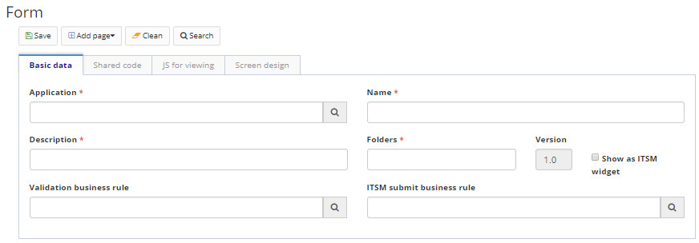
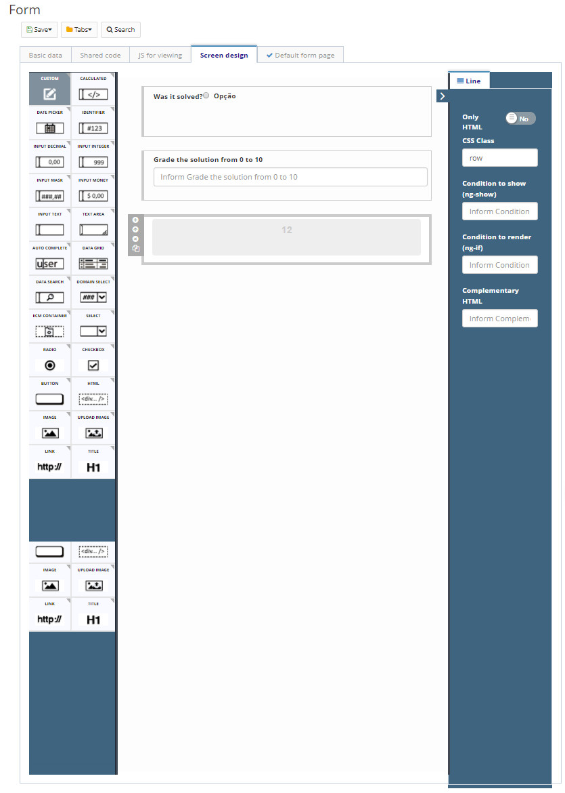
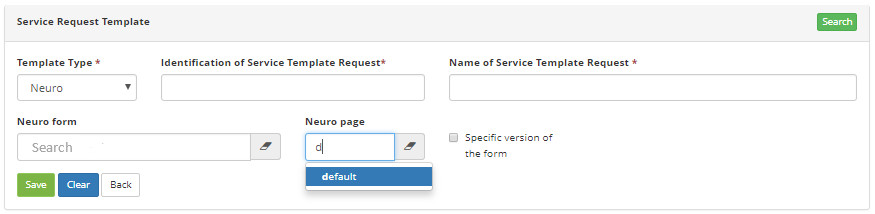
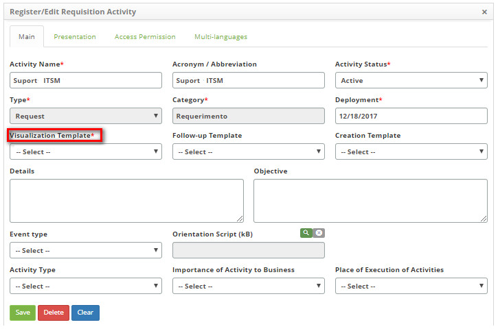
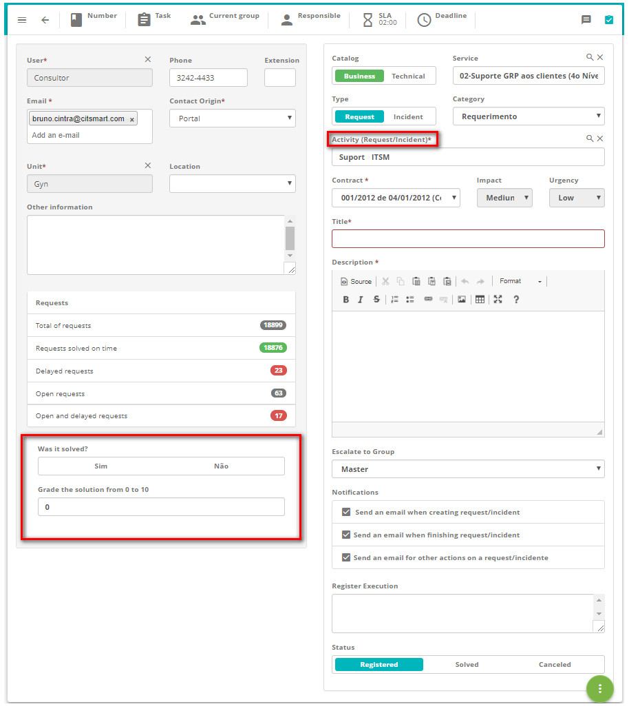

title: Form creation manual on CITSmart Neuro for CITSmart Enterprise ITSM customer satisfaction survey
Description: This functionality aims for the elaboration a satisfaction survey to be answered by the ticket requestor, where the search fields are personalized by a CITSmart Neuro form. 
# Form creation manual on CITSmart Neuro for CITSmart Enterprise ITSM customer satisfaction survey

This functionality aims for the elaboration a satisfaction survey to be answered by the ticket requestor, where the search fields are personalized by a CITSmart Neuro form.

Steps to customize a satisfaction survey
------------------------------------------------------

Creating the form on CITSmart Neuro
------------------------------------------

1. Access the functionality through the menu **Neuro > Management > Form**;

2. As described in the knowledges Form, Developing Applications, fill in the fields of the first tab according to your needs;

    
    
    **Figure 1 - Form register screen**
    
    !!! info "IMPORTANT"
    
        Specifically for the CITSmart Corporation, you must inform Integração ITSM - Builder in the Application field and itsm_builder in the Folder field.
        
3. Create the form layout that will be created on the Screen Design tab, as shown in the example below:

    
    
    **Figure 2 - Neuro form design example**
    
4. On the Add Page menu option, select "Default form page".

Linking the service request template to the CITSmart Neuro
-------------------------------------------------------------------------------

1. Access the functionality through the menu **System > Service Request Template**;

2. Create a new template by filling in the fields below (according to knowledge [Service request template registration and search][1]);

    
    
    **Figure 3 - Service template creation example**
    
    !!! warning "ATTENTION"
    
        The Template Type will always be Neuro.
        
3. In the Neuro Form field, select the previously created Neuro form;

!!! note "NOTE"

    In the Neuro Page field, select the type default.
    
Linking the service activity (portfolio) registration tothe new service request template
----------------------------------------------------------------------------------------

1. Access the functionality through the menu **Process Management > Portfolio and Catalog Management > Portfolio Management**;

2. Select the desired portfolio and click *Advance*;

3. Select the desired service and click *Advance*;

4. In the Request tab, select the desired activity and click *Edit*;

**Figure 4 - Link template to activity**

Validating the search customization
-----------------------------------------

1. Access the functionality through the menu **Process Management > Ticket Management > Service Request and Incident**.

2. tart the registration of a new ticket (see knowledge [Ticket management (services)][2]);

!!! note "NOTE"

    The ticket of this validation must use the activity in which the new template has been linked.
    

**Figure 5 - Ticket satisfaction survey visualization**

!!! tip "About"

    <b>Product/Version:</b> CITSmart | 7.00 &nbsp;&nbsp;
    <b>Updated:</b>09/04/2019 - Anna Martins
