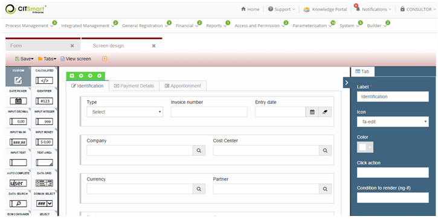
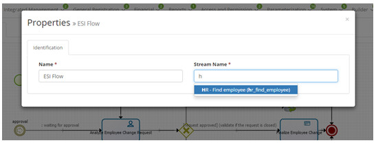

title: Integration guide with CITSmart Enterprise Neuro (ITSM))
Description: Integration guide with CITSmart Enterprise Neuro (ITSM) 
# Integration guide with CITSmart Enterprise Neuro (ITSM)

Assumptions
-----------

1. The Neuro is implemented by the packages cit-portal-web.war and cit-esi-web.war. For ITSM / Neuro integration to work, you must:

- The ITSM version is 7.1.0.0 or higher
- The version of the cit-portal-web is 3.0.29 or higher
- The version of cit-esi-web is 3.1.2 or higher
- ITSM is configured for HTTPS access: //
- The Neuro is installed on the same ITSM server or the ITSM server has access to the Neuro environment in another domain.
- In the case of access to the Neuro in another domain, the ITSM server must have the Neuro certificate properly installed
- The integration parameters are configured in the ITSM
- For the integration to work, the user logged into ITSM must exist in the cit-portal-web database. - That is, the authentication of the ITSM in the Neuro is not made by the service account specified in parameter 311, but by the user logged in to ITSM.
    
Parametrization
-----------------

1. In ITSM there are four parameters that configure integration with Neuro:

    
    
    **Figure 1 - CITSmart parameters**
    
- Parameter 309 indicates whether integration with Neuro is enabled;
- Parameter 310 defines the Neuro URL. This URL includes the context of the application, which is usually cit-esi-web;
- Parameter 311 indicates the service (user) account for integration with Neuro. This user must be registered in the cit-portal-web database of the Neuro environment.
    
Forms of integration 
---------------------

1. There are eight ways to integrate ITSM with Neuro

- Access to Neuro screens by ITSM
- Accessing Neuro forms from the ITSM menu
- Using Neuro forms to open ITSM requests
- Using Neuro forms in ITSM flow jobs
- Execution of Neuro business rules by ITSM
- Execution of ESI flows by ITSM
- Execution of business object transactions by ITSM
- Using Neuro streams in ITSM

2. Each of the forms of integration is detailed below.

Access to Neuro fabrics by ITSM
------------------------------------

1. If the integration parameter 309 indicates that the integration is enabled and the user logged in to ITSM has access to the integration (consultant user already has default access), the "Neuro" menu will be displayed as shown below:

    
    
    **Figure 2 - Main menu**
    
2. Given the authentication and profile conditions, the user has access to all Neuro management screens and features.

    
    
    **Figure 3 - Screen drawing**
    
    !!! note "NOTE"
    
        Neuro screens are rendered within an iframe. This implies that CSS conforms to the GRP standard and therefore is different from the ITSM standard.
        
Accessing Neuro forms from the ITSM menu
-----------------------------------------

1. To access the Neuro forms from the ITSM menu, simply create a new menu telling the path :
*/dynamicFormBuilder/dynamicFormBuilder.load?formName={nome do formulário do Neuro}&page={tipo de página do Neuro}*

   
    
   **Figure 4 -Menu master**
    
2. In this integration case, the Neuro page type is usually crud (for CRUD entries) or default (for general forms);

3. After the menu is configured, the Neuro form is usually accessed in ITSM, obeying local CSS standards. In this case, ITSM authentication in Neuro is done using the service account specified in parameter 311.

**Figura 5 - Dados cadastrais**

Using the Neuro forms in the ITSM request opening
---------------------------------------------

1. Once you've built the form in Neuro, just:

- Register a Neuro type template in ITSM and associate it with the form, as shown below:

**Figure 6 - Request template**
  
2. For cases where the activity initiates a stream from the ITSM itself (which is the majority of cases), the "Page Neuro" field must be filled with "Default" 

- Link template to portfolio activity
    
   
    
   **Figure 7 - Service registration / edition**
    
3. Once the template is associated with the activity, the Neuro form will automatically appear on the portal's ITSM request screen or the requests / incident screen. In this case, ITSM authentication in Neuro is done using the service account specified in parameter 311.

    
    
    **Figure 8 - Mounted Form**
    
Using Neuro forms in ITSM flow tasks
------------------------------------

1. Once you've built the form in Neuro, just:

- Edit the ITSM stream
- Select the user task that should display the Neuro form and click Properties
- In the "Interface" tab, choose "Neuro Form" in the "Interaction type"
- Select the Neuro form (auto-complete) in the "Form Name" field
    
    
    
    **Figure 9 - Tasks**
    
2. In the execution of the task, the associated Neuro form in the flow drawing will be displayed automatically. In this case, ITSM authentication in the Neuro is also done using the service account specified in parameter 311.

    
    
    **Figure 10 - Associated form**
    
Execution of Neuro business rules by ITSM
----------------------------------------------------

1. For execution of Neuro business rules, the following must be done:

- Add a Business Rule component in the ITSM stream
- Create or reference a Neuro business rule on the properties tab.

    
        
    **Figure 11 - Business rule**
    
Execution of ESI by ITSM
------------------------

1. To run Neuro ESI streams, you must do the following:

- Add an ESI Flow component in the ITSM workflow
- Referencing an ESI flow in the properties tab
    
   
    
    **Figure 12 - ESI flow**
    
Execution of business object trasanctions by ITSM
--------------------------------------------------------

1. For execution of Neuro business object transactions, the following must be done:

- Add a Database Transaction component to the ITSM stream
- Fill in the required properties: connection name, database object name, SQL type, input JSON variable, and output JSON variable
    
    
    
    **Figure 13 - DB transaction**

!!! tip "About"

    <b>Product/Version:</b> CITSmart | 7.00 &nbsp;&nbsp;
    <b>Updated:</b>09/04/2019 - Anna Martins
