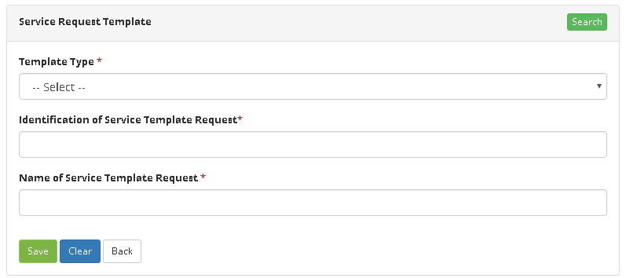

title:  Manual de integração com o CITSmart Enterprise Neuro (ITSM)
Description: Disponibiliza a integração do CITSmart com o Neuro. 
# Manual de integração com o CITSmart Enterprise Neuro (ITSM)

Premissas
-----------

1. O Neuro é implementado pelos pacotes cit-portal-web.war e cit-esi-web.war. Para que a integração ITSM/Neuro funcione, é necessário
que:

    - A versão do ITSM seja 7.1.0.0 ou superior home;
    - A versão do cit-portal-web seja 3.0.29 ou superior;
    - A versão do cit-esi-web seja 3.1.2 ou superior;
    - O ITSM esteja configurado para acesso HTTPS://
    - O Neuro esteja instalado no mesmo servidor ITSM ou que o servidor ITSM tenha acesso ao ambiente Neuro em outro domínio;
    - Para o caso de acesso ao Neuro em outro domínio, o servidor ITSM deve ter o certificado do Neuro devidamente instalado;
    - Os parâmetros de integração estejam configurados no ITSM;
    - Para que a integração funcione, o usuário logado no ITSM deve existir na base de dados do cit-portal-web. Ou seja, a 
    autenticação do ITSM no Neuro não é feita pela conta de serviço especificada no parâmetro 311, e sim, pelo usuário logado no 
    ITSM.
    
Parametrização
-----------------

1. No ITSM existem quatro parâmetros que configuram a integração com o Neuro:

    
    
    **Figura 1 - Parâmetros CITSmart**
    
    - O parâmetro 309 indica se a integração com o Neuro está habilitada;
    - O parâmetro 310 define a URL do Neuro. Essa URL inclui o contexto da aplicação, que geralmente é cit-esi-web;
    - O parâmetro 311 indica a conta de serviço (usuário) para integração com o Neuro. Esse usuário deve estar cadastrado na base 
    de dados do cit-portal-web do ambiente Neuro.
    
Formas de integração 
---------------------

1. Existem oito formas de integração do ITSM com o Neuro

    - Acesso às telas do Neuro pelo ITSM;
    - Acesso a formulários do Neuro pelo menu do ITSM;
    - Utilização de formulários Neuro na abertura de solicitações ITSM;
    - Utilização de formulários Neuro nas tarefas de fluxo ITSM;
    - Execução de regras de negócio do Neuro pelo ITSM;
    - Execução de fluxos ESI pelo ITSM;
    - Execução de transações de objeto de negócio pelo ITSM;
    - Utilização de fluxos do Neuro no ITSM.
    
2. Cada uma das formas de integração é detalhada a seguir.

Acesso às telas do Neuro pelo ITSM
------------------------------------

1. Caso o parâmetro de integração 309 indique que a integração está habilitada e o usuário logado no ITSM tenha acesso à 
integração (usuário consultor já tem acesso default), o menu “Neuro” será apresentado conforme tela abaixo:

    
    
    **Figura 2 - Menu principal**
    
2. Atendidas as condições de autenticação e perfil, o usuário tem acesso a todas as telas de gerenciamento e recursos do Neuro.

    
    
    **Figura 3 - Desenho da tela**
    
    !!! note "NOTA"
    
        As telas do Neuro são renderizadas dentro de um iframe. Isso implica que o CSS obedece ao padrão do GRP e, portanto, é 
        diferente do padrão ITSM.
        
Acesso aos formulários do Neuro pelo menu do ITSM
---------------------------------------------------

1. Para acessar os formulários do Neuro pelo menu do ITSM, basta criar uma novo menu informando o caminho :
*/dynamicFormBuilder/dynamicFormBuilder.load?formName={nome do formulário do Neuro}&page={tipo de página do Neuro}*

    
    
    **Figura 4 - Cadastro de menu**
    
2. Nesse caso de integração, o tipo de página do Neuro geralmente é crud (para cadastros CRUD) ou default (para formulários
gerais);

3. Depois de configurado o menu, o formulário do Neuro é acessado normalmente no ITSM, obedecendo os padrões de CSS locais. Nesse
caso, a autenticação do ITSM no Neuro é feita utilizando a conta de serviço especificada no parâmetro 311.

**Figura 5 - Dados cadastrais**

Utilização dos formulários Neuro na abertura de solicitação ITSM
--------------------------------------------------------------------

1. Depois de construído o formulário no Neuro, basta:

    - Cadastrar um template do tipo Neuro no ITSM e associá-lo ao formulário, conforme tela a seguir:

    
    
    **Figura 6 - Template de solicitação**
    
2. Para os casos em que a atividade inicia um fluxo do próprio ITSM (que é a maioria dos casos), o campo “Página Neuro” deve ser 
preenchido com “Default”;

    - Associar o template à atividade do portfólio

    
    
    **Figura 7 - Cadastro/Edição serviço**
    
3. Depois de associado o template à atividade, o formulário do Neuro aparecerá automaticamente na tela de solicitação do ITSM do 
portal ou na tela de requisições/incidentes. Nesse caso, a autenticação do ITSM no Neuro é feita utilizando a conta de serviço 
especificada no parâmetro 311.

    
    
    **Figura 8 - Formulário montado**
    
Utilização dos formulários Neuro nas tarefas de fluxo
----------------------------------------------------------

1. Depois de construído o formulário no Neuro, basta:

    - Editar o fluxo do ITSM;
    - Selecionar a tarefa de usuário que deve exibir o formulário do Neuro e clicar em propriedades;
    - Na aba “Interface”, escolher “Formulário Neuro” no campo “Tipo de interação”;
    - Selecionar o formulário do Neuro (auto-complete) no campo “Nome do formulário”.
    
    
    
    **Figura 9 - Tarefas**
    
2. Na execução da tarefa, o formulário do Neuro associado no desenho do fluxo será exibido automaticamente. Também nesse caso, a 
autenticação do ITSM no Neuro é feita utilizando a conta de serviço especificada no parâmetro 311.

    
    
    **Figura 10 - Formulário associado**
    
Execução de regras de negócio do Neuro pelo ITSM
----------------------------------------------------

1. Para execução de regras de negócio do Neuro, deve ser feito o seguinte:

    - Adicionar um componente Regra de Negócio no fluxo do ITSM;
    - Criar ou referenciar uma regra de negócio do Neuro na aba de propriedades.

    
    
    
    
    **Figura 11 - Regra de Negócio**
    
Execução de fluxos ESI pelo ITSM
-----------------------------------

1. Para execução de fluxos ESI do Neuro, deve ser feito o seguinte:

    - Adicionar um componente Fluxo ESI no fluxo do ITSM;
    - Referenciar um fluxo ESI na aba de propriedades.
    
    
    
    **Figura 12 - Fluxo ESI**
    
Execução de transações de objeto de negócio pelo ITSM
--------------------------------------------------------

1. Para execução de transações de objeto de negócio do Neuro, deve ser feito o seguinte:

    - Adicionar um componente Transação de Banco de Dados no fluxo do ITSM;
    - Preencher as propriedades obrigatórias: nome da conexão, nome do objeto de banco de dados, tipo do SQL, variável JSON de
    entrada e variável JSON de saída.
    
    
    
    **Figura 13 - Transação de BD**

!!! tip "About"

    <b>Product/Version:</b> CITSmart | 7.00 &nbsp;&nbsp;
    <b>Updated:</b>08/07/2019 - Larissa Lourenço
