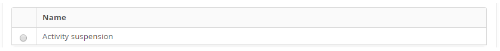

title: Activity suspension reason registration and search
Description: The goal of this feature is to register a reason of a regular activity suspension.

# Activity suspension reason registration and search

How to access
-----------

1.  Access the activity suspension feature navigating through the main menu **General Registration > Register Activity Suspension**.

Preconditions
-------------

1.  No applicable.

Filters
------

1.  The following filter enables the user to restrict the participation of items in the standard feature listing, making it easier to find the desired items:

    -   Name.

    
    
    **Figure 1 - Activity suspension reason search screen**

2.  Perform an Activity Suspension Search:

- Insert the name of the intended activity suspension and click on the Search button. Afterwards, the unit entry will be displayed according to the description provided.
- To list all activity suspensions, just click directly on the Search button, if needed.

Itens list
----------

1.  The following cadastral field is available to the user to facilitate the identification of the desired items in the standard feature listing: Name.

    

    **Figure 2 - Activity suspend listing screen**

2.  After searching, select the intended entry. Afterwards, they will be redirected to the registry screen displaying the content belonging to the selected entry.

3. To edit a unit entry, just modify the information on the intended fields and click on the Save button to confirm the changes to the database, at which date, time and user will be stored automatically for a future audit.

Filling in the registration fields
----------------------------------

1.  The Activity Suspension Registration screen will be displayed, as illustrated on the image below:

     

    **Figure 3 - Activity suspension reason entry screen**

2.  Insert the description of the Activity Suspension reason and click on the Save the button to confirm the entry, at which date, time and user will automatically be stored for a future audit.

!!! tip "About"

    <b>Product/Version:</b> CITSmart | 8.00 &nbsp;&nbsp;
    <b>Updated:</b>09/04/2019 – Anna Martins
