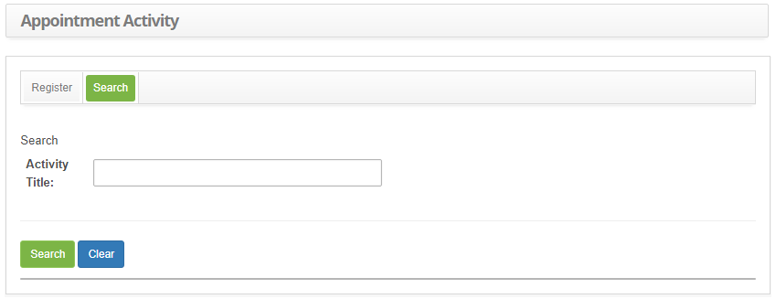
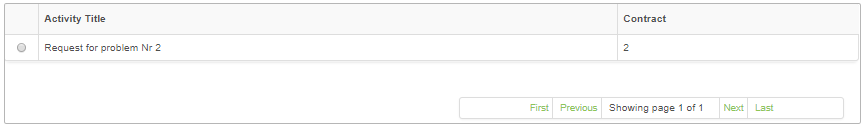
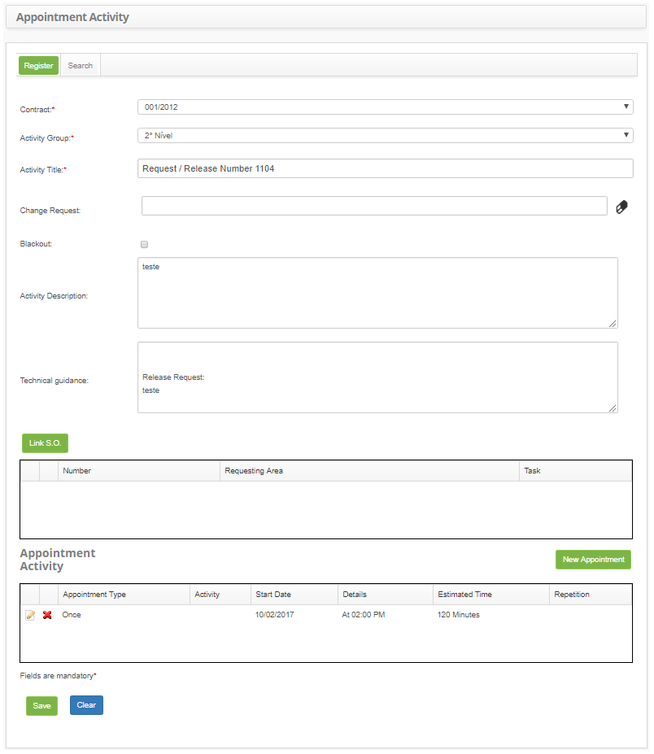

title: Periodic activity registration and search
Description: This feature allows to register and view contract related periodic activities.

# Periodic activity registration and search

This feature allows to register and view contract related periodic activities.

How to access
-----------

1.  Access the Periodic Activity feature navigating through the main menu **Integrated Management > Automation of IT Operations > Periodic Activity**.

Preconditions
------------

1.  A registered contract (see knowledge [Contract registration and search][1]);

2.  A registered periodic activity group (see knowledge [Periodic activity group registration and search][2]).

Filters
------

1.  The following filter enables the user to restrict the participation of items in the standard feature listing, making it easier to find the desired items:

- Activity Title.

2. Click on the Search tab. Afterwards, the search screen will be displayed, as illustrated on the image below:

    
    
    **Figure 1 - Activity search screen**

3.  Perform a Periodic Activity Search:

- Insert the name of the intended activity and click on the Search button. Afterwards, the activity entry will be displayed according to the description provided.

- To list all activities, just click directly on the Search button, if needed.

Itens list
----------------

1.  The following cadastral fields are available to the user to make it easier to identify the desired items in the standard feature listing: Activity Title and Contract.

    
    
    **Figure 2 - Activity listing screen**

2.  After searching, select the intended entry. Afterwards, they will be redirected to the registry screen displaying the content belonging to the selected entry.

3. To edit a periodic activity entry, just modify the information on the intended fields and click on the Save button to confirm the changes to the database.

Filling in the registration fields
----------------------------------

1.  The Periodic Activity Entry screen will be displayed, as illustrated on the image below:

    
    
    **Figure 3 - Periodic activity entry screen**

2.  Fillout the fields as instructed below:

- Contract: select the contract which will a periodic activity scheduled ;

- Activity Group: select the activity group, which will be tasked to perform the activity;

- Activity Title: insert the activity title;

- Change Request: insert the change request, in case the activity is related to a request;

- Blackout: check this box if it is related to a blackout;

- Activity Description: insert the activity description;

- Technical Guidance: insert the technical guidelines to perform the task;

- Link a SO to an activity, if necessary;

   - Click on the Link S.O. button. Afterwards, the

   - To remove a S.O. linked to an activity, just click on the  icon.

- Click on the New Appointment button to determine the activity period. Afterwards, the appointment screen will be displayed, as illustrated on the image below:
    
    
    
   **Figure 4 - Activity appointments**

   - Appointment Type: insert the activity appointment type (daily, weekly, monthly or once);

   - Starts in: insert the activity start date and time;

   - Expires in: insert the expire date;

   - Estimated Time: insert the activity estimated duration, in minutes;

   - Insert the information to schedule the activity, according to the appointment type chosen;

   - Repeat Appointment On: check this box only if they wish to perform this procedure;

   - After all fields are filled out, click on the Save button to confirm the procedure.

   - To edit the activity appointment, just click on the  icon;

3. After providing all information, click on the Save the button to confirm the entry, at which date, time and user will automatically be stored for a future audit.

[1]:/en-us/citsmart-platform-7/additional-features/contract-management/use/register-contract.html
[2]:/en-us/citsmart-platform-7/processes/portfolio-and-catalog/periodic-activity.html

!!! tip "About"

    <b>Product/Version:</b> CITSmart | 8.00 &nbsp;&nbsp;
    <b>Updated:</b>09/05/2019 – Anna Martins
