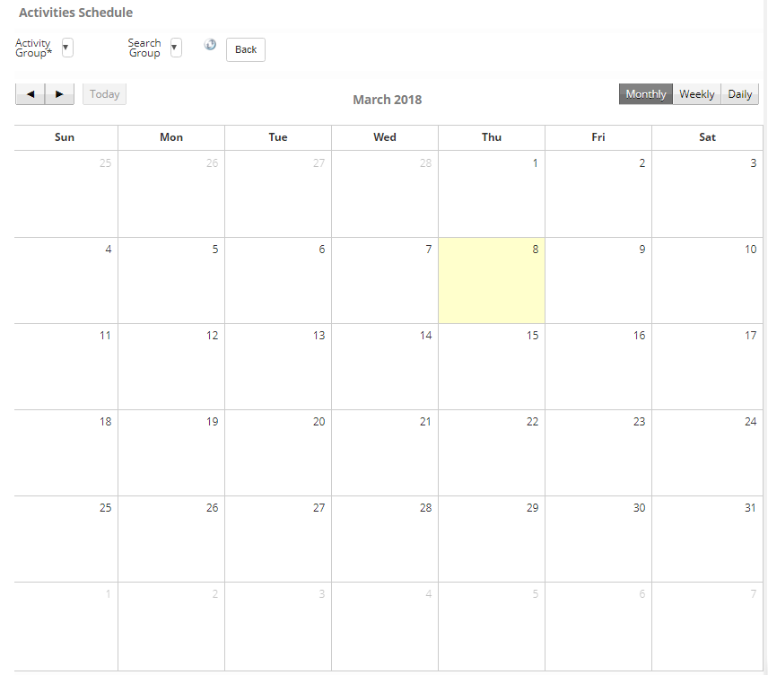
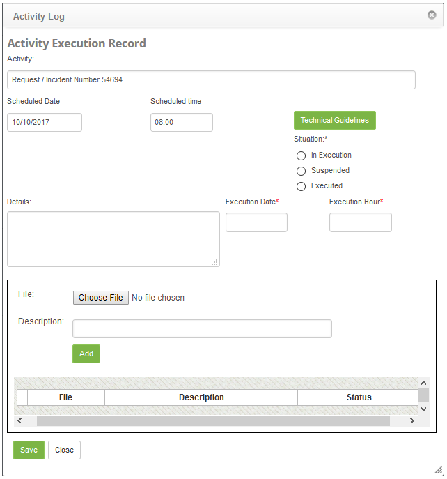
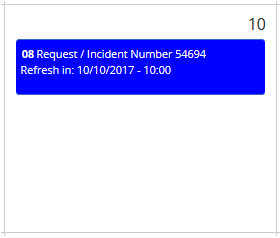
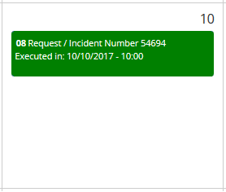
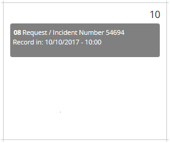

title: Scheduled periodic activities check
Description: The goal of this feature it to verify all the scheduled activities related to the request and incident management, problem management and deployment management to perform them.

# Scheduled periodic activities check

The goal of this feature it to verify all the scheduled activities related to the request and incident management, problem management and deployment management to perform them.

How to access
-----------

1.  Access the **Integrated Management > Automation of IT Operations > Periodic Activities Schedule menus**.

Preconditions
------------

1.  Not applicable.

Filters
------

1.  The following filters enable the user to restrict the participation of items in the standard feature listing, making it easier to locate the desired items:

- Activity Group;
- Search Group;
- Monthly;
- Weekly;
- Daily.

2. The Periodic Activity Schedule will be displayed. It will be displayed in a calendar format, where all activities can be seen. The image below illustrates this screen:
    
    
    
    **Figure 1 - Activity schedule**

    - Activity Group: select the periodic activities performer group to view its scheduled activities;

    - Search Group: select the management which intends to view its scheduled activities.

3. The activities can be viewed Monthly, Weekly or Daily. To define the view mode, click on one of the buttons located above the calendar: Monthly, Weekly or Daily.

Itens list
----------

1.  Not applicable.

Filling in the registration fields
---------------------------------

1.  To register a scheduled activity execution, click on it. Afterwards, a screen will be displayed so the necessary information can be registered, as illustrated on the image below:

    
    
    **Figura 2 - Registro de execução de atividade**

    Figure 2 - Activity execution entry

   - Situation: select the current activity status;
   - Click on the Technical Guidelines button, to check the activity guidelines;
   - If the selected situation is "In Execution" or "Executed", fill out the fields:

     - Details: describe the details of the activity execution;
     - Execution Date: insert the date when the activity was executed;
     - Execution Hour: insert the time when the activity was executed.
   
   - If the selected situation is "Suspended", fill out the fields:

     - Reason: select the activity suspension reason;
     - Complement: insert further details on the activity suspension;
     - Insert the activity suspension date and time.

   - After filling out all the requested information, click on the Save the button to confirm the entry.
   - The activity being performed will be displayed as blue, as illustrated on the image below:
    
   
    
   **Figure 3 - Example 1**

   -  The activity which has been executed will be displayed as green, as illustrated on the image below:

   
    
   **Figure 4 - Example 2**

   -  The activity which has been suspended will be displayed as gray, as illustrated on the image below:

   
    
   **Figure 5 - Example 3**
    
!!! tip "About"

    <b>Product/Version:</b> CITSmart | 8.00 &nbsp;&nbsp;
    <b>Updated:</b>09/05/2019 – Anna Martins
