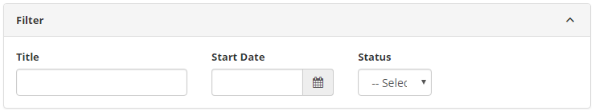
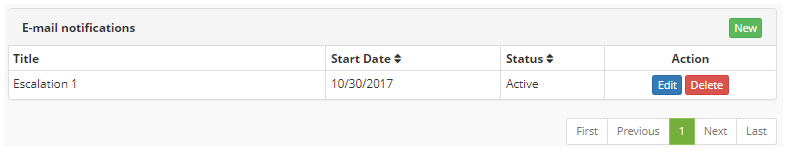
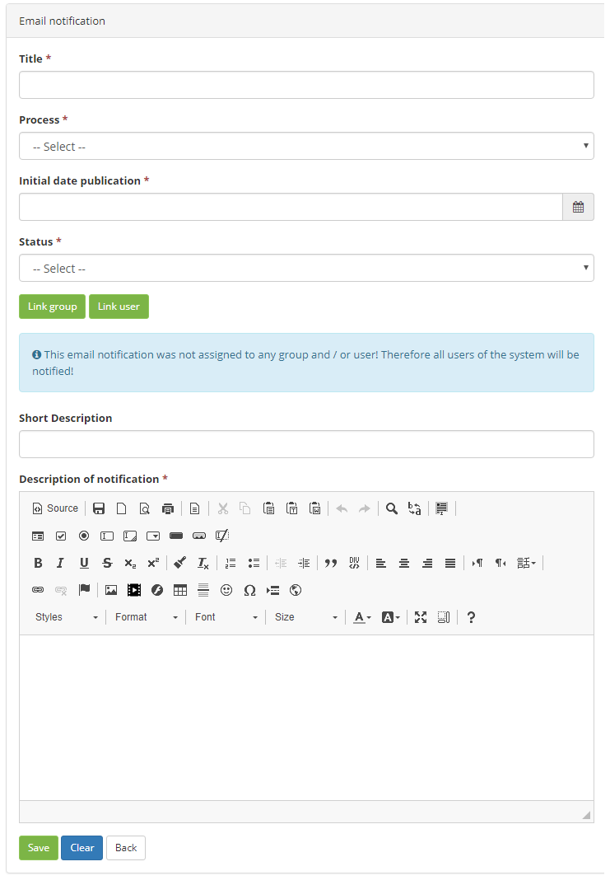

title: Notification via e-mail registration and search
Description: The E-mail Notification feature aims to send a message via e-mail in order to notify users about events that will occur in the system.

# Notification via e-mail registration and search

The E-mail Notification feature aims to send a message via e-mail in order to notify users about events that will occur in the system.

How to access
-----------

1.  Access the functionality through navigation in the main menu **System > Notifications > Notification via E-mail**.

Preconditions
------------

1.  Not applicable.

Filters
-------

1.  The following filters enables the user to restrict the participation of items in the standard feature listing, making it easier to find the desired items:

- Title;
- Start Date;
- Status.

2. In the E-mail Notifications screen, the E-mail Notifications that have been registered are listed, as shown in the figure below:

**Figure 1 - E-mail notification search screen**

Itens list
----------------

1.  The following cadastral fields are available to the user to facilitate the identification of the desired items in the standard feature listing: Title, Start Date and Status.

    

    **Figure 2 - E-mail notification list screen**

2.  There are action buttons available to the user for each item in the listing, they are: Edit and Delete.

Filling in the registration fields
----------------------------------

1. The E-mail Notifications screen will be displayed;

2. Click the New button. Once this is done, the E-mail Notification Registration screen will be displayed, as shown in the figure below:

   
   
   **Figure 3 - E-mail notification registration**

3.  Fill in the fields as directed below:

- Title: report the title of the notification via e-mail;
- Process: inform the process regarding notification by e-mail;
- Initial date publication: enter the starting date that the notification will be displayed via e-mail to the user;
- Status: inform the status of the notification via e-mail;

4. Link group (s) to notification via e-mail;

- Click the Link Group button. After that, the group search screen will be displayed;
- Perform the search, select the group you want to link to the e-mail notification, and click the Add button to perform the operation;
- To remove the group link with the e-mail notification, click Remove. If you want to remove all linked groups, click the Remove All button.

5. Link user (s) to notification via e-mail;

- Click the Link User button. After that, the user search screen will be displayed;
- Perform the search, select the user (s) you want to link to the e-mail notification and click the Add button to perform the operation;
- To remove the user's link with the e-mail notification, click Remove. If you want to remove all linked users, click the Remove All button.
   
   !!! info "IMPORTANT"

         If e-mail notification is not assigned to any group and/or user, all system users will be notified.

   - Short description: provide a brief description of the notification via e-mail;
- Description of notification: enter the detailed description of the notification via e-mail.

6. After the data has been entered, click the Save button to register, in this case the date, time and time will be stored automatically for a future audit.

!!! tip "About"

    <b>Product/Version:</b> CITSmart | 8.00 &nbsp;&nbsp;
    <b>Updated:</b>09/05/2019 – Anna Martins
