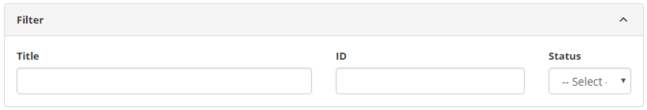
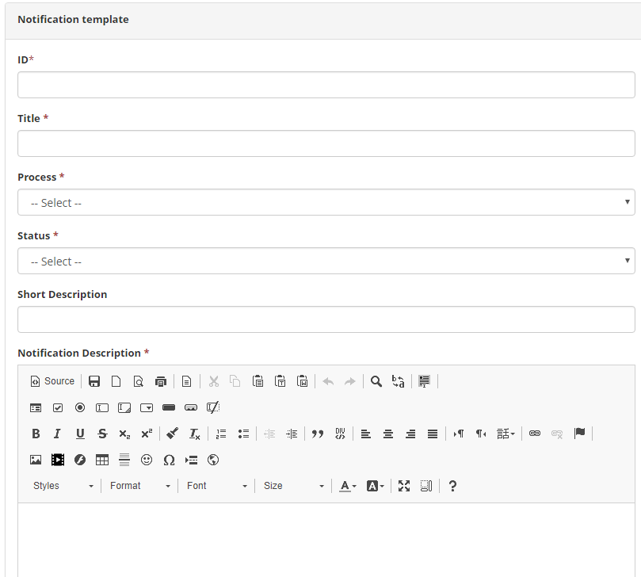

title: Template notification registration and search
Description: The Notification Template feature aims to create a notification template to link to Event Management and Knowledge Base.

# Template notification registration and search

The Notification Template feature aims to create a notification template to link to Event Management and Knowledge Base.

How to access
-----------

1.  Access the notification template feature navigating through the main menu **System > Notifications > Notification Type**.

Preconditions
------------

1.  Not applicable.

Filters
-------

1.  The following filters enables the user to restrict the participation of items in the standard feature listing, making it easier to find the desired items:

- Title;
- ID;
- Status.

2. On the Notification Templates screen, the notification templates that have been registered are listed, as shown in the figure below:

    
    
    **Figure 1 - Notification type search screen**

3.  To search for a specific notification template record, simply fill in the filters as needed.

Itens list
----------------

1.  The following cadastral fields are available to the user to facilitate the identification of the desired items in the standard feature listing: Title, ID and Status.

2. There are action buttons available to the user for each item in the listing, they are: Edit and Delete.

    
    
    **Figure 2 - Notification template listing screen**

Filling in the registration fields
----------------------------------

1.  The Notification Template Screen will be displayed;

2. Click the New button (according to the previous figure). Once this is done, the Notification Template Master screen will be displayed, as shown in the figure below:

    

    **Figure 3 - Notification template registration**

3.  Fill in the fields as directed below:

- Title: enter the title of the notification template;
- Process: inform the process regarding the notification template;
- Status: inform the status of the notification template;
- Short Description: provide a brief description of the notification template;
- Notification Description: enter the detailed description of the notification.

4. After the data has been entered, click the Save button to register, in this case the date, time and time will be stored automatically for a future audit.

!!! tip "About"

    <b>Product/Version:</b> CITSmart | 8.00 &nbsp;&nbsp;
    <b>Updated:</b>09/05/2019 – Anna Martins
