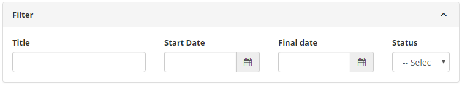
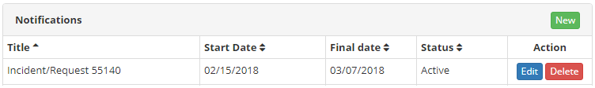
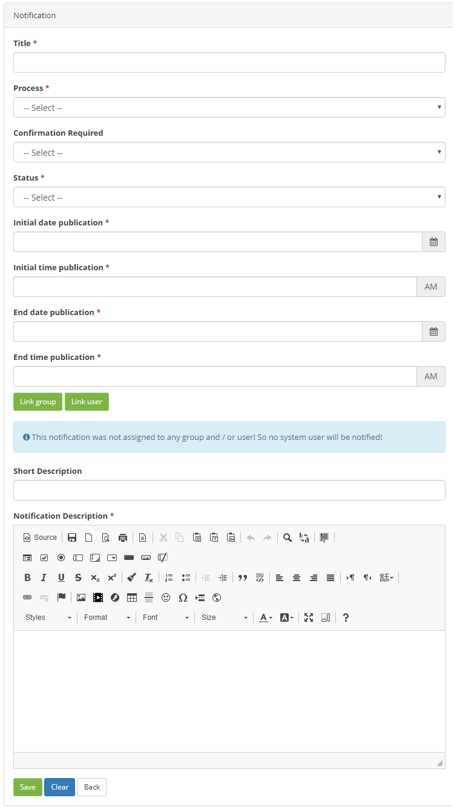
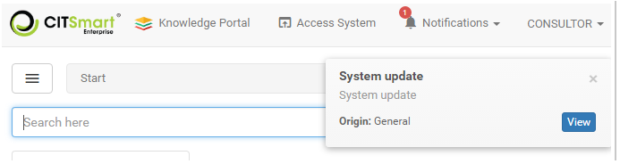
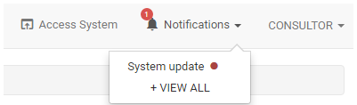
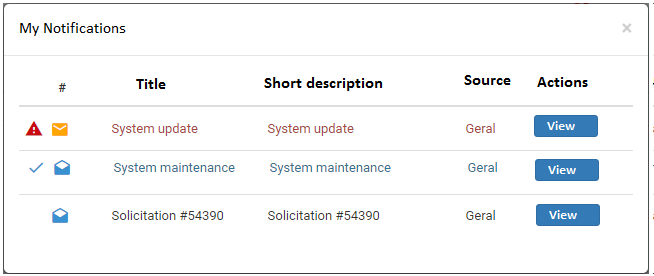

title: Notification registration and search
Description: The Notification feature is intended to create an alert message to notify users about events that will occur on the system.

# Notification registration and search

The Notification feature is intended to create an alert message to notify users about events that will occur on the system.

How to access
----------

1. Access the notifications feature navigating through the main menu **System > Notifications > Notification**.

Preconditions
------------

1. Not applicable.

Filters
------

1. The following filters enables the user to restrict the participation of items in the standard feature listing, making it easier to find the desired items:

    - Title;
    - Start date;
    - Final Date;
    - Status.

    
    
    **Figure 1 - Notification search**

2. To verify a specific notification, simply fill in the filters as needed and click the Search button.

Itens list
-----------

1. The following cadastral fields are available to the user to facilitate the identification of the desired items in the standard feature listing: Title, Start Date, Final date and Status.

2. There are action buttons available to the user for each item in the listing, they are: Edit and Delete.

**Figure 2 - Notification list screen**

Filling in the registration fields
----------------------------------

1. Go to the main menu. After this, the Notification feature will be displayed;

2. On the Notifications screen, click the New button (according to the previous figure). Once this is done, the respective notification form screen will be displayed, as shown below:

       
    
   **Figure 3 - Registration notification**

3.  Fill in the fields as directed below:

- Title: report the title of the notification;
- Process: select the notification process;
- Confirmation Required: set whether notification requires user read confirmation. If yes, when recording the information will be presented a button that allows to verify the users who confirmed the reading of the notification;
- Status: inform the status of the notification;
- Initial date publication : enter the start date that the notification will be displayed to the user;
- Initial time publication: enter the start time the notification will be displayed;
- End date publication: please inform the final date of the notification;
- End time publication: enter the end time of the notification display;
- Add the groups and/or users who will see the notification;
- Short Description: provide a brief description of the notification;
- Notification Description: enter the detailed description of the notification.

4. After the data has been entered, click the Save button to register, in this case the date, time and time will be stored automatically for a future audit.

!!! note "NOTE"

    the registered notifications will be displayed during the period established in this registry. After passing the period, the system will inactivate the notifications.

Viewing notifications
---------------------------

1. When you display the alert message (as shown in the figure below), click the Preview button if you want to view the notification. But if you want to view the notification at a later time, click the Close button in the alert message.

    
    
    **Figure 4 - Notification alert**

    !!! info "IMPORTANT"

        The registered notifications will be displayed during the period established in this registry. After passing the period, the system will inactivate the notifications.

2. To view all system notifications, click the Notifications option at the top of the screen. You will see notifications that have not yet been viewed, as shown in the figure below:
    
    
    
    **Figura 5 - Notifications**

    !!! info "IMPORTANT"

         The system displays the notification counter incremented only when there is notification that requires read confirmation.

3. To see all the notifications, click on the "+ SEE ALL" option, the notifications verification screen will be displayed, as shown in the figure below:

    
    
    **Figure 6 - My notification**

    - The notification with the icon  indicates that it has been displayed;
    - Notification with the icon  indicates that the icon was not displayed;
    - Notification with the icon  indicates that it requires read confirmation;
    - The notification with the icon  indicates that the message has been confirmed.

4. Click the Notification View button. After that, the information will be displayed. If the notification requires the confirmation of the reading, simply click on the Mark as read button.

!!! tip "About"

    <b>Product/Version:</b> CITSmart | 8.00 &nbsp;&nbsp;
    <b>Updated:</b>09/05/2019 – Anna Martins
