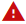
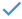

title: Notification registration and search
Description: The Notification feature is intended to create an alert message to notify users about events that will occur on the system.

# Notification registration and search

The Notification feature is intended to create an alert message to notify users about events that will occur on the system.

How to access
----------

1.  Access the notifications feature navigating through the main menu **System > Notifications > Notification**.

Preconditions
------------

1.  Not applicable.

Filters
------

1.  The following filters enables the user to restrict the participation of items in the standard feature listing, making it easier to find the desired items:

    - Title;
    - Start date;
    - Final Date;
    - Status.

    
    
    **Figure 1 - Notification search**

2.  To verify a specific notification, simply fill in the filters as needed and click the Search button.

Itens list
-----------

1.  The following cadastral fields are available to the user to facilitate the identification of the desired items in the standard feature listing: Title, Start Date, Final date and Status.

2. There are action buttons available to the user for each item in the listing, they are: Edit and Delete.

**Figure 2 - Notification list screen**

Filling in the registration fields
----------------------------------

1.  Go to the main menu. After this, the Notification feature will be displayed;

2.On the Notifications screen, click the New button (according to the previous figure). Once this is done, the respective notification form screen will be displayed, as shown below:

       
    
   **Figure 3 - Registration notification**

1.  Fill in the fields as directed below:
Title: report the title of the notification;
Process: select the notification process;
Confirmation Required: set whether notification requires user read confirmation. If yes, when recording the information will be presented a button that allows to verify the users who confirmed the reading of the notification;
Status: inform the status of the notification;
Initial date publication : enter the start date that the notification will be displayed to the user;
Initial time publication: enter the start time the notification will be displayed;
End date publication: please inform the final date of the notification;
End time publication: enter the end time of the notification display;
Add the groups and/or users who will see the notification;
Short Description: provide a brief description of the notification;
Notification Description: enter the detailed description of the notification.
After the data has been entered, click the Save button to register, in this case the date, time and time will be stored automatically for a future audit.
!!! note "NOTA"

    As notificações registradas, serão exibidas durante o período estabelecido
    neste registro. Após passar o período, o sistema irá inativar as
    notificações.

Visualizando as notificações
---------------------------

1.  No momento em que apresentar a mensagem de alerta (conforme exemplo
    ilustrado na figura abaixo), clique no botão *Visualizar*, caso queira
    visualizar a notificação. Mas, caso queira visualizar a notificação, em um
    momento posterior, clique no botão *Fechar* da mensagem de alerta.

    
    
    **Figura 4 - Alerta de notificação**

    !!! info "IMPORTANTE"

        the registered notifications will be displayed during the period established in this registry. After passing the period, the system will inactivate the notifications.

1.  Para visualizar todas as notificações do sistema, clique na
    opção **Notificações**, localizada na parte superior da tela. Será
    apresentada as notificações que ainda não foram visualizadas, conforme
    exemplo ilustrado na figura abaixo:
    
    
    
    **Figura 5 - Notificações**

    !!! info "IMPORTANTE"

         O sistema mostra o contador de notificação incrementado somente quando
         existir notificação que exige confirmação de leitura.

1.  Para ver todas as notificações, clique na opção "+VER TODOS", será
    apresentada a tela para verificação das notificações, conforme ilustrada na
    figura abaixo:

    
    
    **Figura 6 - Minhas notificações**

    -   A notificação com o ícone  , indica que a mesma foi visualizada;

    -   A notificação com o ícone  , indica que a mesma não foi visualizada;

    -   A notificação com o ícone  , indica que a mesma exija confirmação de
    leitura;

    -   A notificação com o ícone  , indica que a leitura da mesma foi confirmada.

1.  Clique no botão *Visualizar* da notificação. Após isso, será apresentada as
    informações da mesma. Caso a notificação exija a confirmação da leitura,
    basta clicar no botão *Marcar como lida*.

!!! tip "About"

    <b>Product/Version:</b> CITSmart | 8.00 &nbsp;&nbsp;
    <b>Updated:</b>07/18/2019 – Anna Martins
