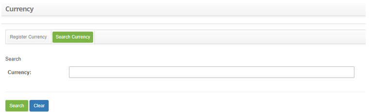
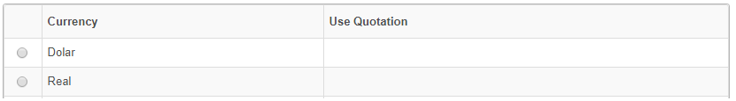
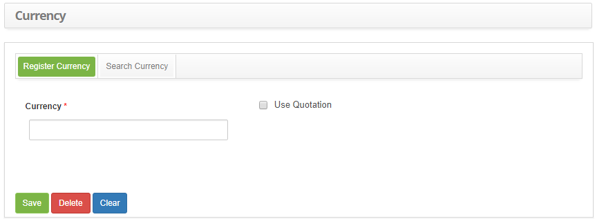

title: Currency registration and search
Description: The goal of this feature is to register the currencies which will be used during other system routines.

# Currency registration and search

The goal of this feature is to register the currencies which will be used during other system routines.

How to access
-----------

1. Access the currency feature navigating through the main menu **Integrated Management > Contracts Management > Currency**.

Preconditions
------------

1. Not applicable.

Filters
------

1. The following filter enables the user to restrict the participation of items in the standard feature listing, making it easier to find the desired items:

     - Currency

  
    
   **Figure 1 – Currency search screen**

2. Conduct a currency search;

     - Insert the name of the intended currency and click on the Search button. Afterwards, the currency entry will be displayed according to the description provided.

     - To list all currencies, just click directly on the Search button, if needed.

Itens list
----------------

1. The following cadastral fields are available to the user to facilitate the identification of the desired items in the standard feature listing: Currency and Use Quotation.

    
    
    **Figure 2 - Currency listing screen**

2. After searching, select the intended entry. Afterwards, they will be redirected to the registry screen displaying the content belonging to the selected entry, as illustrated on the image below:

3. To edit a currency entry, just modify the information on the intended fields and click on the Save button to confirm the changes to the database, at which date, time and user will be stored automatically for a future audit.

Filling in the registration fields
---------------------------------

1. The Currency Registration screen will be displayed, as illustrated on the image below::

    
    
    **Figure 3 - Currency entry screen**

2. Fill out the fields as instructed below:

     - Currency: insert the currency description. ie.: Dollar;
   
     - Use Quotation: check this box to use the currency quotation.

3. Click on the Save the button to confirm the entry, at which date, time and user will automatically be stored for a future audit.

!!! tip "About"

    <b>Product/Version:</b> CITSmart | 8.00 &nbsp;&nbsp;
    <b>Updated:</b>09/05/2019 – Anna Martins
