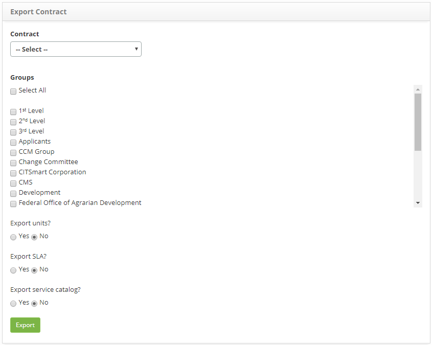

title: Exporting data from contracts
Description: This functionality aims to export the data to facilitate the initial loading of data related to the contracts.

# Exporting data from contracts

This functionality aims to export the data to facilitate the initial loading of data related to the contracts.

How to access
-----------

1. Access the Contract Export feature by navigating through the main menu **Integrated Management > Contract Management > Export Contracts**.

Performing data export
----------------------

1. The Contract Data Export screen will be displayed, as shown in the figure below:

    
    
    **Figure 1 - Data export screen**

2. Enter the data to be exported:

     - Contract: select the contract that will be used as the export basis, if you want to export the data relating to a contract;
   
     - Groups: select the desired group (s) to export the data;
   
     - Export units?: define whether to export the unit data;
   
     - Export SLA?: define whether the service level agreement data will be exported;
   
     - Export service catalog?: define whether to export service catalog data.

3. After the data is entered, click on the Export button;

4. A message will appear to confirm the export execution, click Ok to carry out the operation;

5. The data will be exported in a file in XML format.

!!! tip "About"

    <b>Product/Version:</b> CITSmart | 8.00 &nbsp;&nbsp;
    <b>Updated:</b>09/05/2019 – Anna Martins
