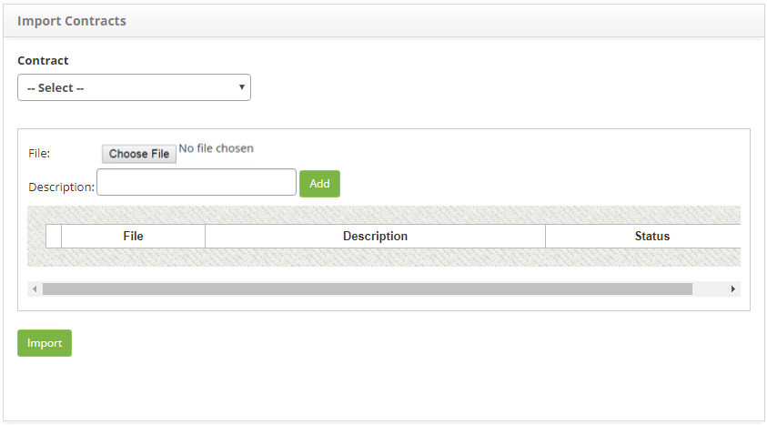

title: Contracts data import
Description: The goal of this feature is to import contract information.

# Contracts data import

The goal of this feature is to import contract information.

How to access
-----------

1.  Access the contract import feature navigating through the main menu **Integrated Management > Contracts Management > Import Contracts**.

Importing data
--------------

1.  Afterwards, the Contract Import screen will be displayed, as illustrated on the image below:

    
    
    **Figure 1 - Contract import screen**

    !!! note “NOTE”

         if the file does not concern a contract, do not select the contract, just add the file for data import.

2.  Add the file for data import;

- Click on the Choose File button;
- Select the intended file;
- Insert a description for the file and click on Add.

3. After editing the file, click on the Import button;

4. A message to confrm the import will be displayed, click on Ok to execute the procedure.

!!! note “NOTE”

       As the data is imported, the system will maintain the existing data and add only the new data.

!!! tip "About"

    <b>Product/Version:</b> CITSmart | 8.00 &nbsp;&nbsp;
    <b>Updated:</b>09/05/2019 – Anna Martins
