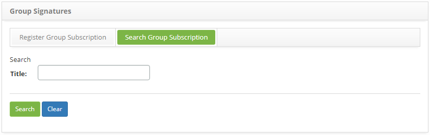
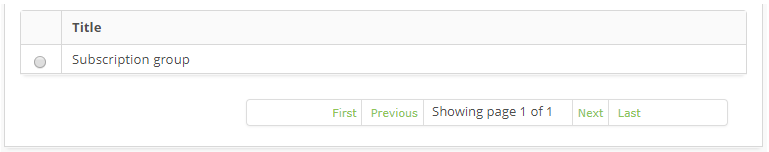
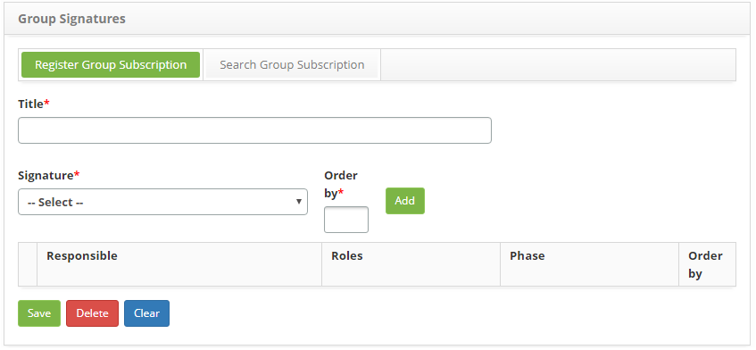
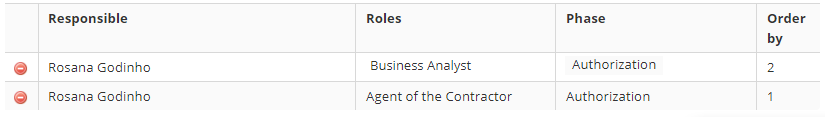

title: Group signatures registration and search
Description: This feature allows registering group signatures to be printed on reports.

# Group signatures registration and search

This feature allows registering group signatures to be printed on reports.

How to access
-----------

1. Access the Group Signature feature navigating through the main menu **Integrated Management > Contracts Management > Group Signatures**.

Preconditions
------------

1. To register group signatures it is necessary to have a registered signature (see knowledge [Signature registration and search][1]).

Filters
------

1. The following filter enables the user to restrict the participation of items in the standard feature listing, making it easier to find the desired items:

   - Title

2. On the Group Subscription screen, click on the Search Group Subscription tab. The search screen will be displayed as illustrated on the image below:

    
    
    **Figure 1 - Group subscription search screen**

3. Conduct a company search:

   - Insert the name of the intended group subscription and click on the Search button. Afterwards, the group subscription entry will be displayed according to the description provided.

   - To list all group subscription, just click directly on the Search button, if needed.

Itens list
----------

1. The following cadastral field is available to the user to make it easier to identify the desired items in the standard feature listing: Title.

    
    
    **Figure 2 - Group subscription listing screen**

2. After searching, select the intended entry. Afterwards, they will be redirected to the registry screen displaying the content belonging to the selected entry.

3. To edit a company entry, just modify the information on the intended fields and click on the Save button to confirm the changes to the database, at which date, time and user will be stored automatically for a future audit.

Filling in the registration fields
----------------------------------

1. The Group Signatures entry screen will be displayed, as illustrated on the image below:

    
    
    **Figure 3 - Group subscription entry screen**

2. Fill out the fields as instructed below:

   - Title: insert a title for the group signature;
   
   - Signature: selecione the signature;
   
   - Order by: insert an order the signature will be displayed on the report signature board ;
   
3. Click on the Add button to add a signature to the group. According to the signature board featured on the service order report, many signatures can be added to each group;

   
    
   **Figure 4 - Signatures added to the group**

4. Click on the Save the button to confirm the entry, at which date, time and user will automatically be stored for a future audit.

[1]:/en-us/citsmart-platform-7/additional-features/contract-management/configuration/signature.html

!!! tip "About"

    <b>Product/Version:</b> CITSmart | 8.00 &nbsp;&nbsp;
    <b>Updated:</b>09/05/2019 – Anna Martins
