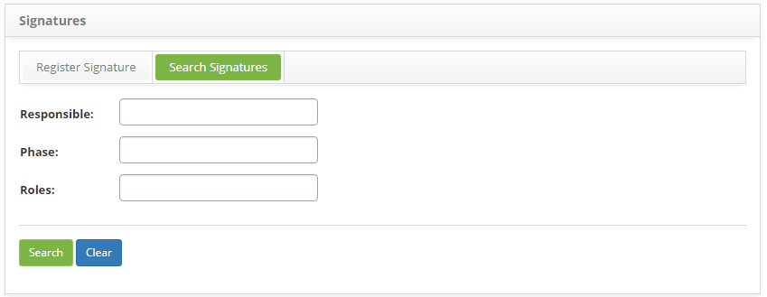
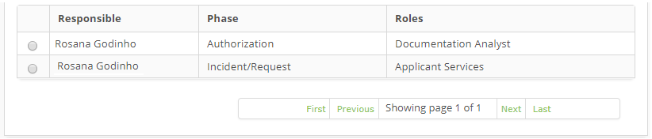
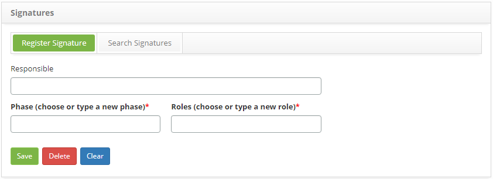

title: Signature registration and search

Description: The goal of this feature is to register signatures to be associated to a signature group, in order to personalize the signatures on the Service Orders report.

# Signature registration and search

The goal of this feature is to register signatures to be associated to a signature group, in order to personalize the signatures on the Service Orders report. These Service Order reports are used to register, verify and charge for the services provided to clients.

How to access
-----------

1. Access the signature feature navigating through the main menu Integrated Management > Contracts Management > Signature.

Preconditions
-------------

1. To register the signature, the staff member must be registered (see knowledge [Staff registration and search][1]).

Filters
-------

1. The following filters enables the user to restrict the participation of items in the standard feature listing, making it easier to find the desired items:

   - Responsible;

   - Phase;

   - Roles.

    
    
    **Figure 1 - Signature search screen**

2. Perform a signature search:

   - Insert the signature responsible name, procedure phase and/or role and click on the Search button. Afterwards, the entries will be displayed according to the information provided.

   - To list all signatures, just click directly on the Search button, if needed.

Itens list
---------

1. The following cadastral fields are available to the user to facilitate the identification of the desired items in the standard feature listing: Responsible, Phase and Roles.

    
    
    **Figure 2 - Signature listing screen**

2. After searching, select the intended entry. Afterwards, they will be redirected to the registry screen displaying the content belonging to the selected entry.

3. To edit a signature entry, just modify the information on the intended fields and click on the Save button to confirm the changes to the database.

Filling in the registrtion fields
----------------------------------

1. The Signature entry screen will be displayed, as illustrated on the image below:

    
    
    **Figure 3 - Signature registration screen**

2. Fill out the fields as instructed below:

   - Responsible: insert the staff member responsible for the signature;

   - Phase (choose or type a new phase): insert the procedure phase, at the signing moment;
   
   - Roles (choose or type a new role): insert the responsible's role.

3. Click on the Save the button to confirm the entry, at which date, time and user will automatically be stored for a future audit.

[1]:/en-us/citsmart-platform-7/initial-settings/access-settings/user/employee.html

!!! tip "About"

    <b>Product/Version:</b> CITSmart | 8.00 &nbsp;&nbsp;
    <b>Updated:</b>09/05/2019 – Anna Martins
