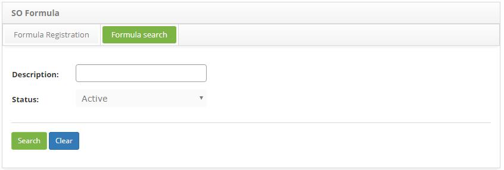
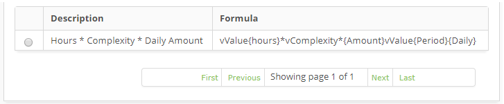
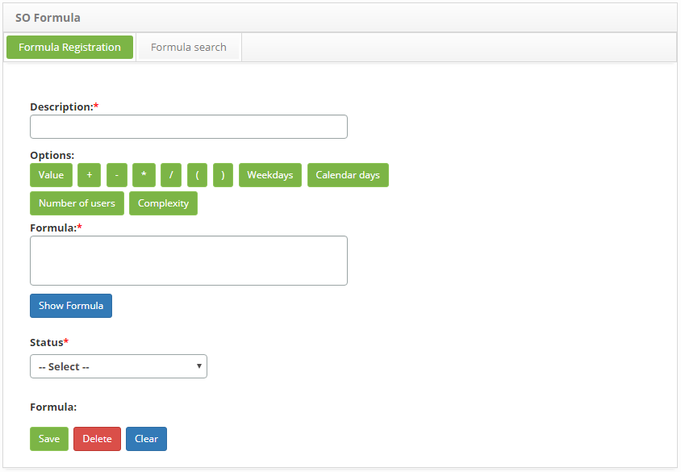
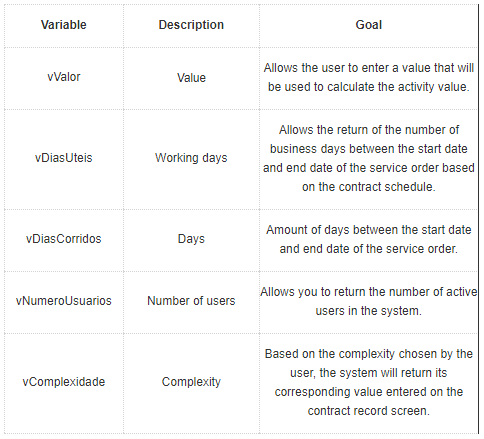
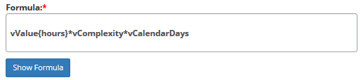
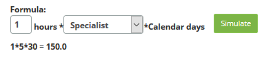

title: Service order formula registration and search
Description: This functionality is intended to record the custom formulas to configure "how" will be the calculation of the total cost value of the contract service activity.

# Service order formula registration and search

This functionality is intended to record the custom formulas to configure "how" will be the calculation of the total cost value of the contract service activity.

How to access
-----------

1. Access the SO Formula functionality through navigation in the main menu **Integrated Management > Contract Management > SO Formula**.

Preconditions
------------

1.  Not applicable.

Filters
-------

1. The following filters enables the user to restrict the participation of items in the standard feature listing, making it easier to find the desired items:

- Description;
- Status.

    
    
    **Figure 1 - Formula search screen**

2. Perform the formula search:

- Enter the description and/or status of the formula you want to search for and click the Search button. After that, the record will be displayed according to the data entered.
- If you want to list all the formula records, simply click the Search button directly.

Itens list
----------------

1. The following cadastral fields are available to the user to facilitate the identification of the desired items in the standard feature listing: Description and Formula.

    
    
    **Figure 2 - OS formula listing screen**

2. After searching, select the desired record. Once this is done, it will be directed to the registration screen displaying the contents of the selected registry;

3.To change the formula data, simply modify the information you want and click the Save button.

Filling in the registration fields
---------------------------------

1. The Formula Master screen will be displayed, as shown in the figure below:

    
    
    **Figure 3- SO formula registration screen**

2. Fill in the fields as directed below:

- Description: enter the name of the formula;
- Options: variables available to describe the formula. In the table below the purpose of these variables is presented for a better understanding.

    

    **Table 1 - Formula Variables**
    
     
    
    **Figure 4 - Example 1 of formula**

    -   **Fórmula**: neste campo, permite descrever a personalização da fórmula
    utilizando as variáveis pré-definidas (explicado acima).

3. After describing the formula, click the Show Formula button.

4. This button validates the formula where it verifies if it is correctly described and the following is the process for the calculation, which will consist of replacing the name of the variables with the value entered by the user or method of return corresponding to the variable, Transforming the formula text into a mathematical expression and returning its calculated result after you click Simulate.

5. All this for the user to have an idea if the calculation structure is as expected;

    
   
    **Figura 5 - Exemplo 2 de fórmula**

    !!! info "IMPORTANT"

         You can use the "{}" keys to delimit a text you wish to include in the formula, where it will not influence the calculation of the activity value.

6. If you add a numeric value next to a variable, it will be concatenated with it.

- Status: inform the situation of the formula.

7. After the data is entered, click the Save button to register, where the date, time and user will be saved automatically for a future audit;
    
    !!! note "NOTE"

        Before writing the formula the system must validate the syntax and only allow the recording if it is correct.

8. You will see a message confirming the success of the formula record.

!!! tip "About"

    <b>Product/Version:</b> CITSmart | 8.00 &nbsp;&nbsp;
    <b>Updated:</b>09/05/2019 – Anna Martins
