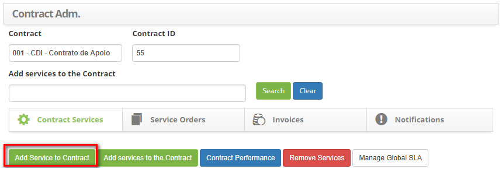
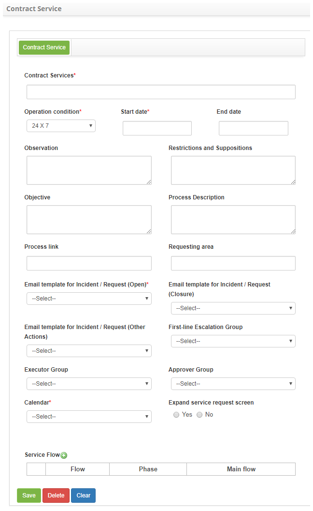
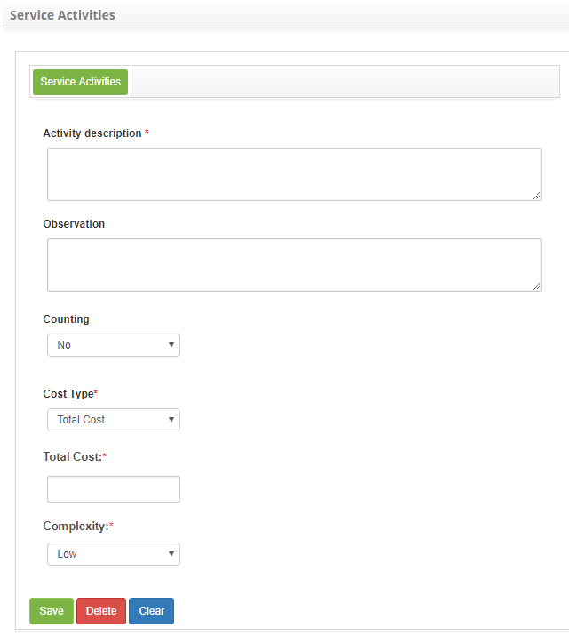
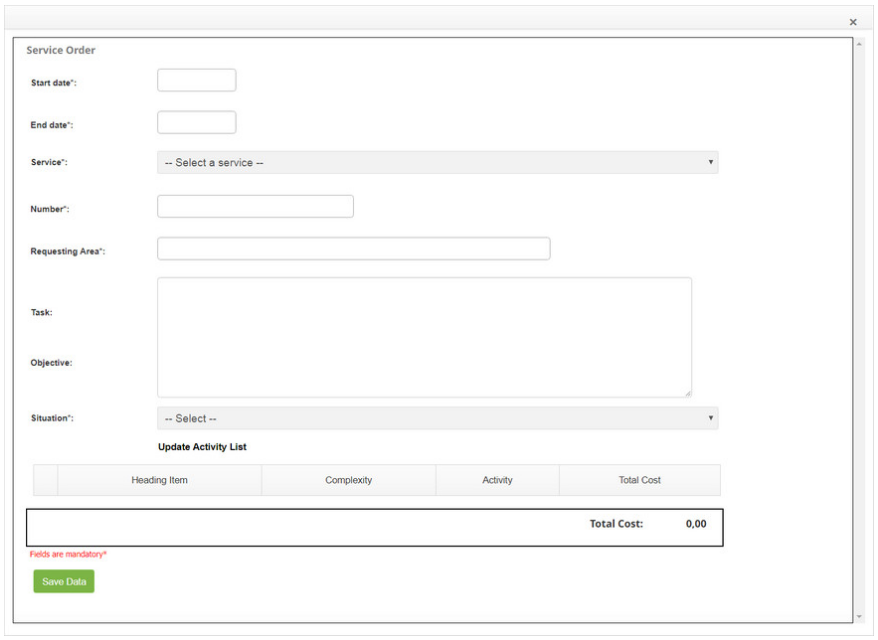
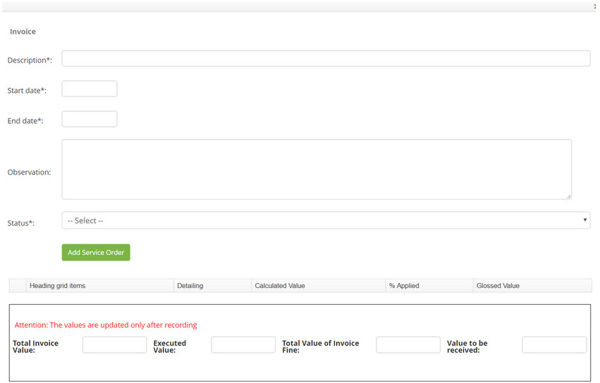

title: Contract administration

Description: Contract management is used to manage the contracts already registered in the system. 

# Contract administration

Contract management is used to manage the contracts already registered in the system. This process allows you to check, add, and delete services, as well as having links to creating Service Order (SO), billing, and notifications.

How to access
-----------

1.  Access the Contract Administration feature by navigating the main menu Integrated Management > Contracts Management > Contract Administration.

Preconditions
------------

1.  Register a group (see knowledge Group registration and search);

2. Register contract (see knowledge Contract registration and search);

3. Register services (see knowledge Service portfolio registration; Service registration ; Service activity registration);

4. Enter service level agreement (general) (see knowledge General service level agreement registration and search);

5. Enter e-mail template (see knowledge E-mail template configuration registration and search).

Filters
------

1. The following filters enables the user to restrict the participation of items in the standard feature listing, making it easier to find the desired items:

- Contract;
- Contract ID;
- Add services to the Contract.

2. The Contract Administration screen will be displayed, as shown in the figure below:

**Figure 1 - Contract search screen**

Itens list
----------

1.  The following cadastral fields are available to the user to facilitate the identification of the desired items in the standard feature listing: Service, Status, Type, Is there any SLA?, Start date and End date.

2. There are action buttons available to the user for each item in the listing, they are: Edit service, Service Level Agreements and Service Activities.

    
    
    **Figure 2 - Contract listing screen**

3.  In this screen, it allows to perform a series of actions regarding the existing contracts, being:

- Add Service to Contract;
- Add Services to the Contract;
- Contract Performance;
- Remove Services;
- Manage Global SLAs;

Linking a service to the contract
-------------------------------

1.  To link a service to the agreement, follow the steps below:

2. On the Contract Services tab, click the Add Service to Contract button, as shown in the figure below:

    
    
    **Figure 3 - Add service to contract button**

3.  The service contract link registration screen will be displayed, as shown in the figure below:

    
    
    **Figure 4 - Contract service registration screen**

4.  Fill in the fields as directed below:

   -  Contract Services: inform the service that will be linked to the contract;
   -  Operation Condition : select the period of execution of the service;
   -  Start date: enter the start date of the service link to the contract;
   -  End date: filling in this field can be done at the time of registration, informing a future date for inactivation of the service or only when it is inactivating the service;
   -  Observation: describe the possible observations regarding the service;
   -  Restrictions and Suppositions: inform the possible restrictions and assumptions for the execution of the service in the contract;
   -  Objective: inform the purpose of the service in the contract;
   -  Process Description: describe the service process in the contract;
   -  Process Link: inform the service process design link, if it exists;
   -  Requesting area: inform who can request the service;
   -  E-mail Template for Incident/request (Open): select the request-opening e-mail template to send notification when registering a service request;
   -  E-mail Template for Incident/Request (Closure): select the request completion template for sending notification at the end of a service request;
   -  E-mail Template for Incident/request (Other Actions): select the e-mail template of request progress for sending notification in the other actions performed in the service requests;
   -  First-line Escalation Group: select the group for 1st level attendance escalation;
   -  Executor group: define the executor group of the service, if it does not inform it, the group defined in parameter "Group ID Level 1" will be considered;
   -  Approver Group: define the approving group of the service;
   -  Calendar: select the calendar of work;
   -  Expand service request screen: if you want the service request screen to be enlarged, check the "yes" option;
   -  Enter the service workflow
        
        *  Click the service flow icon ;

        *  A window will appear for information on the flow of the service, as shown in the figure below:

   
    
   **Figure 5 - Service workflow record**

   -   Flow: select the flow that the service should follow;
   -   Phase: enter the phase at which the flow will start;
   -   Main Flow: inform if flow is main;

   !!! info "IMPORTANT"

         If it is necessary to make use of more than one flow, it is important to inform which is            the main one.

   *  Click Save to perform the operation.

5.  After the data is entered, click on the Save button to register, where the date, time and user will be saved automatically for a future audit.

Linking multiple services to the contract
-------------------------------------

1. To link multiple services to the agreement, follow the steps below:

2. On the Contract Services tab, click the Add services to the Contract button, as shown in the figure below:

    

    **Figure 6 - Add multiple services to contract button**

3.  The service link registration screen for the contract will be displayed, as shown in the figure below:

    
    
    **Figure 7 - Contract services registration screen**

4.  Fill in the fields as directed below:

- Operation Condition: select the period of execution of the services;
- Start date: inform the initial date of the services in the contract;
- End date: the filling of this field can be done at the time of registration, informing a future date for inactivation of the services or only when it is inactivating the services;
- Observation: please provide us with any information you consider pertinent;
- Restrictions and Suppositions: inform the possible restrictions and assumptions for the execution of the services in the contract;
- Objective: state the objective of the services in the contract;
- Process Description: describe the process of services in the contract;
- Process link: inform the process design link of the services;
- Requesting area: inform who can request the service;
- E-mail Template for Incident/request (Open): select the request-opening e-mail template to send notification when registering a service request;
- E-mail Template for Incident/Request (Closure): select the request completion template for sending notification at the end of a service request;
- E-mail Template for Incident/request (Other Actions): select the e-mail template of request progress for sending notification in the other actions performed in the service request;
- First-line Escalation Group: select the 1st level escalation group;
- Executor Group: define the executing group of the services, if it does not inform it, the group defined in the parameter "Group ID Level 1" will be considered;
- Approver Group: select the approving group of the services;
Calendar: select the calendar of work;

  - Please tell the services that will receive the configuration:
      - Click the icon ;
      - A window will appear for service search;
      - Perform the search and select the services you want.
  - Enter the service workflow:
      - Click the service flow icon;
      - A window will appear for information on the flow of the service, as shown in the figure below:

    

    **Figure 8 - Service workflow record**

    -   Flow: select the flow that the services should follow;
    -   Phase: enter the phase at which the flow will start;
    -   Main Flow: inform if the flow is the main one;

    !!! info "IMPORTANT"

         If it is necessary to make use of more than one flow, it is important to inform which will be the main one.

    - Click Save to perform the operation.

5. After the data has been entered, click the Save button to register, where the date, time and user will be saved automatically for a future audit.

Verifying contract services
---------------------------

1. To check the services already linked in the contract, follow the steps below:

2. In the Contract Service tab, all the services that are linked to the contract are shown, as shown in the figure below:

    
    
    **Figure 9 - Contract services**

3.  If you want to search for a specific service, simply enter its name in the Search Services Contract field and click the Search button..

Editing service link information to contract
--------------------------------------------

1.  Click the service icon  you want to edit;

2. The contract service link registration screen will appear with the fields filled with the content of the chosen service;

3. Change the desired data and click the Record button to save the change made to the contract service, where the date, time and user will be saved automatically for a future audit.

Linking specific SLA to contract service
----------------------------------------

1.  In the Contract Service tab, the services that are linked to the agreement are displayed.

2. Click the desired service icon . This will bring up two Link Agreement and Create Agreement specific for this service buttons;

3. Click the Create specific agreement for this service button .

4. After that, the specific service level agreement registration screen will be displayed, as shown in the figure below:

    
    
    **Figure 10 - Service level agreement record screen**

-  Agreement Type : state the type of service agreement;
   -  Availability : this type of agreement indicates the availability of the service, that is, if it is accessible for an agreed period of time. Eg: Have the service provider monitoring the client's company site full time to make sure that users can access the content of the site full time;
   -  Repeated failures: to measure the number of failures occurring during an agreed time and if it exceeds the combined quantity, impose the due penalties;
   -  OS - Expected Results: SO (Service Order) is a document that will provide execution permission for some service. This type of agreement stipulates the limit of this modality of document to the chosen service;
   -  Time (in stages): this type of agreement links the service time to a phase, that is, instead of calculating by time, the SLA will be calculated by a phase that corresponds to an agreed period for the capture period and execution;
   -  Information captured from several other sources: this type of agreement stipulates the limit of the OS (Service Order) to the chosen service.

    -   **Título do Acordo**: informe o título do acordo de nível de serviço;

    -   **Impacto**: informe o impacto que causa a ausência do funcionamento do
    serviço dentro do ambiente organizacional;

    -   **Urgência**: informe a urgência do restabelecimento do serviço dentro do
    ambiente organizacional;

    -   **Permite a mudança de Impacto e Urgência no registro da solicitação?**:
    defina se será permitido a mudança do impacto e urgência no registro de
    solicitação de serviço;

    -   **Descrição do Acordo**: descreva os detalhes sobre o acordo de nível de
    serviço;

    -   **Escopo do Acordo**: descreva uma visão macro sobre o acordo de nível de
    serviço;

    -   **Data de Início**: informe a data de início do acordo de nível de serviço;

    -   **Data Fim**: informe a data de encerramento do acordo de nível de serviço.
    A mesma pode ser informada no momento de encerramento do acordo;

    -   **Avaliar Em**: informe a data na qual o acordo de nível de serviço será
    avaliado;

    -   **Situação**: informe a situação do acordo de nível de serviço: Ativo (em
    uso corrente) ou Inativo (desabilitado);

    -   Se o tipo de acordo informado for **Disponibilidade**, informe o índice de
    disponibilidade do serviço:
    
    
    
    **Figura 11 - Índice**

6.  Informe o percentual de disponibilidade do serviço, isto é, se definir 90%
    significa que a partir de 10% de indisponibilidade sobre o serviço o
    contrato poderá sofrer algum tipo de penalidade acordada sobre ele;

7.  Se o tipo de acordo informado for **Falhas repetitivas**, informe os dados
    do acordo de serviço por falhas repetitivas:

    
    
    **Figura 12 - Acordo por falha**

    -   Caso deseje informar outros dados do acordo de serviço por falhas
    repetitiva, basta clicar no ícone  e preencher os campos;

    -   **Percentual de desconto**: Informe o percentual de desconto;

    -   **Quantidade de Glosas**: informe a quantidade de glosas;

    -   Se o tipo de acordo informado for **OS - Resultados esperados**, informe os
    dados de resultados esperados e níveis de qualidade exigidos:

    
    
    **Figura 13 - Acordo por falha**

    -   **Resultados esperados**: informe os resultados que se espera do serviço;

    -   **Limites**: informe o valor limite da glosa;

    -   **Glosa**: descreva sobre a glosa;

    -   **Limite Glosa**: informe o limite da glosa;

8.  Caso deseje informar outros dados de resultados esperados e níveis de
    qualidade exigidos, basta clicar no ícone  e preencher os campos;

9.  Se o tipo de acordo informado for **Tempo (por fase)**, defina os prazos de
    SLA (acordo de nível de serviço), levando em consideração a prioridade:

    

    **Figura 14 - Prazos de SLA**

    -   **Captura**: defina o tempo de captura da solicitação do serviço, conforme a
    prioridade;

    -   **Resolução**: defina o tempo de resolução do serviço, conforme a
    prioridade;

    -   **Tempo de Ação**: informe o tempo para execução da solicitação do serviço;

    -   **Prioridade**: informe a prioridade do serviço;

    -   **Grupo**: informe o grupo executor do serviço.

    !!! note "NOTA"

        Após os N minutos configurados e caso não tenha realizado nenhuma ação na
        solicitação do serviço, o sistema atribuirá a Prioridade e escalará o Grupo
        que foram configurados para execução da solicitação do serviço.

1.  Indique a prioridade do serviço para cada unidade;

2.  Se o tipo de acordo informado for **Informações diversas capturadas de
    outras fontes**, informe os dados de **acordo de serviço**:

    
    
    **Figura 15 - Acordo de serviço**

    -   **Valor Limite**: informe o valor limite da glosa;

    -   **Unidade (do Valor Limite)**: informe a unidade monetário do valor limite
    da glosa;

    -   **Glosa**: descreva sobre a glosa;

    -   **Limite Glosa**: informe o limite da glosa.

1.  Após os dados informados, clique no botão *Gravar Dados* para efetuar a
    operação, onde a data, hora e usuário serão gravados automaticamente para
    uma futura auditoria;

2.  Para editar um acordo de nível de serviço que foi adicionado ao serviço de
    contrato, basta clicar no ícone   ao lado do acordo;

3.  Para copiar o acordo de nível de serviço para outros serviços do contrato,
    basta clicar no ícone   ao lado do acordo;

4.  Para excluir um acordo de nível de serviço que foi adicionado ao serviço de
    contrato, clique no ícone   ao lado do acordo, onde será aberta a tela de
    acordo de nível de serviço e clique no botão *Excluir Dados*.

Vinculando SLA global ao serviço do contrato
-------------------------------------------

1.  Para vincular um SLA global ao Serviço do Contrato é necessário ter
    realizado o cadastro do Acordo de Nível de Serviço Global.

2.  Há duas formas de vincular o SLA global ao Serviço do Contrato, sendo:

**Primeira forma:**

1.  Na guia de **Serviços do Contrato**, clique no botão *Gerenciar SLAs
    Globais*, conforme indicado na figura abaixo:

    

    **Figura 16 - Acordo de nível de serviço global**

1.  Será apresentada a tela de Acordo de Nível de Serviço Global para realização
    do vínculo do SLA Global com Serviço do Contrato:

    

    **Figura 17 -** **Vínculo do acordo de nível de serviço global ao serviço do
    contrato**

1.  Selecione o Acordo de Nível de Serviço que deseja vincular ao Serviço do
    Contrato;

2.  Ao selecionar o acordo de nível de serviço será exibida uma lista de
    Serviços do Contrato;

3.  Selecione os serviços desejados e clique no botão *Gravar* para realização
    do vínculo do SLA com os serviços.

**Segunda forma**:

1.  Na guia de **Serviço do Contrato**, são apresentados os serviços que estão
    vinculados ao contrato. Clique no ícone   do serviço desejado;

2.  Feito isso, serão exibidos dois botões *Vincular Acordo* e *Criar Acordo
    específico para este serviço*;

3.  Clique no botão *Vincular Acordo;*

4.  Após isso, será apresentada a tela para realização do vínculo do SLA com
    Serviço, conforme ilustrada na figura abaixo:

    
    
    **Figura 18 - Vínculo do acordo de nível de serviço global ao serviço do
     contrato**

1.  Preencha os campos conforme orientação abaixo:

    -   **Acordo de Nível de Serviço**: selecione o acordo de nível de serviço;

    -   **Data Início**: informe a data de início do vínculo do acordo de nível de
    serviço ao serviço do contrato;

    -   **Data Fim**: informe a data final do vínculo do acordo de nível de serviço
    ao serviço do contrato, caso seja necessário;

    -   **Recursos (Disponibilidade)**: informe os recursos, caso o acordo de nível
    de serviço selecionado seja do tipo "Disponibilidade".

1.  Após os dados informados, clique no botão *Gravar Dados* para realização do
    vínculo do SLA com Serviço do Contrato, onde a data, hora e usuário serão
    gravados automaticamente para uma futura auditoria;

2.  Após o vínculo do acordo de nível de serviço ao serviço, clique
    em *Habilita* para que o SLA seja habilitado;

3.  Para editar um acordo de nível de serviço que foi vinculado ao serviço de
    contrato, basta clicar no ícone   ao lado do acordo.

Registrando atividades do serviço do contrato
--------------------------------------------

1.  Na guia de  **Serviço do Contrato**, são apresentados os serviços que estão
    vinculados ao contrato;

2.  Clique no ícone   do serviço desejado;

3.  Feito isso, será exibido o botão *Adicionar Nova Atividade* acima das
    atividades já existentes, clique no mesmo;

4.  Após isso, será exibida a tela de registro de atividade, conforme ilustrada
    na figura abaixo:

    
    
    **Figura 19 - Registro de atividades do serviço**

1.  Preencha os campos conforme orientação abaixo:

    -   **Descrição de Atividade**: descreva a atividade que será executada para
    entrega do serviço;

    -   **Observações**: descreva as observações da atividade, caso seja necessário;

    -   **Contabilizar**: informe se a atividade é para contabilizar as solicitações
    do serviço do contrato. Se "sim", informe o serviço do contrato;

    !!! info "IMPORTANTE"

         A contabilização será feita das solicitações "fechadas", no período da OS
         (Ordem de Serviço), do serviço do tipo requisição/incidente informado.

   - **Tipo custo**: selecione o tipo de custo da atividade.

6.  Se o tipo de custo selecionado for **Custo Total**, proceda da seguinte
    forma:

    

    **Figura 20 - Custo Total**

    -   **Custo Total**: indicar o valor quantitativo corresponde ao custo da
    atividade acordado no contrato;

    -   **Complexidade**: informar o nível de complexidade (dificuldade)
    correspondente que a atividade requer para o desenvolvimento da tarefa.

7.  Se o tipo de custo selecionado for **Fórmula**, proceda da seguinte forma:

    
    
    **Figura 21 - Fórmula**

    -   Selecione a **fórmula** que será utilizada para obter o custo total da
    atividade do serviço, conforme estabelecida no contrato. Após isso, serão
    exibidos campos para serem preenchidos com os valores para o cálculo;

    -   **Horas**: definir as horas por dia, a serem trabalhadas dentro do período
    necessário para executar a tarefa;

    -   **Complexidade**: informar o nível de complexidade (dificuldade)
    correspondente que a atividade requer para o desenvolvimento da tarefa,
    lembre-se que os valores para este item já devem ter sido previamente
    cadastrados na tela de cadastro de contrato;

    -   **Quantidade**: campo referente ao período. Serve para indicar o número de
    vezes que essa atividade foi executada dentro do período. Exemplo:

    -   **Quantidade: 1. Período Mensal**: a atividade é realizada uma vez por mês;

    -   **Quantidade: 1. Período Semanal**: a atividade é realizada uma vez por
    semana;

    -   **Quantidade: 2. Período Diário**: a atividade é executada durante dois
    períodos por dia.

8.  Após os dados informados, clique no botão *Gravar* para efetuar a operação,
    onde a data, hora e usuário serão gravados automaticamente para uma futura
    auditoria;

9.  Para editar uma atividade que foi adicionada ao serviço do contrato, basta
    clicar no ícone   ao lado da mesma;

10.  Para excluir uma atividade que foi adicionada ao serviço do contrato, basta
    clicar no ícone   ao lado da mesma, onde será aberta a tela de atividade do
    serviço e clicar no botão *Excluir Dados* para efetuar a operação.

Verificando o desempenho do contrato
----------------------------------

1.  Na guia de  **Serviço do Contrato**, clique no botão *Desempenho do
    Contrato*. Feito isso, serão apresentadas as informações sobre o desempenho
    do contrato por serviço, conforme exemplo ilustrado na figura abaixo:

    
    
    **Figura 22 - Desempenho do contrato por serviço**

Excluindo vínculo dos serviços com o contrato
--------------------------------------------

1.  Na guia de **Serviço do Contrato**, são apresentados os serviços que estão
    vinculados ao contrato;

2.  Selecione os serviços que deseja excluir e clique no botão *Remover
    Serviço(s) do Contrato*, conforme indicado na figura abaixo:

    

    **Figura 23 - Exclusão de serviços do contrato**

1.  Será exibida uma mensagem para confirmação da exclusão dos serviços, basta
    clicar em *OK* para efetuar a operação;

2.  Feito isso, será excluído com sucesso o vínculo dos serviços com o contrato.

Ordens de serviços (os)
----------------------

*Ordem de Serviço é um documento que irá fornecer a permissão de execução
relativa a algum serviço*.

1.  Na tela de **Administração de Contrato**, informe o contrato desejado e
    clique na guia **Ordens de Serviço**. Feito isso, será apresentada a tela
    onde permite verificar e gerenciar as ordens de serviços, conforme ilustrada
    na figura abaixo:

    
    
    **Figura 24 - Ordens de serviço**

1.  Nesta tela, é possível criar novas Ordens de Serviços, verificar as Ordens
    de Serviços do contrato e executar uma série de ações nas Ordens de Serviços
    existentes, sendo:

    -   Gerar Relatório de Atividade;

    -   Executar Ordem de Serviço;

    -   Imprimir Relatório de Atividade.

1.  Nos próximos tópicos será abordado sobre como proceder com essas ações.

Criando ordem de serviço (os)
----------------------------

1.  Para criar uma OS é necessário que o usuário tenha permissão para abertura
    de OS e que os seguintes procedimentos tenham sido realizados:

    -   Cadastro do serviço do tipo "Ordem de Serviço";

    -   Vínculo do serviço ao contrato (ver sessão *Vinculando um Serviço ao
    Contrato*);

    -   Vínculo do acordo de nível de serviço do tipo "OS - Resultados Esperados" ao
    serviço do contrato (ver sessão *Vinculando SLA Global ao Serviço do
    Contrato*);

    -   Registro das atividades, com os seus respectivos valores, sendo um custo
    total ou calculado por fórmula, do serviço do contrato (ver
    sessão *Registrando Atividades do Serviço do Contrato*).

1.  Na guia de **Ordem de Serviço**, clique no botão *Criar Ordem de Serviço*.
    Será apresentada a tela de registro de Ordem de Serviço, conforme ilustrada
    na figura abaixo:

    
    
    **Figura 25 - Registro de ordem de serviço**

1.  Preencha os campos conforme orientação abaixo:

    -   **Data Início**: informe a data de início da ordem de serviço;

    -   **Data Fim**: informe a data final da ordem de serviço;

    -   **Serviço**: selecione o serviço. Após selecionar o serviço, as informações
    referentes ao mesmo irão aparecer, incluindo suas atividades e seus
    respectivos valores;

    !!! info "IMPORTANTE"

        Será realizado o arredondamento do custo total da OS, após a soma dos
        custos totais de cada atividade do serviço.

   -   **Número**: informe o número da ordem de serviço;

   -   **Área requisitante**: informe a área requisitante da ordem de serviço;

   -   **Tarefa/Demanda**: descreva a tarefa/demanda da ordem de serviço;

   -   **Objetivo**: descreve o objetivo da ordem de serviço;

   -   **Situação**: selecione a situação da ordem de serviço;

   -   Caso o parâmetro "**243 - Ativar assinaturas personalizadas no relatório de
    Ordens de Serviço**" esteja habilitado, será exibido o campo **Grupo de
    Assinaturas**, onde deverá selecionar o grupo de assinaturas a ser
    utilizadas na impressão do relatório de ordem de serviço. A figura abaixo
    ilustra esse campo:

   
    
   **Figura 26 - Campo grupo de assinaturas**

4.  Após os dados informados, clique no botão *Gravar Dados* para efetuar o
    registro, onde a data, hora e usuário serão gravados automaticamente para
    uma futura auditoria.

Verificando as informações de ordem de serviço
---------------------------------------------

1.  Na guia de **Ordem de Serviço**, são apresentadas as ordens de serviços do
    contrato, conforme ilustrado na figura abaixo:

    
    
    **Figura 27 - Consulta de ordens de serviço**

1.  Utilize os botões contidos na barra (todas, em criação, solicitada,
    autorizada, aprovadas, em execução, executada e canceladas) para verificar
    as ordens de serviço por situação. Também poderá ser feita a busca das
    ordens de serviço por período.

    -   Ao clicar em um dos botões, serão listadas as Ordens de Serviços de
        acordo com a situação selecionada;

    -   Caso queira realizar uma consulta de Ordens de Serviços por período,
        basta informar o período desejado nos campos referentes e clicar em um
        dos botões;

    -   Ao lado de cada registro de Ordem de Serviço, serão exibidos ícones que
        possibilitarão a edição da OS, impressão da OS e RA, geração de RA e
        execução da OS.

Editando ordem de serviço
------------------------

1.  Para editar uma OS, proceda da seguinte forma:

-   Clique no ícone   ao da OS que deseja editar. Feito isso, será apresentada a
    tela de registro da ordem de serviço com os campos preenchidos com o
    conteúdo referente à OS escolhida para edição;

-   Altere os dados que achar necessário, como por exemplo, a situação da OS e
    clique no botão *Gravar* para efetuar a operação, onde a data, hora e
    usuário serão gravados automaticamente para uma futura auditoria.

Gerando impressão de ordem de serviço
------------------------------------

1.  Para gerar impressão de uma OS, proceda da seguinte forma:

-   Clique no ícone   da OS. Feito isso, será aberto o relatório da OS em
    formato PDF para impressão;

-   Clique no ícone   da OS. Feito isso, será aberto o relatório da OS em
    formato Excel para impressão.

   !!! note "NOTA"

       O R.A. só pode ser gerado a partir das ordens de serviço com uma situação
       "Aprovado".

Gerando R.A. (relatório de atividade)
------------------------------------

1.  Clique no ícone   da OS aprovada. Feito isso, será exibida uma janela para
    registro das informações a respeito da geração do relatório de atividade;

    
    
    **Figura 28 - Tela de geração de R.A.**

    -   **Data de início**: informe a data inicial da execução das atividades do
    serviço;

    -   **Data final**: informe a data final da execução das atividades do serviço;

    -   **Quantidade**: informe a quantidade executada das atividades do serviço. A
    quantidade informada neste campo, multiplicará o custo da OS no R.A.;

    -   Após os dados informados, clique no botão *Gravar* para efetuar a operação,
    onde a data, hora e usuário serão gravados automaticamente para uma futura
    auditoria.

     !!! note "NOTA"

          O R.A. (Relatório de Atividade) serve para comprovar que o serviço foi
          entregue.

Executando ordem de serviço
--------------------------

!!! note "NOTA"

    Somente as Ordens de Serviço que foram geradas R.A. (Relatório de
    atividades) podem ser executadas.

1.  Após geração do R.A da OS, clique em *Em execução* e logo após no ícone   da
    OS para expandir a área. Feito isso, serão exibidos os R.A. da OS, conforme
    exemplo ilustrado na figura abaixo:

    
    
    **Figura 29 - R.A. da ordem de serviço**

1.  Clique no ícone do R.A. da OS. Após isso, será apresentada a tela de
    registro da Ordem de Serviço;

2.  Registre os dados necessários da execução da OS, modifique a situação da
    mesma para "Executada" e clique no botão *Gravar Dados*para efetuar a
    operação, onde a data, hora e usuário serão gravados automaticamente para
    uma futura auditoria;

3.  Clique no ícone   do R.A. da OS para geração do relatório de R.A. em formato
    PDF;

4.  Clique no ícone   do R.A. da OS para geração do relatório de R.A. em formato
    Excel.

!!! info "IMPORTANTE"

    Após execução da OS, pode ser gerada uma fatura para mesma.

Faturas
-------

1.  Na tela de **Administração de Contrato**, informe o contrato desejado e
    clique na guia **Faturas**. Feito isso, será apresentada a tela onde permite
    verificar e gerenciar as faturas do contrato, conforme ilustrada na figura
    abaixo:

    
    
    **Figura 30 - Faturas do contrato**

1.  Nesta tela, é possível criar novas faturas, verificar as faturas do contrato
    e atualizar a situação das mesmas. Nos próximos tópicos será abordado sobre
    como proceder com essas ações.

Criando fatura
--------------

1.  Na guia de **Faturas**, clique no botão *Criar Fatura*. Será apresentada a
    tela de registro de fatura, conforme ilustrada na figura abaixo:

    

    **Figura 31 - Criação de faturas**

1.  Preencha os campos conforme orientação abaixo:

    -   **Descrição**: informe a descrição da fatura;

    -   **Data Início**: informe a data de início da fatura;

    -   **Data Fim**: informe a data final da fatura;

    -   **Observação**: informe alguma observação que achar necessária;

    -   **Situação**: selecione a situação da fatura (em criação, aguardando
    aprovação, aprovada, rejeitada, em recebimento, recebida ou cancelada);

1.  Adicione a Ordem de Serviço (OS) à fatura:

    -   Clique no botão *Adicionar OS*;

    -   Será apresentada uma janela contendo as OS que foram executadas para
        associar à fatura;

    -   Selecione a OS desejada;

    -   Clique em *Associar* para efetuar a operação;

    -   Será exibida uma mensagem confirmando o sucesso da operação.

        -   Na parte inferior da tela de **Fatura**, serão exibidos os Acordos
            de Nível de Serviço do Contrato. Para cada acordo, informe
            o **detalhamento**, **valor apurado**, **% aplicado** e **valor
            glosado**;

        -   Os campos **Valor total da Fatura**, **Valor Executado**, **Valor de
            Total de Glosas da Fatura** e **Valor a receber** serão calculados
            após a gravação da fatura.

2.  Após os dados informados, clique no botão *Gravar Dados* para efetuar o
    registro, onde a data, hora e usuário serão gravados automaticamente para
    uma futura auditoria.

Verificando as informações de faturas
------------------------------------

1.  Na guia de **Faturas**, são apresentadas as faturas do contrato, conforme
    ilustrado na figura abaixo:

    

    **Figura 32 - Consulta de faturas**

1.  Utilize os botões contidos na barra (todas, em criação, aguardando
    aprovação, aprovadas, em recebimento, recebidas, rejeitadas e canceladas)
    para verificar as faturas por situação. Também poderá ser feita a busca das
    faturas por período.

    -   Ao clicar em um dos botões, serão listadas as faturas de acordo com a
    situação selecionada;

    -   Caso queira realizar a pesquisa da fatura por período, basta informar o
    período desejado nos campos referentes e clicar em um dos botões;

    -   Ao lado de cada fatura, serão exibidos ícones que possibilitarão a edição da
    fatura (em criação), impressão da fatura e apontamento da situação para
    fatura.

Editando fatura
--------------

!!! info "IMPORTANTE"

    Somente as faturas que estão "na criação" podem ser editadas.

1.  Clique no ícone  da fatura que deseja editar. Feito isso, será apresentada
    o registro de fatura com os campos preenchidos com o conteúdo referente à
    fatura escolhida para edição;

2.  Altere os dados necessários e clique em *Gravar Dados* para efetuar a
    operação, onde a data, hora e usuário serão gravados automaticamente para
    uma futura auditoria.

Gerando impressão da fatura
--------------------------

1.  Clique no ícone   da fatura. Feito isso, será exibido o relatório da fatura
    em formato PDF;

2.  Clique no ícone   da fatura. Feito isso, será exibido o relatório da fatura
    em formato Excel.

Apontando situação para fatura
-----------------------------

1.  Para apontar uma situação para uma fatura, ou seja, alterar a situação da
    fatura, proceda da seguinte forma:

-   Clique no ícone   da fatura que deseja apontar uma situação. Feito isso,
    será apresentado o registro da fatura com os campos preenchidos com o
    conteúdo referente à fatura escolhida para apontar uma situação;

-   Aponte a situação que deseja para a fatura e clique em *Atualizar Situação
    da Fatura* para efetuar a operação.

Notificações
-----------

1.  Na tela de **Administração de Contratos**, informe o contrato desejado e
    clique na guia **Notificações;**

2.  Feito isso, será apresentada a tela onde permite adicionar notificações
    referente ao contrato, conforme ilustrada na figura abaixo:

    
    
    **Figura 33 - Notificação do contrato**

1.  No próximo tópico será abordado sobre como adicionar notificações ao
    contrato.

Adicionando notificação
----------------------

1.  Na guia de **Notificação**, clique no botão *Adicionar Notificação*;

2.  Será apresentada a tela de notificação, conforme ilustrada na figura abaixo:

    
    
    **Figura 34 - Notificação**

    -   **Título**: informe o título da notificação;

    -   **Notifica-me somente quando**: selecione a situação de quando deve ser
    notificado o usuário e/ou grupo;

    -   Informe os usuários que serão notificados.

1.  Clique no ícone   . Feito isso, será exibida a tela para pesquisa de
    usuário. Realize a pesquisa do usuário desejado e selecione o mesmo;

2.  Informe os grupos que serão notificados;

3.  Clique no ícone   . Feito isso, será exibida a tela para pesquisa de grupo.
    Realize a pesquisa do grupo desejado e selecione o mesmo;

4.  Selecione os serviços do contrato, os quais deseja receber notificações
    sobre suas alterações;

5.  Após os dados informados, clique no botão *Gravar* para efetuar o registro,
    onde a data, hora e usuário serão gravados automaticamente para uma futura
    auditoria.

!!! tip "About"

    <b>Product/Version:</b> CITSmart | 8.00 &nbsp;&nbsp;
    <b>Updated:</b>07/19/2019 – Anna Martins

[1]:/pt-br/citsmart-platform-7/processes/portfolio-and-catalog/register.html

[2]:/pt-br/citsmart-platform-7/processes/portfolio-and-catalog/services.html

[3]:/pt-br/citsmart-platform-7/processes/portfolio-and-catalog/activity.html
