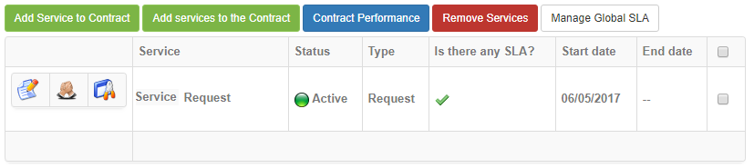
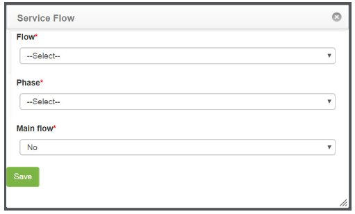
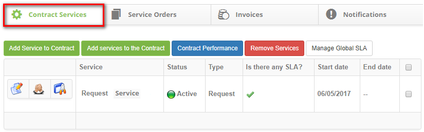
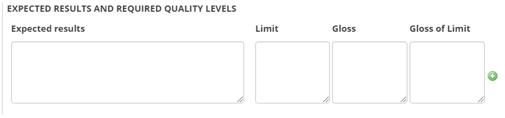
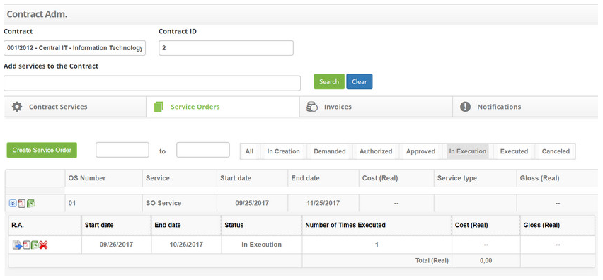

title: Contract administration
Description: Contract management is used to manage the contracts already registered in the system. 

# Contract administration

Contract management is used to manage the contracts already registered in the system. This process allows you to check, add, and delete services, as well as having links to creating Service Order (SO), billing, and notifications.

How to access
-----------

1.  Access the Contract Administration feature by navigating the main menu Integrated Management > Contracts Management > Contract Administration.

Preconditions
------------

1. Register a group (see knowledge [Group registration and search][1]);

2. Register contract (see knowledge [Contract registration and search][2]);

3. Register services (see knowledge [Service portfolio registration][3]; [Service registration][4] ; [Service activity registration][5]);

4. Enter service level agreement (general) (see knowledge [General service level agreement registration and search][6]);

5. Enter e-mail template (see knowledge [E-mail template configuration registration and search][7]).

Filters
------

1. The following filters enables the user to restrict the participation of items in the standard feature listing, making it easier to find the desired items:

- Contract;
- Contract ID;
- Add services to the Contract.

2. The Contract Administration screen will be displayed, as shown in the figure below:

**Figure 1 - Contract search screen**

Itens list
----------

1.  The following cadastral fields are available to the user to facilitate the identification of the desired items in the standard feature listing: Service, Status, Type, Is there any SLA?, Start date and End date.

2. There are action buttons available to the user for each item in the listing, they are: Edit service, Service Level Agreements and Service Activities.

    
    
    **Figure 2 - Contract listing screen**

3.  In this screen, it allows to perform a series of actions regarding the existing contracts, being:

- Add Service to Contract;
- Add Services to the Contract;
- Contract Performance;
- Remove Services;
- Manage Global SLAs;

Linking a service to the contract
-------------------------------

1.  To link a service to the agreement, follow the steps below:

2. On the Contract Services tab, click the Add Service to Contract button, as shown in the figure below:

    
    
    **Figure 3 - Add service to contract button**

3.  The service contract link registration screen will be displayed, as shown in the figure below:

    
    
    **Figure 4 - Contract service registration screen**

4.  Fill in the fields as directed below:

   -  Contract Services: inform the service that will be linked to the contract;
   -  Operation Condition : select the period of execution of the service;
   -  Start date: enter the start date of the service link to the contract;
   -  End date: filling in this field can be done at the time of registration, informing a future date for inactivation of the service or only when it is inactivating the service;
   -  Observation: describe the possible observations regarding the service;
   -  Restrictions and Suppositions: inform the possible restrictions and assumptions for the execution of the service in the contract;
   -  Objective: inform the purpose of the service in the contract;
   -  Process Description: describe the service process in the contract;
   -  Process Link: inform the service process design link, if it exists;
   -  Requesting area: inform who can request the service;
   -  E-mail Template for Incident/request (Open): select the request-opening e-mail template to send notification when registering a service request;
   -  E-mail Template for Incident/Request (Closure): select the request completion template for sending notification at the end of a service request;
   -  E-mail Template for Incident/request (Other Actions): select the e-mail template of request progress for sending notification in the other actions performed in the service requests;
   -  First-line Escalation Group: select the group for 1st level attendance escalation;
   -  Executor group: define the executor group of the service, if it does not inform it, the group defined in parameter "Group ID Level 1" will be considered;
   -  Approver Group: define the approving group of the service;
   -  Calendar: select the calendar of work;
   -  Expand service request screen: if you want the service request screen to be enlarged, check the "yes" option;
   -  Enter the service workflow
        
        *  Click the service flow icon ;

        *  A window will appear for information on the flow of the service, as shown in the figure below:

   
    
   **Figure 5 - Service workflow record**

   -   Flow: select the flow that the service should follow;
   -   Phase: enter the phase at which the flow will start;
   -   Main Flow: inform if flow is main;

   !!! info "IMPORTANT"

         If it is necessary to make use of more than one flow, it is important to inform which is            the main one.

   *  Click Save to perform the operation.

5.  After the data is entered, click on the Save button to register, where the date, time and user will be saved automatically for a future audit.

Linking multiple services to the contract
-------------------------------------

1. To link multiple services to the agreement, follow the steps below:

2. On the Contract Services tab, click the Add services to the Contract button, as shown in the figure below:

    

    **Figure 6 - Add multiple services to contract button**

3.  The service link registration screen for the contract will be displayed, as shown in the figure below:

    
    
    **Figure 7 - Contract services registration screen**

4.  Fill in the fields as directed below:

- Operation Condition: select the period of execution of the services;
- Start date: inform the initial date of the services in the contract;
- End date: the filling of this field can be done at the time of registration, informing a future date for inactivation of the services or only when it is inactivating the services;
- Observation: please provide us with any information you consider pertinent;
- Restrictions and Suppositions: inform the possible restrictions and assumptions for the execution of the services in the contract;
- Objective: state the objective of the services in the contract;
- Process Description: describe the process of services in the contract;
- Process link: inform the process design link of the services;
- Requesting area: inform who can request the service;
- E-mail Template for Incident/request (Open): select the request-opening e-mail template to send notification when registering a service request;
- E-mail Template for Incident/Request (Closure): select the request completion template for sending notification at the end of a service request;
- E-mail Template for Incident/request (Other Actions): select the e-mail template of request progress for sending notification in the other actions performed in the service request;
- First-line Escalation Group: select the 1st level escalation group;
- Executor Group: define the executing group of the services, if it does not inform it, the group defined in the parameter "Group ID Level 1" will be considered;
- Approver Group: select the approving group of the services;
Calendar: select the calendar of work;

  - Please tell the services that will receive the configuration:
      - Click the icon ;
      - A window will appear for service search;
      - Perform the search and select the services you want.
  - Enter the service workflow:
      - Click the service flow icon (images/manage-5.png);
      - A window will appear for information on the flow of the service, as shown in the figure below:

    

    **Figure 8 - Service workflow record**

    -   Flow: select the flow that the services should follow;
    -   Phase: enter the phase at which the flow will start;
    -   Main Flow: inform if the flow is the main one;

    !!! info "IMPORTANT"

         If it is necessary to make use of more than one flow, it is important to inform which will be the main one.

    - Click Save to perform the operation.

5. After the data has been entered, click the Save button to register, where the date, time and user will be saved automatically for a future audit.

Verifying contract services
---------------------------

1. To check the services already linked in the contract, follow the steps below:

2. In the Contract Service tab, all the services that are linked to the contract are shown, as shown in the figure below:

    
    
    **Figure 9 - Contract services**

3.  If you want to search for a specific service, simply enter its name in the Search Services Contract field and click the Search button..

Editing service link information to contract
--------------------------------------------

1.  Click the service icon  you want to edit;

2. The contract service link registration screen will appear with the fields filled with the content of the chosen service;

3. Change the desired data and click the Record button to save the change made to the contract service, where the date, time and user will be saved automatically for a future audit.

Linking specific SLA to contract service
----------------------------------------

1.  In the Contract Service tab, the services that are linked to the agreement are displayed.

2. Click the desired service icon . This will bring up two Link Agreement and Create Agreement specific for this service buttons;

3. Click the Create specific agreement for this service button .

4. After that, the specific service level agreement registration screen will be displayed, as shown in the figure below:

    
    
    **Figure 10 - Service level agreement record screen**

5.  Fill in the fields as directed below:

-   **Agreement Type**: state the type of service agreement;

    -   **Availability**: this type of agreement indicates the availability of
        the service, that is, if it is accessible for an agreed period of time.
        Eg: Have the service provider monitoring the client's company site full
        time to make sure that users can access the content of the site full
        time;

    -   **Repeated failures**: to measure the number of failures occurring
        during an agreed time and if it exceeds the combined quantity, impose
        the due penalties;

    -   **OS - Expected Results**: SO (Service Order) is a document that will
        provide execution permission for some service. This type of agreement
        stipulates the limit of this modality of document to the chosen service;

    -   **Time (in stages)**: this type of agreement links the service time to a
        phase, that is, instead of calculating by time, the SLA will be
        calculated by a phase that corresponds to an agreed period for the
        capture period and execution;

    -   **Information captured from several other sources**: this type of
        agreement stipulates the limit of the OS (Service Order) to the chosen
        service.

-   **Agreement Title**: enter the title of the service level agreement;

-   **Impact**: report the impact that causes the absence of service operation
    within the organizational environment;

-   **Urgency**: report the urgency of restoring service within the
    organizational environment;

-   **Allow impact/urgency change?**: define if it will be allowed to change the
    impact and urgency in the registration of service request;

-   **Agreement description **: describe the details of the service level
    agreement;

-   **Agreement Scope**: describe a macro view on the service level agreement;

-   **Start date**: enter the start date of the service level agreement;

-   **End date**: enter the end date of the service level agreement. It may be
    informed at the time of closure of the agreement;

-   **Evaluate**: enter the date on which the service level agreement will be
    evaluated;

-   **Situation**: report the service level agreement status: active (in current
    use) or Inactive (disabled);

-   If the type of informed agreement is **Availability**, enter the service
    availability index:

**Figure 11 - Index**

6.  Inform the percentage of availability of the service, that is, if you define
    90% means that from 10% of downtime on the service the contract may suffer
    some type of agreed penalty on it.

7.  If the reported agreement type is **Repetitive Failures**, enter service
    agreement data for repetitive faults:

**Figure 12 - Agreement by failure**

8.  If you wish to enter other service agreement data due to repetitive faults,
    simply click on the icon  and fill in the fields.

9.  **Discount percentage**: enter the percentage of discount;

10.  **Amount of Glosses**: enter the number of glosses;

11.  If the type of agreement informed is **OS - Expected results**, please
    report expected performance data and required quality levels:

**Figure 13 - Agreement by failure**

-   **Expected results**: report the results expected from the service;

-   **Limit**: enter the limit value of the gloss;

-   **Gloss**: describe on the gloss;

-   **Gloss of limit**: enter the gloss limit.

12.  If you wish to inform other expected results and required quality levels,
    simply click on the icon   and fill in the fields.

13.  If the type of informed agreement is **Time (in stages)**, set SLA (Service
    Level Agreement) deadlines, taking priority into account:

**Figure 14 - SLA deadlines**

-   **Capture**: set the capture time of the service request, according to the
    priority;

-   **Resolution**: set the resolution time of the service, according to
    priority;

-   **Action Time**: enter the time for executing the service request;

-   **Priority**: enter the priority of the service;

-   **Group**: report the executing group of the service;

   !!! note "NOTE"

     After the N minutes are configured and if you have not performed any
     action on the service request, the system assigns the Priority and scales
     the Group that has been configured to execute the service request.

14.  Indicate the service priority for each unit;

15.  If the type of agreement informed is **Information captured from several
    other sources**, please inform service agreement data:

**Figure 15 - Service agreement**

-   **Value limit**: enter the lmit value of the gloss;

-   **Unit (Limit Value)**: inform the monetary unit of the limit value of the
    gloss;

-   **Gloss**: describe on the gloss;

-   **Gloss limit**: enter the gloss limit.

16.  After the data is entered, click the *Save* button to perform the operation,
    where the date, time and user will be saved automatically for a future
    audit.

17.  To edit a service level agreement that has been added to the contract
    service, simply click the icon  next to the agreement.

18.  To copy the service level agreement for other contract services, simply
    click the icon next to the agreement.

4.  To delete a service level agreement that was added to the contract service,
    click the icon  next to the agreement, where the service level agreement screen opens, and
    click the *Delete* button.

Linking global sla to contract service
--------------------------------------

1.  To link a global SLA to the Contract Service you must have completed the
    Global Service Level Agreement.

2.  There are two ways to link the global SLA to the Contract Service:

**First way:**

1.  On the **Contract Services** tab, click the *Manage Global SLAs* button, as
    shown in the figure below:

**Figure 16 - Global service level agreement**

1.  The Global Service Level Agreement screen for performing the global SLA link
    with Contract Service will be displayed:

**Figure 17 - Linking the global service level agreement to the contract
service**

1.  Select the Service Level Agreement you wish to link to the Contract Service;

2.  Selecting the service level agreement will display a list of Contract
    Services;

3.  Select the desired services and click the *Save* button to perform the SLA
    link with the services.

**Second way:**

1.  In the Contract Service tab, the services that are linked to the agreement
    are displayed. Click *the desired service icon* .

2.  This will bring up two buttons for this service: *Link
    Agreement* and *Create specific agreement for this service*;

3.  Click the *Link Agreement* button.

4.  After that, the screen for performing the SLA link with Service will be
    displayed, as shown in the figure below:

**Figure 18 - Linking the global service level agreement to the contract
service**

5.  Fill in the fields as directed below:

    -   **Service Level Agreement (Contract)**: select the service level
        agreement;

    -   **Start date**: enter the start date of the service level agreement link
        to the contract service;

    -   **End date**: report the end date of the service level agreement link to
        the contract service, if necessary;

    -   **Features (Availability)**: enter features if the selected service
        level agreement is of the "Availability" type.

6.  After the data entered, click the *Savr* button to perform the SLA link with
    Contract Service, where the date, time and user will be automatically saved
    for a future audit.

7.  After the service level agreement link to the service, click *Enable* to
    have the SLA enabled.

8.  To edit a service level agreement that was linked to the contract service,
    simply click the .

Registering contract service activities
---------------------------------------

1.  In the Contract Service tab, the services that are linked to the agreement
    are displayed.

2.  Click the icon  of the desired service.

3.  Once this is done, the *Add New Activity* button above the existing
    activities will be displayed, click on it.

4.  After that, the activity log screen will be displayed, as shown in the
    figure below:

**Figure 19 - Register of service activities**

5.  Fill in the fields as directed below:

-   **Activity description**: describe the activity that will be performed for
    delivery of the service;

-   **Observation**: describe the observations of the activity, if necessary;

-   **Couting**: tell whether the activity is to account for contract service
    requests. If "yes", inform the contract service;

   !!! info "IMPORTANT"

     The accounting will be made of the "closed" requests, in the period of the
     SO (Service Order), the service of the request/incident type informed.

-   **Cost type**: select the type of cost of the activity;

6.  If the selected cost type is** Total Cost**, proceed as follows:

**Figure 20 - Total cost**

-   **Total Cost**: indicate the quantitative value corresponds to the cost of
    the activity agreed in the contract;

-   **Complexity**: to inform the corresponding level of complexity (difficulty)
    that the activity requires for the development of the task.

7.  If the selected cost type is **Formula**, proceed as follows:

**Figure 21 - Formula**

-   Select the** formula** that will be used to obtain the total cost of the
    service activity as set forth in the agreement. After that, fields will be
    displayed to be filled with the values for the calculation;

-   **Hours**: set the hours per day, to be worked within the period required to
    perform the task;

-   **Complexity**: to inform the corresponding level of complexity (difficulty)
    that the activity requires for the development of the task, remember that
    the values for this item must already have been previously registered in the
    contract record screen;

-   **Quantity**: field referring to the period. Serves to indicate the number
    of times this activity was performed within the period. Example:

-   **Quantity**: 1. Monthly Period - The activity is performed once a month.

-   **Quantity**: 1. Weekly Period - The activity is performed once a week.

-   **Quantity**: 2. Daily Period - The activity is performed during two periods
    per day.

8.  After the data is entered, click on the *Save* button to perform the
    operation, where the date, time and user will be saved automatically for a
    future audit.

9.  To edit an activity that has been added to the contract service, simply
    click the icon  next to it.

10.  To delete an activity that was added to the contract service, simply click
    the icon  next to it, where the service activity screen will open and click
    the *Delete Data* button to perform the operation.

Verifying contract performance
------------------------------

1.  On the **Contract Service** tab, click the *Contract Performance* button.
    Once this is done, the information about the performance of the service
    contract will be presented, as shown in the figure below:

**Figure 22 - Service contract performance**

Excluding the services link with contract
-----------------------------------------

1.  In the **Contract Service** tab, the services that are linked to the
    agreement are displayed.

2.  Select the services you want to delete and click the *Remove
    Services* button in the Agreement, as shown in the figure below:

**Figure 23 - Exclusion of contract services**

3.  A message will appear to confirm the deletion of the services, just
    click *Ok* to carry out the operation.

4.  Once this is done, the service link with the contract will be successfully
    deleted.

Service Orders (SO)
-------------------

*Service Order is a document that will provide the execution permission related
to some service.*

1.  On the **Contract Administration** screen, enter the agreement you want and
    click the **Service Orders** tab. Once this is done, the screen where you
    can check and manage the service orders will be displayed, as shown in the
    figure below:

**Figure 24 - Service orders**

2.  In this screen, you can create new Orders of Service, check the Service
    Orders of the contract and perform a series of actions on the existing
    Orders of Service, being:

-   Generate Activity Report;

-   Perform Order of Service;

-   Print Activity Report.

3.  In the next topics will be discussed on how to proceed with these actions.

Creating service order (so)
---------------------------

1.  To create an OS it is necessary that the user has permission to open the OS
    and that the following procedures have been performed:

-   Registration of the service of the type "Order of Service";

-   Service Link to Contract (see session *Linking a Service to the Contract*);

-   Link of the service level agreement of type "OS - Expected Results" to the
    service of the contract (see session *Linking Global SLA to the Contract
    Service*);

-   Record of activities, with their respective values, being a total cost or
    calculated by formula, of the service of the contract (see
    session *Registering Contract Service Activities*).

2.  On the **Service Order** tab, click the *Create Service Order* button. The
    Service Order registration screen will be displayed, as shown in the figure
    below:

**Figure 25 - Service order record**

3.  Fill in the fields as directed below:

-   **Start date**: enter the start date of the service order;

-   **End date**: enter the end date of the service order;

-   **Service**: select the service. After selecting the service, the
    information about it will appear, including its activities and their
    respective values;

   !!! info "IMPORTANT"

     The total cost of the OS will be rounded up after the sum of the total costs
     of each service activity

-   **Number**: enter the service order number;

-   **Requesting area**: inform the ordering area of ​​the service order;

-   **Task**: describe the task/demand of the service order;

-   **Objective**: describes the purpose of the service order;

-   **Situation**: select the status of the service order;

-   If the "**243 - Enable custom signatures in the Work Orders Report**"
    parameter is enabled, the Subscription Group field is displayed, where you
    must select the group of signatures to be used when printing the work order
    report. The figure below illustrates this field:

**Figure 26 - Subscription group field**

1.  After the data has been entered, click the *Save Data* button to register,
    where the date, time and user will be saved automatically for a future
    audit.

Verifying the service order information
---------------------------------------

1.  In the **Service Order** tab, the service orders of the contract are shown,
    as shown in the figure below:

**Figure 27 - Service orders consultation**

2.  Use the buttons on the bar (all created, requested, authorized, approved,
    running, executed, and canceled) to check service orders by situation. You
    can also search for service orders by period.

-   Clicking on one of the buttons will list the Service Orders according to the
    selected situation;

-   If you would like to make a Service Orders query by period, simply enter the
    desired period in the referring fields and click on one of the buttons;

-   Next to each Service Order record, icons will be displayed that will enable
    OS editing, OS and RA printing, RA generation and OS execution.

Editing service order
---------------------

1.  To edit an OS, proceed as follows:

-   Click the icon  of the SO you want to edit. Once this is done, the service order
    registration screen will be displayed with the fields filled with the SO
    content chosen for editing;

-   Change the data you need, such as the status of the SO and click on
    the *Save* button to perform the operation, where the date, time and user
    will be saved automatically for a future audit.

Generating service order printing
---------------------------------

1.  To generate an OS impression, proceed as follows:

-   Click the icon  to open the SO report in PDF format for printing.

-   Click the icon  to open the SO report in Excel format for printing

   !!! note "NOTE"

    The A.R. can only be generated from the Service Orders with an "Approved"
    situation.

Generating A.R. (Activity Report)
---------------------------------

1.  Click the **Approved SO** icon . Once this is done, a window will appear to record the information regarding the generation of the activity report;

**Figure 28 - Generation screen of A.R.**

-   **Start date:** inform the initial date of the execution of the activities
    of the service;

-   **End date**: inform the final date of the execution of the activities of
    the service;

-   **Quantity**: enter the amount of service activities performed. The amount
    reported in this field will multiply the cost of OS in R.A.

-   After the data is entered, click on the *Save Data* button to perform the
    operation, where the date, time and user will be saved automatically for a
    future audit.

!!! note "NOTE"

    The A.R. (Activity Report) serves to prove that the service was delivered.

Running order of service
------------------------

   !!! note "NOTE"

     Only the Service Orders that were generated A.R. (Activity Report) may be
     executed.

1.  After generating the A.R. from the SO, click *Running* and right after the
    SO icon to expand the area. Once this is done, the SO will be displayed, as
    shown in the figure below:

**Figure 29 - A.R. of the service order**

2.  Click the SO icon . After that, the Service Order registration screen will be displayed;

3.  Record the required SO execution data, modify the status of the SO to
    "Executed" and click the *Record Data* button to perform the operation,
    where the date, time and user will be automatically saved for a future
    audit.

4.  Click on the A.R. SO icon  to generate the A.R. report in PDF format.

4.  Click the SO A.R. icon  to generate the A.R. report in Excel format.

!!! info "IMPORTANT"

    After running the SO, an invoice can be generated for it.

Invoices
--------

1.  On the Contract Administration screen, enter the agreement you want and
    click the Invoices tab. Once this is done, you will be presented with the
    screen where you can check and manage the invoices of the contract, as shown
    in the figure below:

**Figure 30 - Contract invoices**

1.  On this screen, you can create new invoices, check contract invoices, and
    update invoice status. In the next topics will be discussed on how to
    proceed with these actions.

Creating invoice
----------------

1.  On the **Invoice** tab, click the *Create Invoice* button. The invoice
    registration screen will be displayed, as shown in the figure below:

**Figure 31 - Creating invoices**

2.  Fill in the fields as directed below:

-   **Description**: enter the description of the invoice;

-   **Start date**: enter the invoice start date;

-   **End date**: enter the end date of the invoice;

-   **Observation**: please provide any comments you may have;

-   **Status**: select the invoice status (in creation, awaiting approval,
    approved, rejected, received, received or canceled);

3.  Add the Service Order (OS) to the invoice:

    -   Click the *Add Service Order* button;

    -   A window will appear containing the OSs that were executed to associate
        with the invoice;

    -   Select the desired OS;

    -   Click *Associate* to perform the operation;

    -   A message confirming the success of the operation will be displayed.

-   At the bottom of the** Invoice** screen, the Contract Service Level
    Agreements will be displayed. For each agreement, please state
    the **breakdown, calculated value,% applied** and **glossed value**;

-   The Invoice **Total Amount**, **Value Amount, Invoice Total
    Amount** and **Amount Invoice Amount** fields will be calculated after the
    invoice has been saved;

4.  After the data has been entered, click the *Save* button to register, where
    the date, time and user will be saved automatically for a future audit.

Checking invoice information
----------------------------

1.  In the **Invoices** tab, the invoices of the contract are shown, as shown in
    the figure below:

**Figure 32 - Invoice search**

2.  Use the buttons on the bar (all created, waiting for approval, approved,
    received, received, rejected, and canceled) to check status invoices. You
    can also search for invoices by period.

-   By clicking one of the buttons, the invoices will be listed according to the
    selected situation;

-   If you want to perform the invoice search by period, simply enter the
    desired period in the referring fields and click one of the buttons;

-   Next to each invoice, icons will be displayed that will allow you to edit
    the invoice (in creation), invoice printing and invoice statusing.

Editing invoice
---------------

!!! info "IMPORTANT"

    Only invoices that are "in creation" can be edited.

1.  Click the icon  for the invoice you want to edit. Once this is done, the invoice record
    will be displayed with the fields filled with the contents of the invoice
    chosen for editing;

2.  Change the required data and click *Write Data* to perform the operation,
    where the date, time and user will be automatically saved for a future
    audit.

Generating invoice print
------------------------

1.  Click the invoice icon . Once this is done, the invoice report will be displayed in PDF format.

2.  Click the invoice icon . Once this is done, the invoice report will be displayed in Excel format.

Assigning a situation to invoice
--------------------------------

1.  To assign a situation to an invoice, that is, change the invoice status,
    proceed as follows:

-   Click the invoice icon  that you want to pinpoint a situation. Once this is done, the invoice registration will be displayed with the fields filled with the content  of the invoice chosen to indicate a situation;

-   Point the situation you want to the invoice and click Update Invoice Status
    to complete the operation.

Notifications
-------------

1.  On the **Contract Administration** screen, enter the agreement you want and
    click the **Notifications** tab.

2.  Once this is done, the notification box for the contract will be displayed,
    as shown in the figure below:

**Figure 33 - Notification of contract**

3.  The next topic will be about adding notifications to the contract.

Adding notification
-------------------

1.  On the **Notification** tab, click the *Add Notification* button.

2.  The notification screen will be displayed, as shown in the figure below:

**Figure 34 - Notification**

-   **Title**: report the title of the notification;

-   **Notify me only when**: select the situation of when to notify the user
    and/or group;

-   Tell users they will be notified;

3.  Click the icon . Once this is done, the screen for user search will be displayed. Perform
    the desired user search and select the same one.

4.  Inform the groups that will be notified;

5.  Click the icon . Once this is done, the group search screen will be displayed. Perform the
    desired group search and select the group.

6.  Select contract services, which you want to receive notifications about your
    changes.

7.  After the data is entered, click on the *Save* button to register, where the
    date, time and user will be saved automatically for a future audit.

!!! tip "About"

    <b>Product/Version:</b> CITSmart | 8.00 &nbsp;&nbsp;
    <b>Updated:</b>07/19/2019 – Anna Martins

[1]:/en-us/citsmart-platform-7/initial-settings/access-settings/user/group.html
[2]:/en-us/citsmart-platform-7/processes/portfolio-and-catalog/contract.html
[3]:/en-us/citsmart-platform-7/processes/portfolio-and-catalog/register.html
[4]:/en-us/citsmart-platform-7/processes/portfolio-and-catalog/services.html
[5]:/en-us/citsmart-platform-7/processes/portfolio-and-catalog/activity.html
[6]:/en-us/citsmart-platform-7/processes/service-level/register-sla.html
[7]:/en-us/citsmart-platform-7/plataform-administration/email-settings/configure-email-template.html
