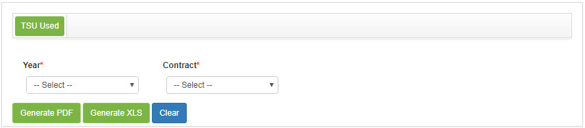

title: Report generation – Contract management
Description: Report generation – Contract management

# Report generation – Contract management

Generating TSUS usage report
----------------------------

*This report is intended to present information on the use of TSU in contracts*.

### How to access

1. Access the TSUs Usage Reporting feature by navigating the main
    menu **Reports > Contracts Management > TSU Use**.

### Filters

1. The following filter enable the user to restrict the participation of items in the standard feature listing, making it easier to locate the desired items as shown in the figure below:

      - Year;

      - Contract.

2. The **Usage Report Generation** screen will be displayed, as shown in the
    following figure:

    

    **Figure 1 - TSU usage report generation screen**

3.  Set the filters as needed:

     -  **Year**: select the desired year;

     -  **Contract**: Select the agreement to verify information about the use
        of TSU in it.

Generating TSU follow-up report
-------------------------------

*This report aims to present information monitoring the use of the TSUs*.

### How to access

1.  Access the TSU Tracking Report functionality by navigating the main
    menu **Reports > Contracts Management > TSU Monitoring**.

### Filters

1. The following filter enable the user to restrict the participation of items
    in the standard feature listing, making it easier to locate the desired
    items as shown in the figure below:

     -  Contract

2. The **TSU Monitoring Report Generation** screen will be displayed, as shown
    in the following figure:

    

    **Figure 2 - TSU tracking report generation screen**

3. Select the contract to verify the use of TSU in it.

!!! tip "About"

    <b>Product/Version:</b> CITSmart | 7.00 &nbsp;&nbsp;
    <b>Updated:</b>09/09/2019 - Anna Martins
