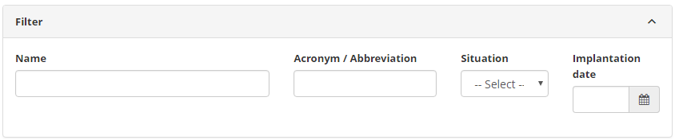
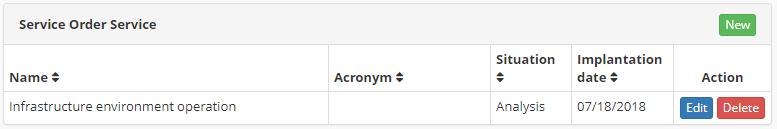

title: SO service registration and search
Description: This functionality aims registering the SO service.

# SO service registration and search

This functionality aims registering the SO service.

How to access
-------------

1.  Access the **SO Services** feature navigating through the main
    menu **Integrated Management > Contracts Management > SO Services
    Registration**.

Preconditions
-------------

1.  Have a registered service category (see knowledge [Service Category
    registration and search][1]);

2.  Have a registered service type (see knowledge [Service Type registration and
    search][2]).

Filters
-------

1.  The following filter enables the user to restrict the participation of items
    in the standard feature listing, making it easier to find the desired items:

-   Name;

-   Acronym/Abbreviation;

-   Situation;

-   Implantation date.

**Figure 1 - SO service screen**

2.  To search for an SO service insert the acronym/abbreviation, name, situation
    and/or its entry date.

Items list
----------

1.  The following cadastral fields are available to the user to facilitate the
    identification of the desired items in the standard listing of the
    functionality: **Name,** **Acronym**, **Situation** and **Implantation
    date**.

2.  There are action buttons available to the user for each item in the listing,
    they are: *Edit* and *Delete*.

**Figure 2 - SO service listing screen**

1.  After the search, select the desired record. Once this is done, it will be
    directed to the registration screen displaying the contents of the selected
    registry;

2.  To edit an SO service entry, click on the *Edit* button. Then, the user will
    be redirected to the registry screen displaying the content belonging to the
    selected entry.

Filling in the registration fields
----------------------------------

1.  Click on the *New* button (according to the previous figure). Then, the **SO
    Services Entry Screen** will be displayed, as illustrated on the image
    below:

**Figure 3 - SO services entry screen**

2.  Fill out the fields as instructed below:

-   **Service Name**: insert the SO Service name;

-   **Acronym/Abbreviation**: insert an acronym or an Abbreviation to identify
    the service, if necessary;

-   **Situation**: insert the SO service current status;

-   **Implantation date**: define the date the service will be implemented;

-   **Service Category**: insert the SO service category;

-   **Service Details**: describe the SO service details;

-   **Objective of Service/Goal of Service**: describe the SO service goal;

-   **Event Type**: insert the SO service event type;

-   **Importante of Bussiness Service**: insert the importance of the SO
    service to the businesse;

    -   **High**: the service is indispensable to the keep the business running.

    -   **Medium**: the service is important, but productivity is not entirely
        dependant on it.

    -   **Low**: the service is necessary for the business' daily operations,
        but its absence will not cause dramatic issues.

    -   **Normal**: the service to be performed will not affect the business'
        daily productivity.

    -   **To be defined**: the service importance is unknown on the moment of
        the request.

-   **Service Execution Location**: insert the location the service will be
    performed;

    -   **Internal**: the service will be executed within the organization;

    -   **External**: the service will be executed outside the organization. For
        example: in another organization ou branch office;

    -   **Internal/External**: the service can be executed within or outside the
        organization.

3.  Click on the *Save* the button to confirm the entry, at which date, time and
    user will automatically be stored for a future audit.

[1]:/en-us/citsmart-platform-7/processes/portfolio-and-catalog/service-category.html
[2]:/en-us/citsmart-platform-7/processes/portfolio-and-catalog/type-service.html

!!! tip "About"

    <b>Product/Version:</b> CITSmart | 8.00 &nbsp;&nbsp;
    <b>Updated:</b>09/09/2019 – Anna Martins
