title:  Manual do usuário do aplicativo mobile CITSmart Call (iOS)
Description: Configurar e utilizar o aplicativo mobile CITSmart Call na plataforma iOS. 
# Manual do usuário do aplicativo mobile CITSmart Call (iOS)

Este documento tem o propósito de fornecer orientações necessárias para instalar, configurar e utilizar o aplicativo mobile **CITSmart
Call** na plataforma iOS.

Ele oferece vários recursos, tais como:

1. Realizar ligações via VoIP (somente áudio);
2. Realizar ligações via VoIP (áudio e vídeo);

Este documento foi estruturado em **cinco** seções:

1. Pré-condições;
2. Instalação e Configuração do App no mobile;
3. Assistente SIP Account;
4. Assistente Remote Configuration;
5. Configuração do usuário logado.

Pré-condições
----------------

1. O usuário deverá estar registrado no CITSmart (ver conhecimento [Cadastro e pesquisa de usuário][1]);

2. Configurar e instalar o servidor de JANUS (ex.: https://janus.conf.meetecho.com/docs/deploy.html);

3. Configurar os parâmetros CITSmart conforme conhecimento relacionado.

Instalação e configuração do App no Mobile
--------------------------------------------

Para instalar o **CITSmart Call**, deve ser realizada a busca do aplicativo na loja on-line (App Store).

1. Pesquise por **CITSmart Call** na App Store, selecione e baixe o aplicativo;

2. Após a instalação aparecerá em seus aplicativos o ícone do **CITSmart Call**:

    
    
    **Figura 1 - App instalado**
    
3. Ao acessar o aplicativo, aparecerão mensagens de permissão para realização de chamadas usando contatos salvos no mobile, o
sistema de vídeo e se o app pode enviar mensagens de notificação referente ao App, conforme figuras abaixo;

4. Clicar em "OK" para todas as opções;

    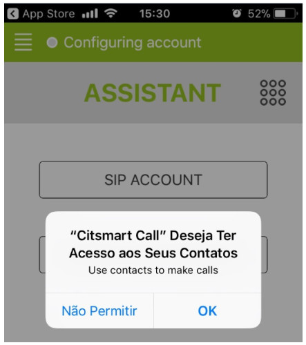
    
    **Figura 2 - Tela de acesso a contatos do mobile**
    
    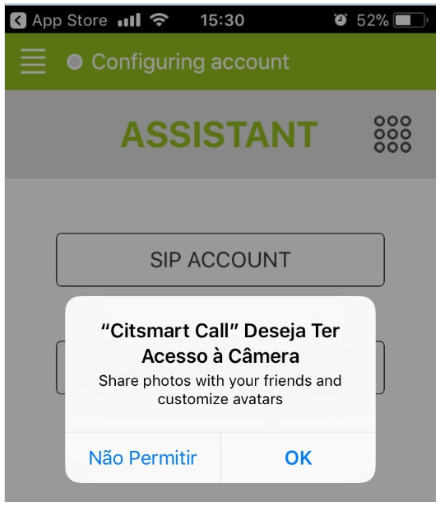
    
    **Figura 3 - Tela de acesso à câmera do mobile**
    
    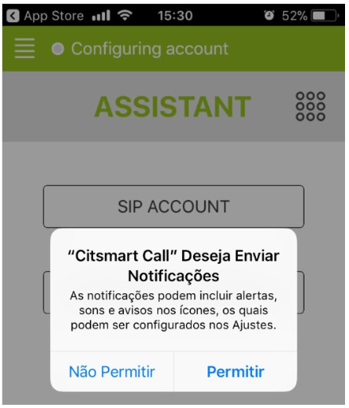
    
    **Figura 4 - Tela de permissão para envio de notificação**
    
5. Após configurar as permissões será apresentada a tela com as duas opções de assistente de configuração do aplicativo, conforme
figura abaixo:

    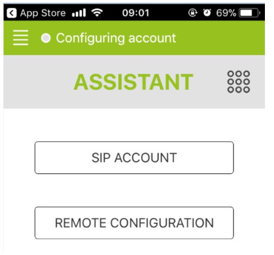
    
    **Figura 5 - Tela de assistente de configuração**
    
Assistente SIP Account
------------------------

1. O assistente SIP é um sistema de configuração de voz sobre IP (VoIP) que não depende do JANUS. Ao clicar nessa opção, será
apresentada a seguinte tela:

    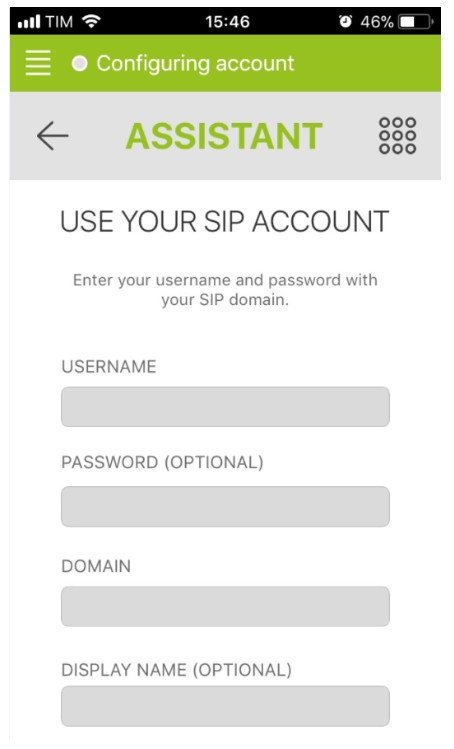
    
    **Figura 6 - Tela de acesso via SIP**
    
    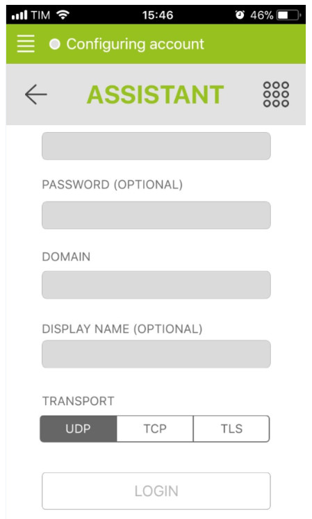
    
    **Figura 7 - Tela de acesso via SIP (continuação)**
    
2. Informe os dados:

    - **Username**: informe o nome do usuário já cadastrado;
    - **Password**: informe a senha já cadastrada;
    - **Domain**: informe o endereço do servidor para conexão. Deve ser colocado o protocolo (https) na URL;
    - **Display name**: informe um nome para se personalizar a sessão;
    - **Transport**: selecione o tipo de protocolo:
        - **UDP**: é um protocolo simples da camada de transporte, mas não há qualquer tipo de garantia que o pacote irá chegar ou
        não:
        - **TCP**: é o principal protocolo de envio e recebimento de dados na internet, possui maior confiabilidade em relação a
        segurança que o UDP;
        - **TLS**: é um protocolo de criptografia projetados para internet. Permite a comunicação segura entre os lados cliente e 
        servidor de uma aplicação web.
        
3. Clicar em "Login".

Assistente Remote Configuration
--------------------------------

1. A segunda opção assistente "Remote Configuration" serve para configuração do App em relação ao JANUS. Ao realizar a configuração
e instalação do JANUS. Ao se clicar nesse assistente, será apresentada a tela abaixo:

    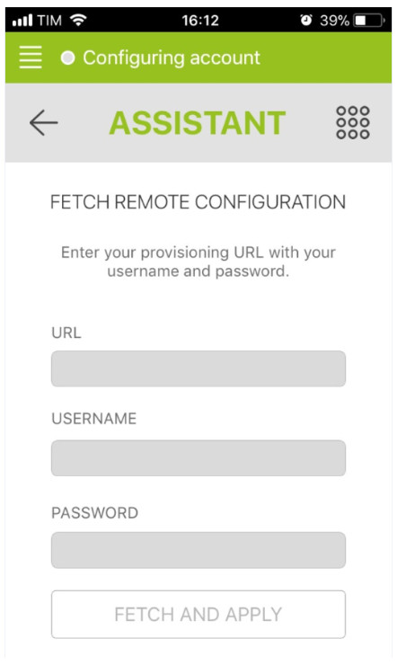
    
    **Figura 8 - Tela de acesso via Remote Configuration**
    
2. Informe os dados:

    - **URL**: informe o endereço da conexão CITSmart que se deseja acessar:
    - **Username**: informe o nome do usuário CITSmart;
    - **Password**: informe a senha CITSmart.
    
3. Clicar em "Fetch and Apply" (buscar e aplicar).

Configuração do usuário logado
----------------------------------

1. Quando o usuário está logado em algum das opções de assistentes é possível modificar algumas configurações pré-estabelecidas, 
isso é feito clicando no ícone   localizado no canto superior esquerdo, então as seguintes
telas de configuração serão apresentadas:

    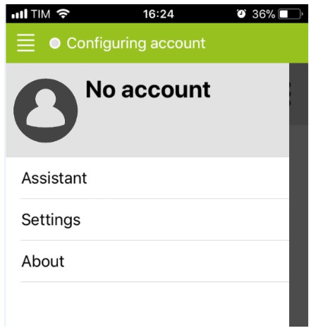
    
    **Figura 9 - Tela de configuração de conta**
    
2. Na opção **Assistant**, é possível a troca de assistente;

3. Na opção **Settings**, é possível configurar as seguintes opções:

    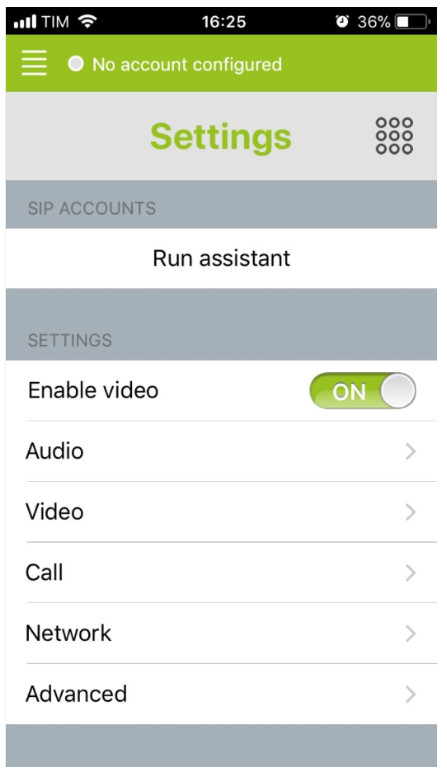
    
    **Figura 10 - Tela de configuração de conta**
    
4. É possível a configuração de itens de Áudio(Áudio), Vídeo (Vídeo), Call (Chamada), Network (Rede) e Advanced (Configurações 
Avançadas);

5. É importante ressaltar que dentro da guia Network (Rede), existe a opção de cadastrar um outro usuário e senha e salvar, 
conforme figura abaixo:

    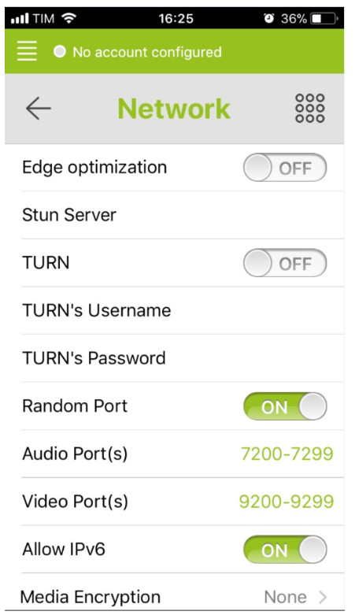
    
    **Figura 11 - Tela de cadastro de outro usuário e senha**
    
6. Na opção **Turn's Username**, digite o novo usuário;

7. Na opção **Turn's Password**, digite a nova senha;

8. O teclado estará então disponível para realizar ligações:

    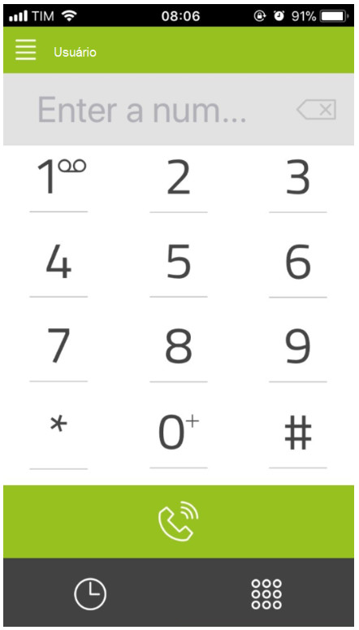
    
    **Figura 12 - Tela do teclado**
    
    !!! note "NOTA"
    
        Além das opções Turn's Username e Turn's Password, os demais itens de configuração são opcionais, a cargo das necessidades
        de cada usuário.
        
Veja também
--------------

- [Regras de parametrização - VoIP][2]

!!! tip "About"

    <b>Product/Version:</b> CITSmart | 7.00 &nbsp;&nbsp;
    <b>Updated:</b>08/06/2019 - Larissa Lourenço
    
[1]:/pt-br/citsmart-platform-7/initial-settings/access-settings/user/user-register.html
[2]:/pt-br/citsmart-platform-7/plataform-administration/parameters-list/parametrization-voip.html
