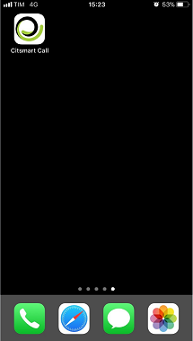
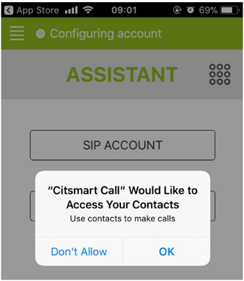
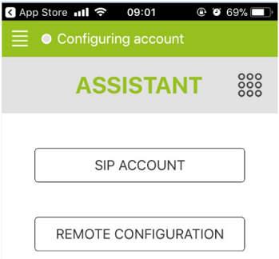
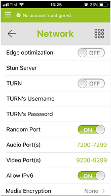

title: CITSmart call mobile application user guide (iOS)
Description: This document is intended to provide guidance for installing, configuring, and using the **CITSmart Call mobile** application on the iOS plataform.

# CITSmart call mobile application user guide (iOS)

This document is intended to provide guidance for installing, configuring, and
using the **CITSmart Call mobile** application on the iOS plataform.

It offers several features such as:

1.  Make calls via VoIP (audio only);

2.  Make connections via VoIP (audio and video);

This document was structured in **five** sections:

1.  Preconditions;

2.  Installing and configuring the App on mobile;

3.  SIP Account Wizard;

4.  Remote Configuration Wizard;

5.  User configuration logged in.

Preconditions
-------------

1.  The user must be registered in CITSmart (see knowledge [User registration
    and search][1]);

2.  Configure and install the JANUS server (e.g.:https://janus.conf.meetecho.com/docs/deploy.html);

3.  Configure the CITSmart parameters according to related knowledge.

Mobile app installation and configuration
-----------------------------------------

To install **CITSmart Call**, the application must be searched in the online
store (App Store).

1.  Search for **CITSmart Call** in the App Store, select and download the
    application;

2.  After installation the **CITSmart Call** icon will appear in your
    applications:

**Figure 1 - App installed**

1.  When accessing the application, you will see permission messages to make
    calls using contacts saved on the mobile, the video system and if the app
    can send notification messages related to the App, as shown below.

2.  Click *OK* for all options.

**Figure 2 - Mobile contact access screen**

**Figure 3 - Mobile camera access screen**

**Figure 4 - Permission to send notification screen**

3.  After configuring the permissions, the screen with the two application
    configuration assistant options will appear, as shown below:

**Figure 5 - Configuration assistant screen**

SIP account assistant
---------------------

1.  The SIP assistant is a voice over IP (VoIP) configuration system that does
    not depend on JANUS. Clicking on this option will display the following
    screen:

**Figure 6 - SIP access screen**

**Figure 7 - SIP access screen (continuation)**

2.  Enter the data:

-   **Username**: enter the name of the user already registered;  
    **Password**: enter the password already registered;  
    **Domain**: enter the server address for the connection. The protocol
    (https) must be placed in the URL;  
    **Display name**: enter a name to customize the session;  
    **Transport**: select the protocol type:

    -   **UDP**: this is a simple transport layer protocol, but there is no
        guarantee that the package will arrive or not:

    -   **TCP**: it is the main protocol of sending and receiving data on the
        internet, it has greater security reliability than UDP;

    -   **TLS**: is an encryption protocol designed for the internet. Allows
        secure communication between the client and server sides of a web
        application.

3.  Click on *Login.*

Remote configuration assistant
------------------------------

1.  The second "Remote Configuration" assistant option is for configuring the
    App in relation to JANUS. When configuring and installing JANUS. Clicking on
    this assistant will display the screen below:

**Figure 8 - Access screen via Remote Configuration**

1.  Enter the data:

-   **URL**: enter the address of the CITSmart connection you want to access:

-   **Username**: enter the user name CITSmart;

-   **Password**: enter the CITSmart password.

1.  Click on *Fetch and Apply*.

User logged configuration
-------------------------

1.  When the user is logged in to any of the assistant options it is possible to
    modify some pre-set settings, this is done by clicking the icon   located in the upper left corner, then the following configuration screens
    will be displayed:

**Figure 9 - Account setup screen**

2.  In the **Assistant** option, you can change the assistant;

3.  In the **Settings** option, you can configure the following options:

**Figure 10 - Account setup screen**

4.  You can configure the items for Audio, Video, Call, Network, and Advanced;

5.  It is important to note that within the Network tab, there is the option to
    register another user and password and save, as shown below:

**Figure 11 - Another user's password and password screen**

6.  In the **Turn's Username** option, type the new user;

7.  In the **Turn's Password** option, type the new password;

8.  The keypad will then be available to make connections:

**Figure 12 - Keyboard screen**

!!! note "NOTE"

    In addition to the Turn's Username and Turn's Password options, the other
    configuration items are optional, depending on the needs of each user.

See also
--------

-   [Parameterization rules - Voip][1].

!!! tip "About"

    <b>Product/Version:</b> CITSmart | 7.00 &nbsp;&nbsp;
    <b>Updated:</b>09/10/2019 - Anna Martins
    
[1]:/en-us/citsmart-platform-7/initial-settings/access-settings/user/user-register.html
[2]:/en-us/citsmart-platform-7/plataform-administration/parameters-list/parametrization-voip.html
