title: CITSmart Enterprise ITSM mobile application user guide (iOS)
Description: This document is intended to provide guidance for installing, configuring, and using the **CITSmart ITSM Enterprise** mobile application (iOS plataform).

# CITSmart Enterprise ITSM mobile application user guide (iOS)

This document is intended to provide guidance for installing, configuring, and
using the **CITSmart ITSM Enterprise** mobile application (iOS plataform).

It offers several features, such as:

1.  Facility in service and have a direction of where the request is located;

2.  Filter personal and work group requests;

3.  Viewing the details of a service request;

4.  Receipt of notifications.

This document is structured in **three** major sections:

1.  Preconditions

2.  Installing and Configuring the App on the Mobile;

3.  Using the App on Mobile.

Preconditions
-------------

1.  Using **CITSmart Enterprise ITSM** solution in version 7.2.2.0 or higher;

2.  To setup the server for using **CITSmart ITSM Enterprise** mobile
    application (see the knowledges: [CITSmart Enterprise ITSM server
    configuration manual for use of APP (iOS and Android)][1]) and [Mobile Options Configuration Registration and
    Search][2]).

Installing and configuring the app on the mobile
------------------------------------------------

To install CITSmart ITSM Enterprise, the app must be searched in the online
store (App Store).

1. Search for **CITSmart ITSM Enterprise** on App Store, select and download
    the app;

2. After installation, the CITSmart ITSM Enterprise icon will appear in your
    applications:

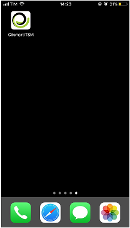

**Figure 1 - Installed app**

3. The connections screen will be displayed, press the *Create connection*, as
    shown in the figure below:

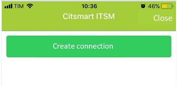

**Figure 2 - Connection screen**

4. The "New connection" screen for connection registration will be displayed:

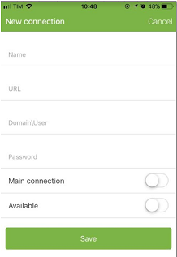

**Figure 3 - Connection log screen**

5. Enter the relevant data:

     -   **Connection name**: enter the name of the connection you want to
        connect to;

     -   **Server URL**: enter the server address for the connection. The
        protocol (https) must be placed in the URL;

     -   **Main connection?**: inform if the chosen URL will be the primary ;

     -   **Domain \\ User**: From this version the user will have to inform the
        use LDAP domain and its user;

     -   The format is citsmart.local\\user.consultor (example), where the first
        part is the domain information and the second part is the user;

     -   **Password**: The user will enter the password to access the system;

     -   **Available**:

     -   **Enabled**: When enabled, the connection will be provided in the URL
        field, and in addition, to get the position of the attendant this field
        must be enabled;

     -   **Disabled**: When disabled the system will not allow connection to the
        server nor will it pick up the position of the attendant.

!!! warning "ATTENTION"

    If the device is changed, this connection must be deleted.

6. After entering the desired connection data, press the *Create* button;

7. After the connection is added, the list of created connections will appear.
    To change a connection, simply select the desired connection and make the
    change;

8. To connect, just select the connection, in the initial screen of the
    application;

9. Enter the username and password:

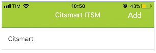

**Figure 4 - Connection**

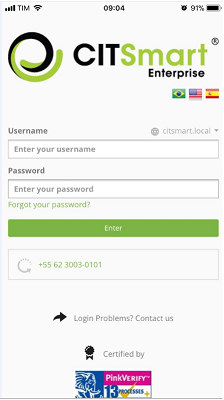

**Figure 5 - Login screen**

Using the app on the mobile
---------------------------

### Viewing service requests

1. After the connection is made, the menu screen will be displayed, where you
    can click on the Service Ticket:

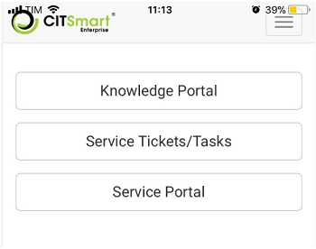

**Figure 6 - Menu screen**

2. To choose the type of request you want to view, click on the icon  located in the upper left corner;

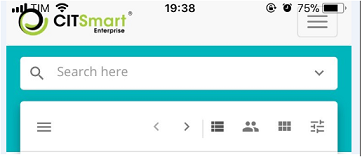

**Figure 7 - Request search screen**

3. Will be presented filters ( Number, Requester, Request Type, Status,
    Contract, Executor group, Current work, Responsible, SLA Status, Sort by,
    View, Exhibition and Show sub request ), as shown in the figure below:

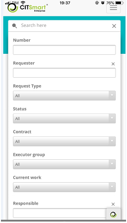

**Figure 8 - Filters**

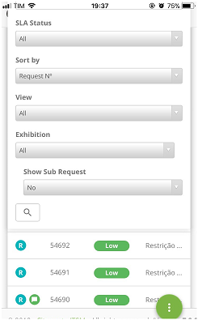

**Figure 9 - Filters (continuation)**

4. Select the filter of request you want and click on the  , in the lower left corner;

5. The list of service requests will be displayed, depending on the filter
    chosen:

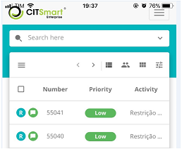

**Figure 10 - Ticket list**

!!! note "NOTE"

    In order for the search functionality to work, it is necessary to
    configure the corresponding web service (notices) in the "Web Service
    Operation Register" screen in CITSmart Enterprise Web.

6. In each request, when you click on it, a list of options is displayed,
    being:

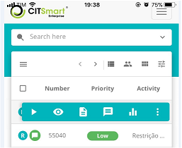

**Figure 11 - Ticket list**

- capture the request to the logged in user or just view the ticket without
capturing;

 - view the ticket;

 - shows the summary of the request;

 - view messages;

 - show ticket reports;

 - options menu for the request (Delegate, Suspend, Change SLA, Reclassify,
Create sub-requests, Show sub-requests, Schedule activity, Create related
request and Print Request).

### Creating service request

1. To create a service request, press the icon  located in the lower right corner of the screen and select the  "New ticket" option, as ilustrated below:

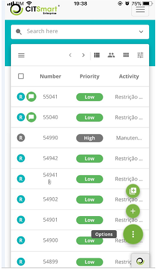

**Figure 12 - Creating a service request**

   !!! info "IMPORTANT"

       The request registered by citsmart ITSM Enterprise uses services that are
       configured in citsmart Enterprise Web.

2. After performing the operation, the request registration message will be
    displayed.

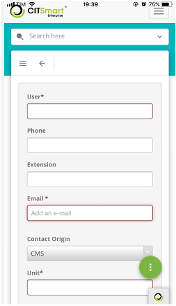

**Figure 13 - Create request**

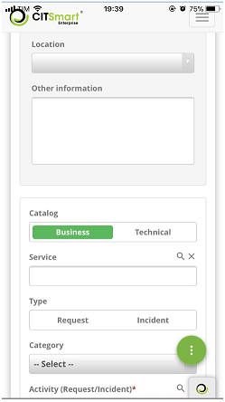

**Figure 14 - Create request (continuation)**

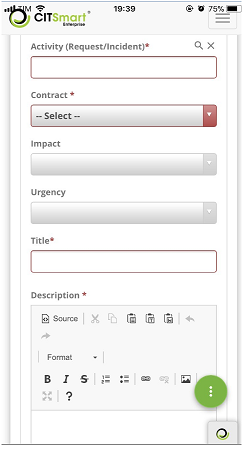

**Figure 15 - Create request (continuation)**

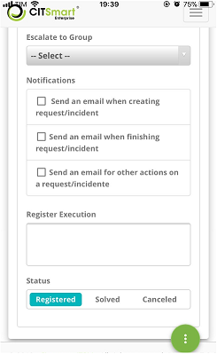

**Figure 16 - Create request (continuation)**

3. Fill in the fields as described below:

    -   **Applicant**: Enter the name of the applicant, that is, the name of the
    person requesting the opening of an incident or service request.

!!! info "IMPORTANT"

    After reporting the requester a statistical summary of the calls of him is
    shown (per situation), as well as another statistical summary of
    satisfaction (per type of response) about the services already requested by
    him. These two summaries are paginated, thus it is possible to move
    forward/backward to view all the information preserving performance and
    screen lay-out.

   -   **Phone**: Enter the telephone number of the applicant;

   -   **Extension**: Enter the extension number of the applicant, if applicable;

   -   **E-mail**: inform the requestor's e-mail;

   -   **Contact Origin**: Enter the origin of the contact to register the service
    request;

   -   **Unit**: Select the unit on which the applicant is full;

   -   **Physical Location**: state the location of the applicant;

   -   **Other Information**: Describe the observations about the applicant, if
    necessary.

4. Record service request information:

     -  **Catalog**: select the catalog of services;

     -  **Service**: Enter the service for the selected service catalog. If the
        service catalog is "**Business**", the business services for selection
        will be available in this field, but if the service catalog is
        "**Technical**", the support / technical services for selection will be
        available in this field;

     -  **Type**: select the type of request, whether it is an incident opening
        or service request;

        -  **Incident**: If the situation presented is an unplanned outage, a
            reduction in the quality of the service or failure of any
            configuration item that has not yet impacted an IT service. Eg: The
            network link is out, the network is slow, the server is
            inaccessible, etc.

        -  **Request**: refers to requests for demands made by users within the
            Information Technology environment. They can range from access
            requests to suggestions for improvement at low cost. Ex .: request
            of access to the network for a new user, request of configuration of
            some equipment, request to add some software in the workstation,
            etc.

     -  **Category**: Enter the category of service to facilitate the search of the
    activity (Request / incident). The category will identify the nature of the
    activity, positioning it within similar groups of action, placing it in the
    hierarchy of its category;

     -  **Activity (Request / Incident)**: Inform the activity that will be
    performed referring to the type of request. If the reported activity has a
    "Guidance Script" associated with it, it will be displayed in the "Scripts"
    tab represented by the icon  located in the upper right corner of the screen;

    -  **Contract**: after informing the activity (Request / incident), the
    contract will be displayed for which the opening of an incident or service
    request will be made;

    -  **Urgency**: After informing the activity (request / incident), the urgency
    information will be displayed which indicates the speed at which the service
    needs to be performed;

    -  **Impact**: After informing the activity (Request / incident), the impact
    information of the service to the business will be displayed;

!!! note "NOTE"

    After informing the Request / incident activity, the expected time to
    fulfill the request will be established, as configured in the record of the
    time of service related to the activity. The service time will be counted
    according to what was defined in the calendar linked to the unit, but if the
    unit does not have a linked calendar, it will be accounted according to the
    calendar linked to the service. However, when closing the expected time of
    attendance is counted the delay in time, being disregarded the calendar.

   -  **Title**: Enter the title of the service request;

   -  **Description**: Enter the description of the service request. The
    description must be objective, including all the information necessary to
    attend to it;

   -  **Head to group**: Enter the group to which the service request will be
    directed. If you do not inform the group, the request will be directed to
    the executor group defined in the record of the link of the Request /
    incident activity to the contract. But if the executor group is not defined
    in the record of the link of the Request / incident activity to the
    contract, the request will be directed to the executor group defined in
    parameter "9 - Group ID Level 1";

   -  **Notifications**: Check the options for sending notification of the request
    to be sent to the requestor;

   -  **Execution Record**: it is not necessary to fill in this field, as it is
    indicated for the technician who will attend the request, to describe the
    execution of his activity.

   -  **Situation**: Select the option that fits with the current status of the
    request: Registered / In progress.

### Approving/rejecting service request

Some requests need approval, so to meet them you need to approve them.

1.  Select the request that is eligible for approval;

2.  The "Details" screen will be displayed displaying the description of the
    request for approval / rejection of the request;

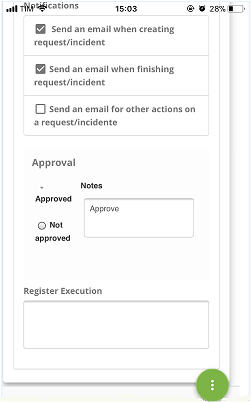

**Figure 17 - Request approval /reject screen**

1.  To approve the request, just press the Approve button;

2.  To reject the request, press the Reject button. A screen will be displayed
    to choose the justification for this rejection, as shown in the figure
    below:

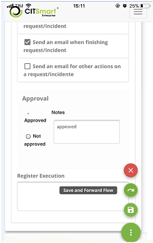

**Figure 18 - Request rejection screen justified**

   -   Choose the justification for rejecting/approve the request and press the  button *Save and forward the Flow*.

!!! tip "About"

    <b>Product/Version:</b> CITSmart | 8.00 &nbsp;&nbsp;
    <b>Updated:</b>09/10/2019 – Anna Martins
    
[1]:/en-us/citsmart-platform-7/additional-features/mobile-and-field-service/configuration/app-android-ios.html

[2]:/en-us/citsmart-platform-7/additional-features/mobile-and-field-service/configuration/options.html
