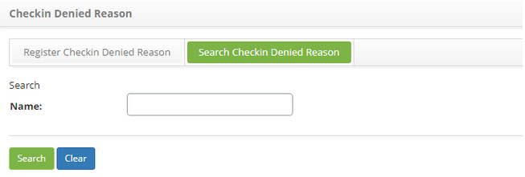

title: Check in denied reason registration and search
Description: This feature allows registering a checkin denied reason, which will be used to check in through the app (CITSmart Enterprise ITSM Mobile).

# Check in denied reason registration and search

This feature allows registering a checkin denied reason, which will be used to
check in through the app (CITSmart Enterprise ITSM Mobile).

How to access
-------------

1.  Access the checkin denied reason feature navigating through the main
    menu **Integrated Management > Labour Force Management > Register Checkin
    Denied Reason**.

Preconditions
-------------

1.  No applicable.

Filters
-------

1.  The following filter enables the user to restrict the participation of items
    in the standard feature listing, making it easier to find the desired items:

    -  Name

**Figure 1 - Checkin denied reason search screen**

2.  Perform a checkin denied reason search;

   -  Insert the name of the intended checkin denied reason and click on
    the *Search* button. Afterwards, the checkin denied reason entry will be
    displayed according to the description provided.

   -  To list all checkin denied reasons, just click directly on
    the *Search* button, if needed.

Items list
----------

1.  The following cadastral field is available to the user to facilitate the
    identification of the desired items in the standard feature
    listing: **Name**.

**Figure 2 - Deny check in reason list screen**

2.  After searching, select the intended entry. Afterwards, they will be
    redirected to the registry screen displaying the content belonging to the
    selected entry.

3.  To edit a checkin denied reason entry, just modify the information on the
    intended fields and click on the *Save* button to confirm the changes to the
    database, at which date, time and user will be stored automatically for a
    future audit.

Filling in the registration fields
----------------------------------

1.  The **Checkin Denied Reason** screen will be displayed, as
    illustrated on the image below:

**Figure 3 - Checkin denied reason entry screen**

2.  Insert the description of the checkin denied reason.

3.  Click on the *Save* the button to confirm the entry, at which date, time and
    user will automatically be stored for a future audit.

!!! tip "About"

    <b>Product/Version:</b> CITSmart | 8.00 &nbsp;&nbsp;
    <b>Updated:</b>09/10/2019 – Anna Martins
