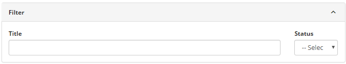
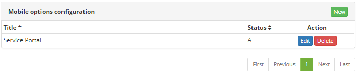
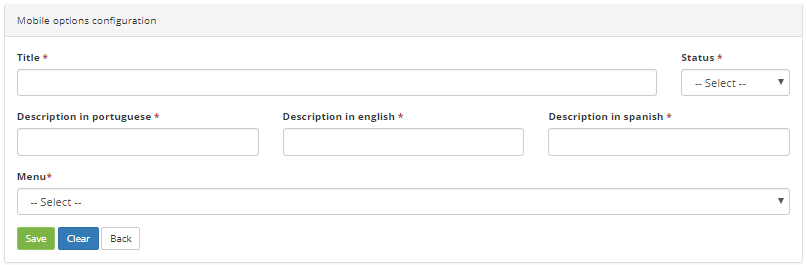
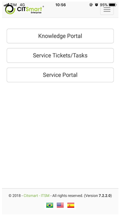

title: Mobile options configuration registration and search

Description: This feature is intended to configure the Menu options for mobile use.

# Mobile options configuration registration and search

This feature is intended to configure the Menu options for mobile use.

How to access
-------------

1.  Access the feature by browsing the main menu **Access and Permission \>
    Mobile Options Configuration**.

Preconditions
-------------

1.  Have the CITSmart Enterprise ITSM Mobile application installed on the mobile
    device (see knowledge [CITSmart ITSM Enterprise mobile application user
    guide (iOS)][1], [CITSmart Enterprise ITSM Mobile application user guide
    (Android)][2]);

Filters
-------

1.  The following filter enables the user to restrict the participation of items
    in the standard feature listing, making it easier to find the desired items:

    -  Title;

    -  Status

2.  On the Mobile Options Configuration home screen, you can perform the mobile
    options configuration search:

-   Enter the name and status of the configuration you want to search.

**Figure 1 - Mobile options configuration search screen**

Items list
----------

1.  The following cadastral fields are available to the user to make it easier
    to identify the desired items in the default listing of the
    functionality: **Title** and **Status**.

2.  There are action buttons available to the user in relation to each item in
    the listing, they are: *Edit* and *Delete*.

    

    **Figure 2 - Mobile options configuration listing screen**

3.  To change the registry data of Mobile Options Configuration, simply modify
    the information of the desired fields and click the *Save* button to save
    the change made to the record, where the date, time and user will be saved
    automatically for a future audit.

Filling in the registration fields
----------------------------------

1.  By accessing the Mobile Options Configuration screen, click on the New
    button (as shown in figure 2), then it will be displayed the following
    screen :

    

    **Figure 3 - Mobile options configuration screen**

2.  Fill in the fields:

    -  **Title**: fill in the name of the practice to be used (eg NOC);

    -  **Status**: select option "Active";

    -  **Description in portuguese**: title of the Menu option to be used in the
    Portuguese language in mobile;

    -  **Description in english**: title of the Menu option to be used in the
    English language;

    -  **Description in spanish**: title of the Menu option to be used in the
    Spanish language;

    -  **Menu**: Select the option that best fits the desired functionality.

Checking the services portal on the mobile
------------------------------------------

1.  Once the system configuration has already been done (previous section), the
    following screen will be displayed in the mobile:

**Figure 4 - Services portal on mobile**

!!! tip "About"

    <b>Product/Version:</b> CITSmart | 8.00 &nbsp;&nbsp;
    <b>Updated:</b>09/10/2019 – Anna Martins
    
[1]:/en-us/citsmart-platform-7/additional-features/mobile-and-field-service/apps/ios.html
[2]:/en-us/citsmart-platform-7/additional-features/mobile-and-field-service/apps/android.html
