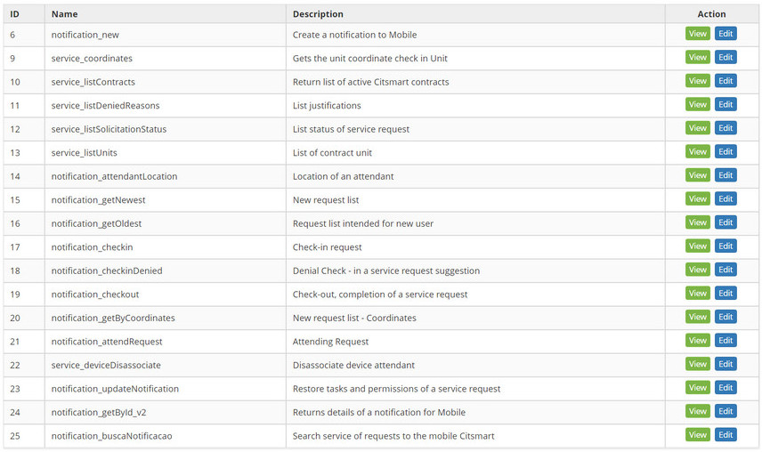

title: CITSmart Enterprise ITSM mobile web services registration and search
Description: This functionality is intended to link request execution groups to CITSmart Enterprise ITSM Web Services to gain access to Mobile features.

# CITSmart Enterprise ITSM mobile web services registration and search

This functionality is intended to link request execution groups to CITSmart
Enterprise ITSM Web Services to gain access to Mobile features.

How to access
-------------

1.  Access the citsmart mobile web services functionality by navigating the main
    menu **System** > **Settings > Citsmart Mobile Web Service**.

Preconditions
-------------

1.  Not applicable.

Filters
-------

1.  The following filter enables the user to restrict the participation of items
    in the standard feature listing, making it easier to find the desired items:

     -  Web Service's Filter

    

    **Figure 1 - Citsmart mobile's web service settings search screen**

2.  Perform the web services configuration search for CITSmart Mobile. Enter the
    name of the web service configuration for CITSmart Mobile that you want to
    search, after which you will see the it's registration.

Items list
----------

1.  The following cadastral fields are available to the user to facilitate the
    identification of the desired items in the standard listing of the
    functionality: **ID**, **Name** and **Description**.

2.  There are action buttons available to the user in relation to each item in
    the listing, they are: *View* and *Edit*, as shown in the figure below:

**Figure 2 - Citsmart mobile's web service listing screen**

Filling in the registration fields
----------------------------------

1.  When accessing the feature, the **Web Services Configuration for CITSmart
    Mobile** screen, containing two tabs, will be displayed.

2.  The **List Web Services** tab displays the web services.

3.  To edit the Web Service data, click the *Edit* button, as shown below:

**Figure 3 - Web service registration screen for Citsmart mobile**

Viewing the web service configurations for CITSmart mobile
----------------------------------------------------------

1.  To view the Web Service information, click the *View* button. When selecting
    this option, the Web Service Registration tab will be opened for the
    observation of it's registration information , not allowing you to change
    it, as shown below:

**Figure 4 - Citsmart mobile web services configuration view**

Performing web services configuration
-------------------------------------

1.  The Web Services Configuration screen for CITSmart Mobile will appear,
    containing two tabs, one that allows you to link the groups to the web
    services and another one that presents the CITSmart Mobile web services, as
    shown in the figure below:

    

    **Figure 5 - Citsmart mobile web services configuration screen**

2.  In the Link Groups tab, link the activity executing group to CITSmart Mobile
    Web Services.

3.  Select the desired group. After this, the group will be linked to the Web
    Services of CITSmart Mobile;

4.  If you want to remove the group link with web services, just click on the
    icon .

!!! warning "ATTENTION"

    At the time the group is selected, it will be linked to all CITSmart
    Mobile Web Services in an automated way.

       
!!! tip "About"

    <b>Product/Version:</b> CITSmart | 7.00 &nbsp;&nbsp;
    <b>Updated:</b>09/10/2019 - Anna Martins

