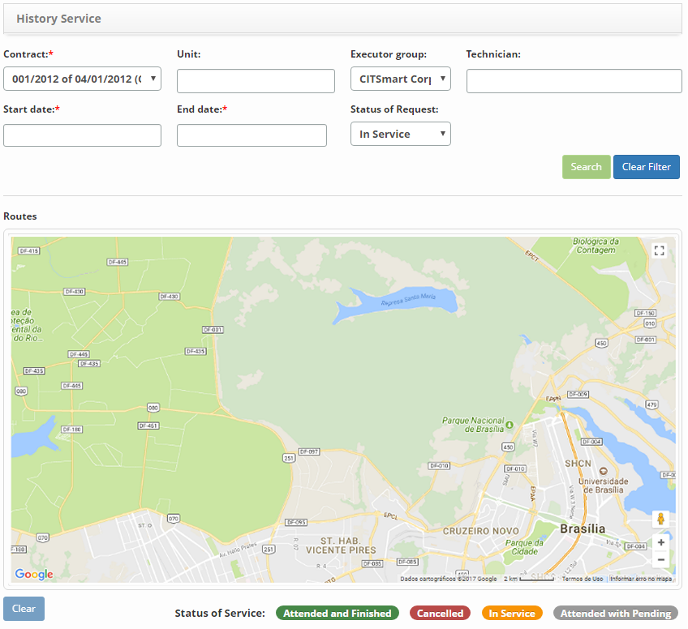

title: Checking service history
Description: This functionality has the objective of verifying the history of service requests made by the field technicians.

# Checking service history

This functionality has the objective of verifying the history of service
requests made by the field technicians.

How to access
-------------

1.  Access the Call History feature by navigating in the main menu **Integrated
    Management > Workforce Management > History Service**.

Preconditions
-------------

1.  Configure the system connection with the Google APIs (see [CITSmart
    Enterprise ITSM server configuration manual for use of APP (iOS and
    Android)][1] - sections 5 to 7)

Filters
-------

1.  The following filters enables the user to restrict the participation of
    items in the standard feature listing, making it easier to find the desired
    items:

-   Contract;

-   Unit;

-   Executor group;

-   Technician;

-   Start date;

-   End date;

-   Status of Request.

**Figure 1 - History service search screen**

Items list
----------

1.  No applicable.

Filling in the registration fields
----------------------------------

1.  No applicable.

Checking the service history
----------------------------

1.  The **Call History Verification** screen will be displayed, as shown in the
    following figure. In this screen, you can view the service request
    fulfillment history made by the field technician (s), according to the
    filters provided:

**Figure 2 - Checking the service history**

2.  Set the filters according to your need:

-   **State**: inform the state of the service requests that you want to check
    the history of your service by the field technician (s);

-   **Cities**: inform the city about the requests for services that wish to
    verify the history of their service by the field technician (s);

-   **Contract**: inform the contract regarding the requests for services that
    wish to verify the history of their service by the field technician (s);

-   **Unit**: inform the unit about the requests for services that wish to
    verify the history of their service by the field technician (s);

-   **Executor Group**: informing the executing group of service requests to
    verify attendance;

-   **Technician**: inform the technician to check the history of service
    requests;

 !!! note "NOTE" 

    When selecting the technician, will be presented the requests for services
    that the same attended and that makes reference to the contract (s) that he
    belongs.

-   **Start date**: inform the start date that refers to the day worked by the
    technician;

-   **Date end**: inform the end date that refers to the day worked by the
    technician;

-   **Request Status**: select the service request fulfillment situation;

3.  After the filters are set, click the *Search* button. Once this is done, the
    history of service requests will be displayed on the map by the field
    technician, as shown in the following figure:

**Figure 3 - Service requests history of service requests by field technician**

!!! tip "About"

    <b>Product/Version:</b> CITSmart | 8.00 &nbsp;&nbsp;
    <b>Updated:</b>09/10/2019 – Anna Martins
    
[1]:/en-us/citsmart-platform-7/additional-features/mobile-and-field-service/configuration/app-android-ios.html
