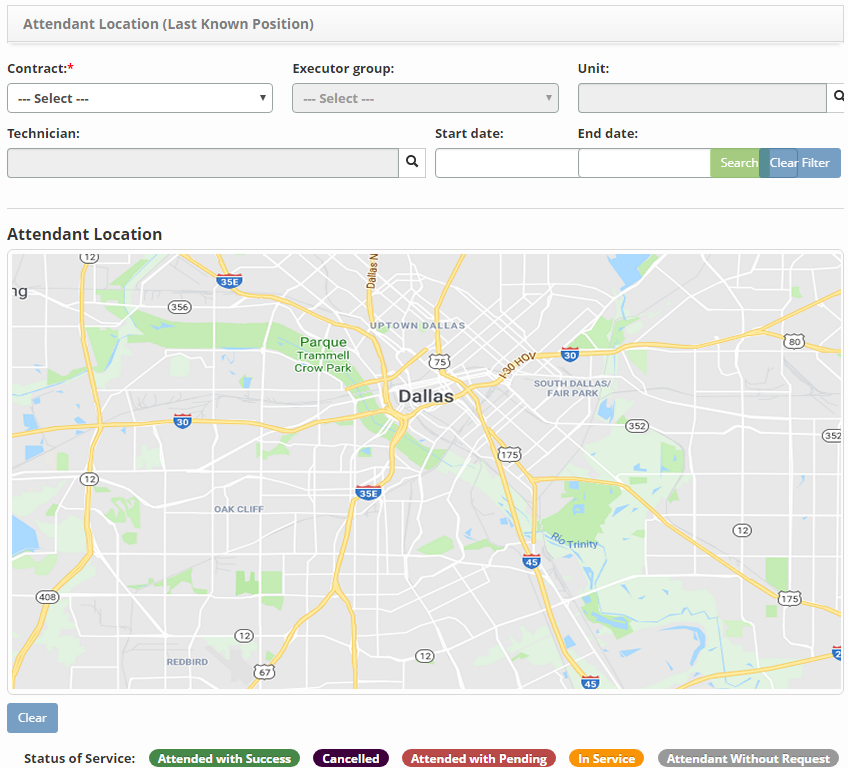
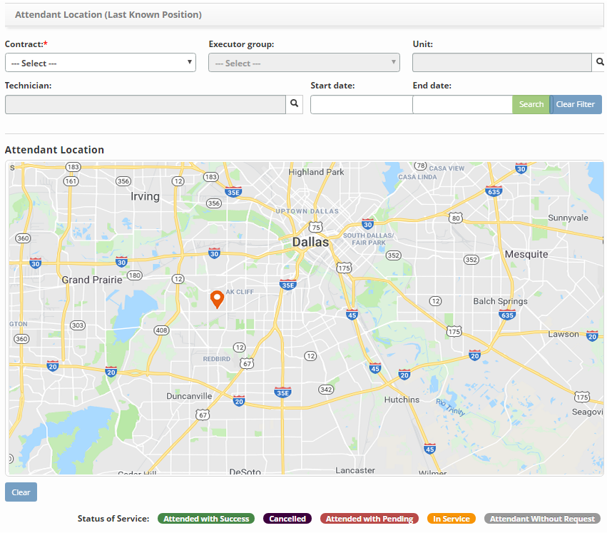

title: Verification of the position of the attendants
Description:

# Verification of the position of the attendants

This functionality has the objective of verifying the positioning of the technicians, that is, the current location of field technicians, responsible for service requests.

How to access
-------------

1.  Access the Attendant Positioning feature by navigating the main
    menu **Integrated Management > Attendance Management > Attendant
    Positioning**.

Preconditions
-------------

1.  Configure the system connection with the Google APIs (see
    knowledge [CITSmart Enterprise ITSM server configuration manual for use of
    APP (iOS and Android)][1])

Filters
-------

1.  The following filters enables the user to restrict the participation of
    items in the standard feature listing, making it easier to find the desired
    items:

-   Contract;

-   Executor group;

-   Unit;

-   Technician;

-   Start date:

-   End date.

**Figure 1 - Attendant location filter**

Items list
----------

1.  No applicable.

Filling in the registration fields
----------------------------------

1.  No applicable.

Verifying the position of attendants
------------------------------------

1.  The Technician **Position Verification** screen will be displayed, as shown
    in the following figure. In this screen, you can see the location of the
    technician (s) on the map, according to the filters;

**Figure 2 - Technicians positioning screen**

2.  Set the filters as you need them:

-   **Contract**: inform the technician contract to verify its location;

-   **Executor Group**: inform the executor group to which the technician
    belongs to verify their location;

-   **Unit**: inform the technician unit to verify its location;

-   **Technician**: inform the technician that you want to check your location
    on the map;

-   **Start date**: inform the initial date of service request;

-   **End date**: inform the end date of the service request fulfillment;

3.  After the filters are set, click the *Search* button. Once this is done, the
    location of the technicians will be displayed on the map, as shown in the
    figure below:

**Figure 3 - Positioning visualization (location) of field technicians**

4.  Click on the location of the technician to verify the information regarding
    the fulfillment of the service request.

!!! tip "About"

    <b>Product/Version:</b> CITSmart | 8.00 &nbsp;&nbsp;
    <b>Updated:</b>09/10/2019 – Anna Martins
    
[1]:/en-us/citsmart-platform-7/additional-features/mobile-and-field-service/configuration/app-android-ios.html
