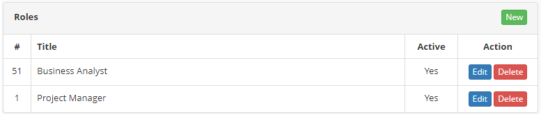
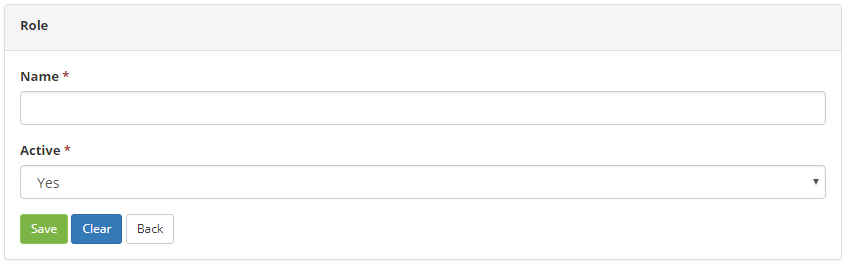

title: Role registration and search
Description: The goal of this feature is to register the roles of each staff member related to projects.

# Role registration and search

The goal of this feature is to register the roles of each staff member related to projects.

How to access
-------------

1.  Access the **Role Entry** feature navigating through the main
    menu **Integrated Management > Project Management > Role**.

Preconditions
-------------

1.  No applicable.

Filters
-------

1.  No applicable.

Items list
----------

1. The following cadastral fields are available to the user to facilitate the
    identification of the desired items in the standard feature
    listing: **Title** and **Active**.

**Figure 1 - Role listing screen**

2. There are action buttons available to the user for each item in the listing,
    they are: *Edit* and *Delete*.

3. To edit a role entry, click on the *Edit* button.

4. Afterwards, they will be redirected to the registry screen displaying the content belonging to the selected entry.

Filling in the registration fields
----------------------------------

1. The Role screen will be displayed. Click on the *New* (as shown in the
    previous figure) button.

2. Then, the **Role Entry** screen will be displayed, as illustrated on the
    image below:

**Figure 2 - Role entry screen**

3. Fill out the fields as instructed below:

    -  **Name**: name the role;

    -  **Active**: insert the role current situation.

4. Click on the *Save* the button to confirm the entry, at which date, time and
    user will automatically be stored for a future audit.

!!! tip "About"

    <b>Product/Version:</b> CITSmart | 8.00 &nbsp;&nbsp;
    <b>Updated:</b>07/18/2019 – Anna Martins
