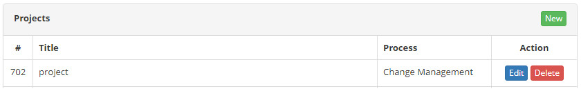
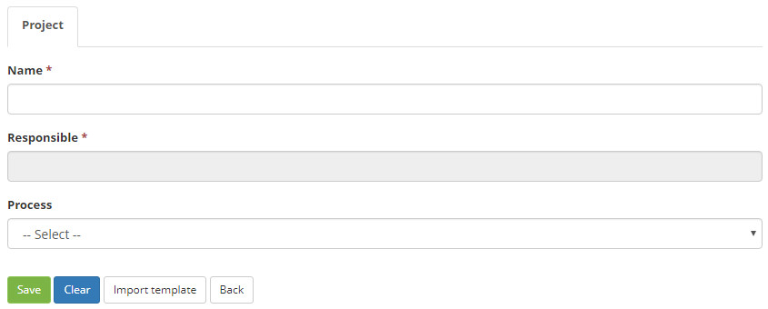
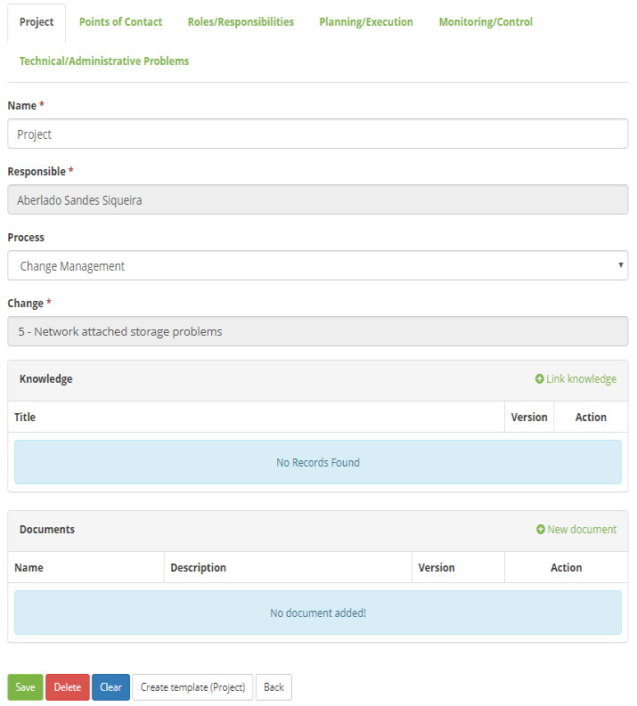

title: Project templates creation
Description: The goal of this feature is to create a project model to speed up the project development process.

# Project templates creation

The goal of this feature is to create a project model to speed up the project
development process.

How to access
-------------

1.  Access the **Project** feature navigating through the main menu **Integrated
    Management > Project Management > Projects**.

Preconditions
-------------

1.  Have a registered project (see knowledge [Project registration and
    management][1]).

Filters
-------

1.  No applicable.

Items list
----------

1.  The following cadastral fields are available to the user to facilitate the
    identification of the desired items in the standard feature
    listing: **Title** and **Process**.

2.  There are action buttons available to the user for each item in the listing,
    they are: *Edit* and *Delete*.

**Figure 1- Projects listing screen**

Filling in the registration fields
----------------------------------

1. The **Project** listing entry screen will be displayed. Click on
    the *New** button (as shown in the previous figure). The **Project Entry
    Screen** will be displayed, as illustrated on the image below:

**Figure 2 - Project entry screen**

2. Fill in the corresponding fields. Afterwards, the project template entry
    screen will be displayed, as illustrated on the image below:

**Figure 3 – Project template creation screen**

3. Name the project template. Click on the *Save* button to confirm the entry.
    Then, the template will be successfully created.

!!! tip "About"

    <b>Product/Version:</b> CITSmart | 7.00 &nbsp;&nbsp;
    <b>Updated:</b>09/11/2019 - Anna Martins

[1]:/en-us/citsmart-platform-7/additional-features/project-management/use/project-management.html
