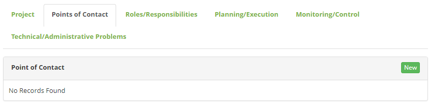
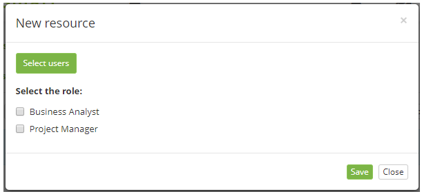
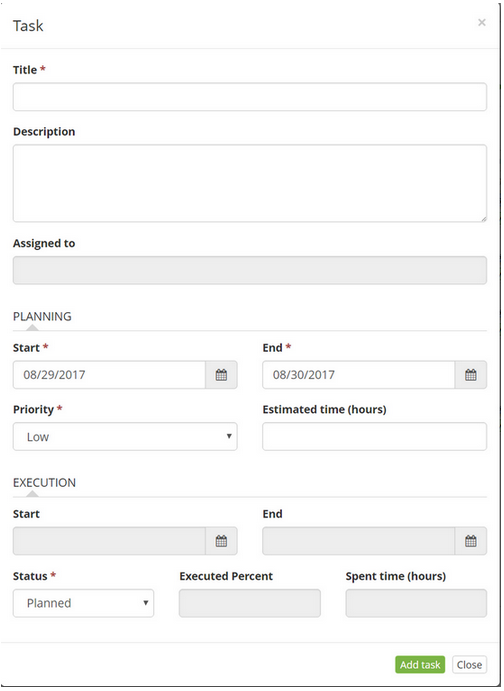

title: Project registration and management
Description: The Project is a unique process, consisting of a group of coordinated and controlled tasks with start and end dates, undertaken to achieve a goal according to specific requirements, including time, cost and resource constraints.

# Project registration and management

The Project is a unique process, consisting of a group of coordinated and
controlled tasks with start and end dates, undertaken to achieve a goal
according to specific requirements, including time, cost and resource
constraints.

How to access
-------------

1.  Access the Project functionality through navigation in the main
    menu **Integrated Management > Project Management > Project**.

Preconditions
-------------

1.  Register employee (see knowledge [Staff registration and
    search][1]);

2.  Register user (see knowledge [User registration and
    search][2]).

Filters
-------

1.  No applicable.

Items list
----------

1.  The following cadastral fields are available to the user to facilitate the
    identification of the desired items in the standard feature
    listing: **Title** and **Process**.

2.  There are action buttons available to the user for each item in the listing,
    they are: *Edit* and *Delete*.

**Figure 1 - Projects screen**

Filling in the registration fields
----------------------------------

1. The **Projects** screen will be displayed. Click the *New* button. Once this
    is done, the Project Master screen is displayed, as shown in the following
    figure:

**Figure 2 - Project registration screen**

2. Fill in the fields as directed below:

   -  **Name**: enter the name of the project;

   -  **Responsible**: enter the name of the project manager;

   -  **Process**: select the process that provides the project. Once this is
    done, a field will be displayed to inform the record of the process that
    originated the creation of the project.

3. The *Import template* button allows you to import a project template to
    create a project from it.

4. After the initial project data is entered, click the *Save* button to
    register, where the date, time and user will be automatically saved for a
    future audit.

Enrolling additional project information
----------------------------------------

1.  After registering the initial data of the project, you can register the
    complementary information of the same one. The figure below illustrates the
    Project screen after recording the initial data:

**Figure 3 - Project management screen**

Linking knowledge
-----------------

1.  Link knowledge to the project if needed. In the Project log, in the
    Knowledge area, click *Link knowledge*, the knowledge base search screen
    will be displayed. Perform the search of the desired knowledge, select the
    same one and click on the *Add* button to make the link.

Adding documents
----------------

1.  Add a document to the project, if necessary:

-   In the Project record, in the **Documents** area, click *New document*, the
    document addition screen will be displayed;

-   Enter the data of the document, attach it and click on the *Save* button to
    carry out the operation.

Defining the project communication matrix
-----------------------------------------

1. On the **Project** registration screen, click the **Contact Points** tab.
    Once this is done, a screen will be displayed as shown in the figure below:

**Figure 4 - Contact points screen**

2. Click the *New* button, the contact points registration screen will be
    displayed:

**Figure 5 - Contact points master screen**

3. Fill in the fields as directed below:

    -   **Employee**: enter the name of the employee that is part of the project;

    -   **Responsibility**: select the responsibility of the employee within the
    project;

      -   **Responsible**: person responsible for the execution of the task;

      -   **Accountable**: person who answers for the task;

      -   **Consulted**: person who must be consulted for the execution of the
        task;

      -   **Informed**: person who must be informed about the progress and status
        of the task.

    -   **Active**: notify if employee is active. If not, escalone another employee.

   !!! info "IMPORTANT"

      Only one collaborator who is active in the project can be scaled.

4.  After the data is entered, click *Save* to register. After that, the
    registration will be displayed on the Project screen.

**Figure 6 - Contact point master screen**

Registering the roles/responsibility
------------------------------------

1.  Sign the people (resources) that will perform the project tasks.

2.  On the Project registration screen, click
    the **Roles/Responsibilities** tab, a screen will be displayed as shown in
    the figure below:

**Figure 7 - Roles/responsibilities screen**

3.  Click the *Link new resource* button, done this, the link resource screen
    will be displayed:

**Figure 8 - Resource master screen**

4.  Click the *Select users* button, the user search screen will be displayed.
    Perform the search of the users who are members of the project, select the
    same ones and click on the button *Save* to carry out the operation. Select
    the role of the users and click the *Save* button to make the link.

   !!! note "NOTE"

       You are allowed to select multiple users for the link.

   !!! example "EXAMPLE"

       Example: To select multiple users for the link, perform a user search and
       select it and then search for another user and select it. And after that,
       just click the Add button.

       If you do not have the roles registered, you can make a registration from
       this screen, just click the Roles button.

5.  After you link the resources, they will be displayed on the project screen,
    as shown in the following figure:

**Figure 9 - Project resources**

Registering tasks
-----------------

1. Define the project tasks to be performed during the estimated time to
    execute the project. On the Project registration screen, click on
    the **Planning/Execution** tab, the project task planning screen will be
    displayed:

**Figure 10 - Planning/execution screen**

   !!! info "IMPORTANT"

       If you want to import a task template to make it easier to register tasks,
       click the Import template button, the Task template screen appears, click
       the Apply button of the template you want. Once this is done, the task
       template will be displayed, and if you are going to proceed with the
       template, click the Save button and confirm the template import.

2. Click the project actions icon . Once this is done, the Job Register screen will be displayed, as shown in the following figure:

**Figure 11 - Task record screen**

3. Fill in the fields as directed below:

   -  **Title**: report the title of the task;

   -  **Description**: enter the job description. The description must be
    objective, including the information necessary for the execution of the
    task;

   -  **Assigned to**: enter the resource that will perform the task.

4.  Carry out the task planning:

    -   **Start**: enter the expected start date of the task. Check the field at the
    time of activity execution;

    -  **End**: enter the due date for the completion of the task.

    -  **Priority**: select the priority of the task to execute;

    -  **Estimated time (hours)**: enter the amount of hours it will take to
    perform the activity.

5.  Some fields in the "**execution**" area are for simple conference, so it is
    not necessary to fill them out:

    -  **Start**: the date that started the task execution will be displayed;

    -  **End**: the date that the task is finished is displayed;

    -  **Status**: report the task status;

    -  **Executed Percent**: will be displayed how much has been executed of the
    task;

6.  **Spent time (hours)**: the hours spent with the task will be displayed.

7.  After entering the task data, click the *Add Task* button to perform the
    operation.

8.  After registering the task, if you want to edit it, just click on the icon 

9.  If you need to register a subtask, simply click on the task icon  and proceed with the registration.

### Creating task model

1.  After logging the project tasks, if you want to create a task template for
    later use in order to speed up the task creation process, proceed as
    follows:

2.  On the Project Tasks Planning screen, click the *Create Model
    (Task)* button. After that, the Model Register screen will be displayed, as
    shown in the figure below:

**Figure 12 - Job register screen**

3.  Enter the name of the template and click the *Create new model* button to
    perform the operation.

Creating project baseline
-------------------------

A project baseline can be used to compare initial project plans, or the state of
a project at certain key points as it progresses, with its current state. When
you define a baseline for a project, data in multiple task key fields is
captured and saved as a numbered set of baseline data. As the project
progresses, you can query this captured data to compare it with your current
data.

1.  To create a baseline of project tasks, do the following:

    -   On the Project Tasks Planning screen, click the *Create Baseline* button and
    confirm the creation of the baseline. Once this has been done, the baseline
    will be displayed;

    -   Click *Back* to return to the project task schedule.

    -   After returning to the task planning screen, to view the baseline, simply
    click the *View baseline* button.

Project monitoring
------------------

1.  This functionality allows you to monitor/control project tasks. In the
    Project log, click the **Monitoring/Control** tab, the monitoring screen
    will be displayed, as shown in the following figure:

**Figure 13 - Project Task monitoring screen**

-    - Allows you to edit the task information;

-    - Allows to record the hours spent with the task;

-    - Allows you to view the times that were recorded in the project task.

Technical/administrative problems
---------------------------------

1.  This feature shows the incidents that were logged for the project. In the
    Project log, click on the **Technical/Administrative Issues** tab, the
    administrative/technical problems administration screen will be displayed,
    as shown in the following figure:

**Figure 14 - Technical/administrative issues screen**

[1]:/en-us/citsmart-platform-7/initial-settings/access-settings/user/employee.html
[2]:/en-us/citsmart-platform-7/initial-settings/access-settings/user/user-register.html

!!! tip "About"

    <b>Product/Version:</b> CITSmart | 8.00 &nbsp;&nbsp;
    <b>Updated:</b>09/11/2019 – Anna Martins
