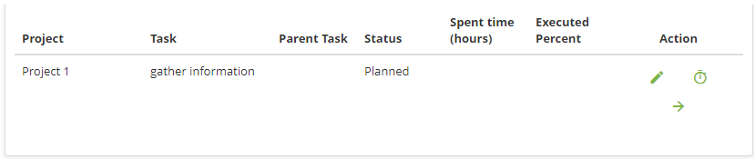
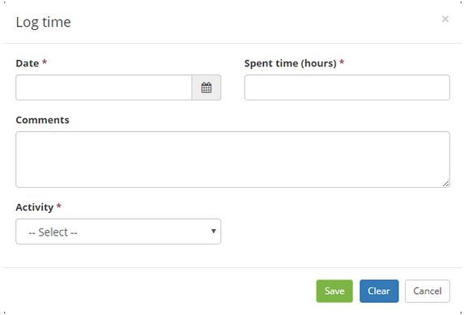
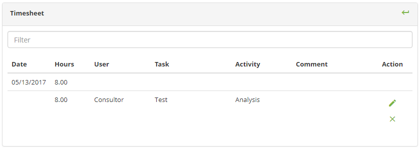
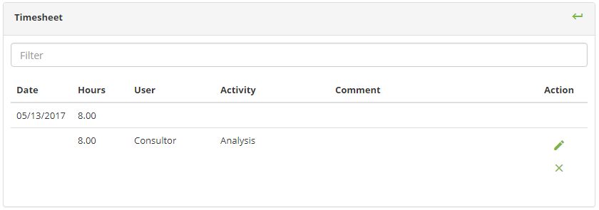

title: My projects tasks
Description: This functionality is intended to manage your project-related tasks.

# My projects tasks

This functionality is intended to manage your project-related tasks.

How to access
-------------

1.  Access the My Tasks feature by navigating the main menu **Integrated
    Management > Project Management > My Tasks**.

Preconditions
-------------

1.  Have tasks assigned to your user.

Filters
-------

1.  The following filter enables the user to restrict the participation of items
    in the standard feature listing, making it easier to find the desired items:

-   Filter

**Figure 1 - Task search screen**

Items list
----------

1.  The following cadastral fields are available to the user to facilitate the
    identification of the desired items in the standard feature
    listing: **Project**, **Task**, **Parent Task**, **Status**, **Spent time
    (hours)** and **Executed Percent**.

2.  There are action buttons available to the user for each item in the listing,
    they are: *Edit task*, *Log time* and *Timesheet*, as shown in the figure
    below:

**Figure 2 - Task list screen**

3.  To update the information about the task execution, such as status, click
    the icon .

   
Recording the hours spent with the task - filling in the registration fields
----------------------------------------------------------------------------

1.  After checking your tasks, on the Tasks screen, click the task icon  that you want to record the hours worked with. Once this is done, the time recording screen will be displayed:

**Figure 3 - Time recorder screen**

2.  Fill in the fields as directed below:

-   **Date**: enter the date on which the task was executed;

-   **Spent time (hours)**: enter the time spent on the task on the date
    entered;

-   **Comments**: describe what was done in the execution of the task, if
    necessary;

-   **Activity**: select the type of activity performed relative to the task.

3.  After the data is entered, click the *Save* button to register.

Checking the time records spent with the tasks (timesheet)
----------------------------------------------------------

1.  On the Tasks screen, click the icon  in the upper right corner of the screen to check the record of the hours spent with the tasks. Once this is done, the task log screen will be displayed, as shown in the following figure:

**Figure 4 - Record of spent hours with all tasks**

2.  Click the task icon  to check the record of the hours spent with a task. Once this is done, the
    log of hours spent with the task will be displayed, according to the example shown in the following figure:

**Figure 5 - Record of hours spent with a task**

!!! tip "About"

    <b>Product/Version:</b> CITSmart | 8.00 &nbsp;&nbsp;
    <b>Updated:</b>09/11/2019 – Anna Martins
