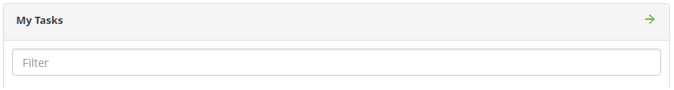

title: Minhas tarefas de projeto
Description: Esta funcionalidade tem o objetivo de gerenciar suas tarefas relacionadas aos projetos.

# Minhas tarefas de projeto

Esta funcionalidade tem o objetivo de gerenciar suas tarefas relacionadas aos
projetos.

Como acessar
-----------

1.  Acesse a funcionalidade de **Minhas Tarefas** através da navegação no menu
    principal **Gestão Integrada > Gerência de Projetos > Minhas Tarefas**.

Pré-condições
------------

1.  Ter tarefas atribuídas ao seu usuário.

Filtros
-------

1.  O seguinte filtro possibilita ao usuário restringir a participação de itens
    na listagem padrão da funcionalidade, facilitando a localização dos itens
    desejados:

    -   Filtro.

    

    **Figura 1 - Tela de pesquisa de tarefas**

Listagem de itens
--------------

1.  Os seguintes campos cadastrais estão disponíveis ao usuário para facilitar a
    identificação dos itens desejados na listagem padrão da
    funcionalidade: Projeto, Tarefa, Tarefa Pai, Status, Tempo gasto
    (horas) e Percentual Executado.

2.  Existem botões de ação disponíveis ao usuário em relação a cada item da
    listagem, são eles: *Editar tarefa*, *Lançar horas* e *Timesheet*, conforme
    ilustrado na figura abaixo:

    
    
    **Figura 2 - Tela de listagem de tarefas**

3.  Para atualizar as informações sobre a execução da tarefa, como por exemplo,
    o status, clique no ícone   da mesma.

Registrando as horas gastas com a tarefa - preenchimento dos campos cadastrais
-----------------------------------------------------------------------------

1.  Após verificar suas tarefas, na tela de Tarefas, clique no ícone  da tarefa
    que deseja registrar as horas trabalhadas com a mesma. Feito isso, será
    apresentada a tela para registro das horas:

    
    
    **Figura 3 – Tela de cadastro de horas**

2.  Preencha os campos conforme orientações abaixo:

    -   **Data**: informe a data em que foi executada a tarefa;

    -   **Tempo gasto (horas)**: informe o tempo gasto com a execução da tarefa na
    data informada;

    -   **Comentários**: descreva o que foi feito na execução da tarefa, caso ache
    necessário;

    -   **Atividade**: selecione o tipo de atividade executado em relação a tarefa.

3.  Após os dados informados, clique no botão *Gravar* para efetuar o registro.

Verificando os registros de horas gastas com as tarefas (timesheet)
-----------------------------------------------------------------

1.  Na tela de Tarefas, clique no ícone   localizado no canto superior direito
    da tela para verificar o registro das horas gastas com as tarefas. Feito
    isso, será apresentada a tela de registro de horas referente às tarefas,
    conforme exemplo ilustrado na figura a seguir:

    
    
    **Figura 4 – Registro de horas gastas com todas tarefas**

2.  Clique no ícone   da tarefa para verificar o registro das horas gastas com
    uma tarefa. Feito isso, será apresentada a tela de registro de horas gastas
    com a tarefa, conforme exemplo ilustrado na figura a seguir:

**Figura 5 – Registro de horas gastas com uma tarefa**

!!! tip "About"

    <b>Product/Version:</b> CITSmart | 8.00 &nbsp;&nbsp;
    <b>Updated:</b>07/18/2019 – Anna Martins
