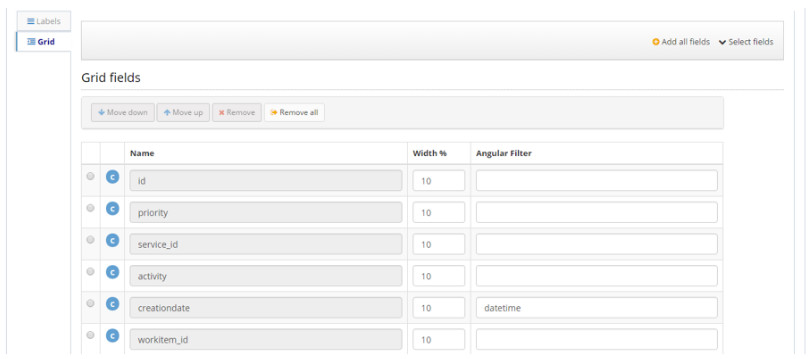
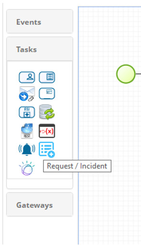

title: Manual for creation and use of the dashboards component about tickets of CITSmart Enterprise ITSM via CITSmart Neuro
Description: This document contains technical guidelines for creating custom widgets on the CITSmart Enterprise ITSM dashboard that allow the display and execution of tasks associated with request or incident flows.

# Manual for creation and use of the dashboards component about tickets of CITSmart Enterprise ITSM via CITSmart Neuro

This document contains technical guidelines for creating custom widgets on the
CITSmart Enterprise ITSM dashboard that allow the display and execution of tasks
associated with request or incident flows.

!!! note "NOTE"

    This feature is only available in the CITSmart Enterprise ITSM version
    7.2.3.0 (or above).

!!! info "IMPORTANT"

    This knowledge is intended for CITSmart consultants with prior knowledge of
    the CITSmart Neuro components and who master basic HTML and Javascript
    concepts.

Use guide
---------

The screen below shows an example with the "**Tasks of my groups**" panel:

   

    **Figure 1 - Call screen**

A double click on one of the rows displays the request screen and allows the
user to perform the task (if allowed):

**Figure 2 - Call example screen**

Neuro components
----------------

The **itsm_tasks** neuro package contains all the components required to create
panels in CITSmart Enterprise ITSM:

   

   **Figure 3 - Component Neuro screen**

The package is composed by of the following elements:

1.  ITSM Tasks Application;

2.  Four labels for internationalization;

3.  CSS feature itsm-tasks;

4.  Javascript resource with the AngularJS directive itsm-tasks;

5.  HTML feature itsm-tasks;

6.  Business object vw_itsm_tasks;

7.  Three preconfigured forms for display on the ITSM dashboard:

    -  Open and Uninitiated Calls (availableTasks);

    -  Open calls to my groups (tasksByUserGroups);

    -  My calls in progress (tasksByUser).

Business object
---------------

The **vw_itsm_tasks** business object, of VIEW type , has all the attributes
needed to display the task rows in panels.

   

   **Figure 4 - DDL screen**

As will be explained, each SQL of the business object can be associated with a
panel through itsm-taks directive:

   

   **Figure 5 - SQL screen**

The **itsm-tasks** package business object is already configured with three
SQLs. However, as required, these SQLs can be customized or other SQL can be
created.

The **CSV report** columns exported in the dashboard are the same columns
configured in the Business Object Form tab:

**Figure 6 - Grid fields screen**

CSS resources
-------------

The **itsm-tasks** CSS feature contains CSS specific classes for displaying the
layout of the forms and was created from the **serviceRequestIncident.css** file
of CITSmart Enterprise ITSM.

JS angular directive
--------------------

The Itsm-tasks AngularJS directive encapsulates logic for displaying task panes
on any Neuro form.

The syntax for embedding the directive into HTML is as follows:

*\<itsm-tasks sql-name="identificação do SQL do objeto de negócio"
object-map="objeto JSON com parâmetros para execução do SQL"\>\</itsm-tasks\>*

The directive uses the itsm-tasks HTML page feature to display the data:

   

   **Figure 7 - Request listing screen**

In addition to enabling the display and execution of tasks, the directive
allows:

1.  Filter the tasks by any keyword displayed on the grid;

2.  Update screen data;

3.  Generate a CSV report with the tasks displayed on the screen. The exported
    CSV report obeys the screen filters and contains all the columns defined in
    the business object master grid.

Smart report creation
---------------------

The Smart Report displayed on the **dashboard** must be of the **Neuro** type.

Each Smart Report must be associated with a form and its respective page:

**Figure 8 - Smart Report registration screen**

Dashboard configuration
-----------------------

To configure the CITSmart Enterprise ITSM dashboard with task panes, simply
create a widget associated with the Smart Report with the Neuro form:

**Figure 9 - Widget screen**

Application of the component in flow design
-------------------------------------------

From here are technical guidelines for setting up the ticket creation flow
component.

This guidance is intended for Consultants or CITSmart users who master the
knowledge of creating ITSM flows.

The **Request / Incident** component can be accessed in the **Tasks** tab of the
flow design:

   

   **Figure 10 - Task screen**

It allows the creation of tickets or incidents related or not to the ticket of
the stream being executed.

Here is an example flow that uses the component:

   

   **Figure 11 - Flow example**

In the previous example, the execution of the **Purchase
Requests** and **Project Analysis** components is triggered in parallel after
the **Create WBS** task runs.

Flow execution is stopped until the request created by the component is finished
or canceled.

The last parallel gateway ensures that the flow is completed only after
completion of the tickets represented by the **Purchase Request** and **Project
Analysis** components.

Detailing the component properties
----------------------------------

The following figure shows the properties of the component:

   

   **Figure 12 - Component properties screen**

Here are the description of each property:

-   **Type**: allows the selection of the type of the
    request: **Request** or **Incident**;

    -   If no value is entered in the **Applicant User** property, the request
        created will assume the same requester as the request for the flow. On
        this property can be informed:

        -   The user login (e.g: carlos.santos);

        -   An expression that represents the value of a flow variable or an
            attribute of some object in the flow. Examples:

-   \${requestTimeOff.days}

-   \${usuarioSolicitante}

-   If no value is entered in the **Group property for targeting**, the created
    request will assume the same current group as the request for the stream.
    The values of this property allow to inform:

       -  The acronym of the user (e.g .: **SDNIVEL1**)

       -   An expression that represents the value of a flow variable or an attribute of some object in the flow. Examples:

             -   \${requestTimeOff.currentGroup}

             -   \${grupoParaDirecionamento}

       -   **Contract**: may be left blank to assume the same contract as the flow
    request or can be informed:

    -   The contract ID (table primary key)

    -   An expression that represents the value of a flow variable or an
        attribute of some object in the flow. Examples:

        -   \${requestTimeOff.contract}

        -   \${contratoAtual}

    -   A **RHINO** script that returns the contract ID. To build the script,
        just click the **Build expression** button.

-   **Service**: can be left blank to assume the same service as the request of
    the flow or can be informed:

    -   The service ID (table primary key)

    -   An expression that represents the value of a flow variable or an
        attribute of some object in the flow. Examples:

        -   \${requestTimeOff.service}

        -   \${servicoAtual}

    -   A **RHINO** script that returns the ID of a service. To build the
        script, just click the **Build expression** button.

-   **Impact** and **Urgency**: they are optional and accept the values:

    -   High

    -   Medium

    -   Low

-   **Related request**: allows the request you created be related to the
    request for the flow or to the initial request that originated the flow. The
    allowed values are:

    -   Not related

    -   Related to flow request

    -   Related to the primary request

-   **Name of the variable with the Neuro objects**: you can enter the name of
    the object that will be used by the Neuro forms.

-   **Description**: A free text and / or an expression can be informed.

    -   Example: perform purchase request for the
        requests **\${serviceRequest.idRelatedRequest}**

Attachments of this knowledge
-----------------------------

The attachments of this knowledge are:

-   Neuro packages with components for creating panels.

-   Files with HTML, CSS and Javascript capabilities. These files are already
    included in the Neuro packages (just so you can easily view the content).

!!! note "NOTE"

     It is worth mentioning that since the vw_itsm_tasks Neuro business object is
     implemented by View, the DDL syntax varies according to each database
     manager. Therefore, there are package attachments for each type of database.

Attachments
-----------

    
[Postgres][1]

[Sqlserver][2]

[Directive][3]

[Tasks][4]

[Oracle][5]

[Css][6]

!!! tip "About"

    <b>Product/Version:</b> CITSmart | 7.00 &nbsp;&nbsp;
    <b>Updated:</b>09/11/2019 - Anna Martins

[1]:en-us/citsmart-platform-7/additional-features/reports/create/dashboard/configuration/images/package_itsm_tasks_postgres.json
[2]:en-us/citsmart-platform-7/additional-features/reports/create/dashboard/configuration/images/package_itsm_tasks_sqlserver.json
[3]:en-us/citsmart-platform-7/additional-features/reports/create/dashboard/configuration/images/itsm-tasks-directive.js
[4]:en-us/citsmart-platform-7/additional-features/reports/create/dashboard/configuration/images/itsm-tasks.html
[5]:en-us/citsmart-platform-7/additional-features/reports/create/dashboard/configuration/images/package_itsm_tasks_oracle.json
[6]:en-us/citsmart-platform-7/additional-features/reports/create/dashboard/configuration/images/itsm-tasks.css
