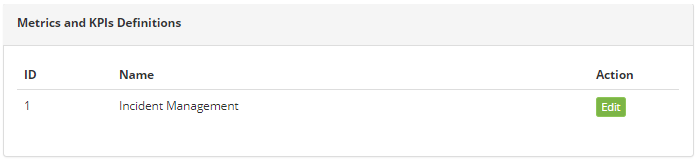
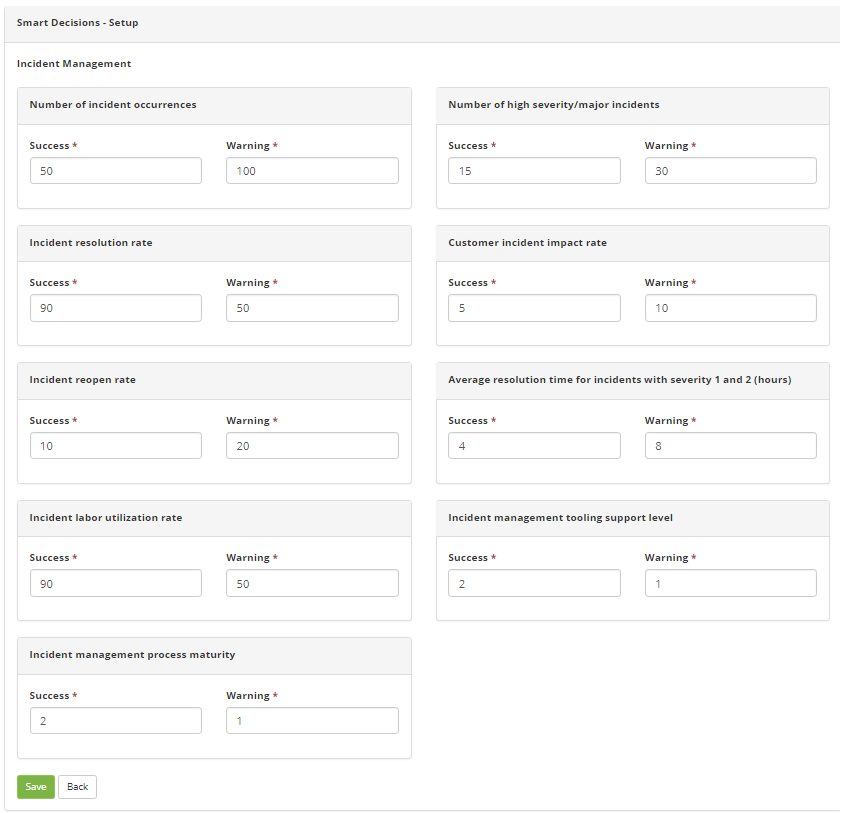

title: Metrics and KPIs definition
Description: The Metrics and KPIs Definition feature aims to define the targets of the Incident Management process indicators for managerial analysis, which are displayed in the "General Incident Management - KPIs" widget that can be added to the dashboard to be displayed In the management panel, on the main screen of the system.

# Metrics and KPIs definition

The Metrics and KPIs Definition feature aims to define the targets of the
Incident Management process indicators for managerial analysis, which are
displayed in the "General Incident Management - KPIs" widget that can be added
to the dashboard to be displayed In the management panel, on the main screen of
the system.

How to access
-------------

1.  Access the main menu **System > Settings > Metrics and KPIs Definitions**.

Preconditions
-------------

1.  No applicable.

Filters
-------

1.  No applicable.

Items list
----------

1.  The following cadastral fields are available to the user to facilitate the
    identification of the desired items in the standard feature
    listing: **ID** and **Name**.

2.  There are action buttons available to the user for each item in the listing,
    they are: *Edit*.

**Figure 1 - Metrics and KPIs definition listing screen**

Defining the metrics of the incident management process - Filling in the registration fields
--------------------------------------------------------------------------------------------

1.  After accessing the functionality, click *Edit* (as shown in previus
    figure). The **Metrics and KPIs Definition** screen will be displayed, as
    shown in the figure below:

**Figure 2 - Definition of metrics and KPIs**

2.  Fill in the fields as directed below:

   -  In the "**Success**" fields, enter the acceptable value for the business;

   -  In the "**Warning**" fields, enter the critical value for the business.

3.  After the data is entered, click the *Save* button to perform the operation.

See also
--------

-   [Smart Decisions Template
    registration](/en-us/citsmart-platform-7/additional-features/reports/create/dashboard/use/template-smart-decision.html).

!!! tip "About"

    <b>Product/Version:</b> CITSmart | 8.00 &nbsp;&nbsp;
    <b>Updated:</b>09/11/2019 – Anna Martins
