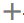
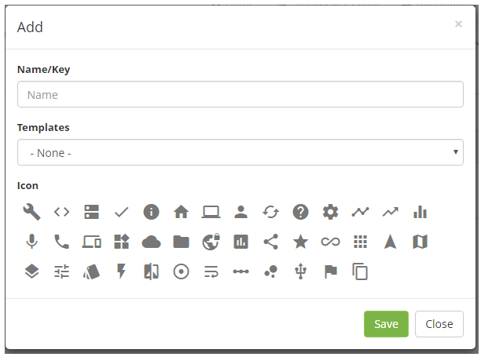
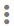
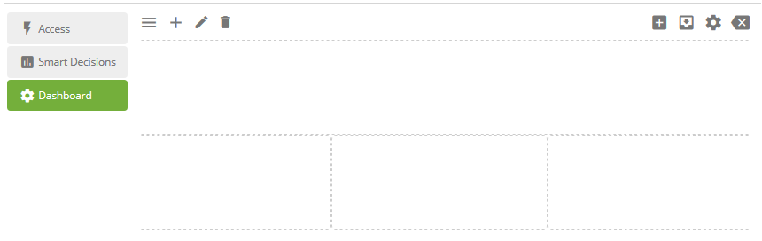
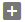
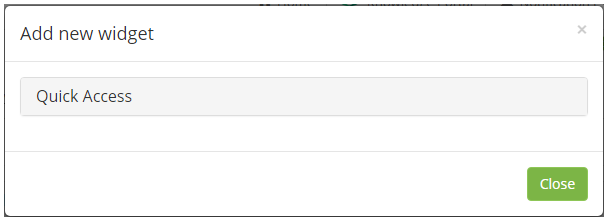
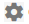
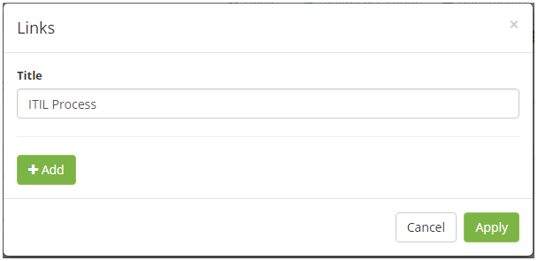
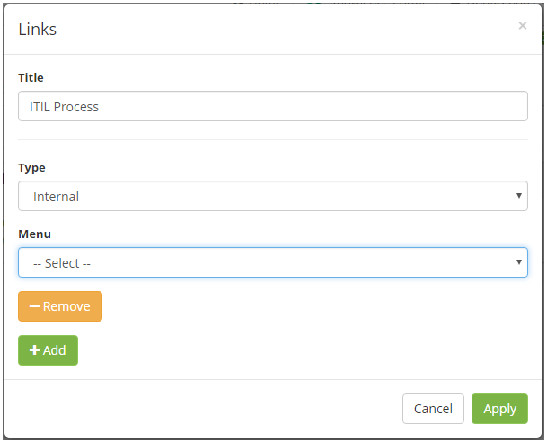

title: Management panel (Smart Decision)
Description: The management panel is displayed on the main screen of the system. In this dashboard you can add dashboard with links to features for quick access, smart reports and charts that contain relevant information.

# Management panel (Smart Decision)

The management panel is displayed on the main screen of the system. In this
dashboard you can add dashboard with links to features for quick access, smart
reports and charts that contain relevant information.

Adding dashboard
----------------

1.  On the system startup screen, click the icon . The new dashboard registration screen will be displayed.

**Figure 1 - Dashboard registration**

2.  Enter dashboard data;

    -  **Name/Key**: enter the name of the dashboard;

    -  **Template**: select a template to create the dashboard based on it, if
    necessary;

    -  **Icon**: select an icon to represent the dashboard.

3.  After the data is entered, click the *Save* button to register.

4.  To edit dashboard information, click the icon .

    
Adding widget to the dashboard
------------------------------

1. Select the dashboard and click the icon  to enable editing mode that allows you to add new widgets. Once this is done, the editing screen will be displayed;

**Figure 2 - Edition of the dashboard**

2. Click the icon  to add a widget. The screen for choosing the desired widget will be
    displayed.

**Figure 3 - Widgets**

3. Click one of the options and then click on the widget you want to add to the
    dashboard;

    -   **Quick access**: allows you to add links for quick access.

    -   **Smart Reports**: allows you to add dynamic reports.

    -   **Widgets**: allows you to add graphs with relevant information.

4. If you have added the "links" widget, please enter the desired links;

    -   Click the widget's configuration icon ;

    -   The link addition screen will be displayed, as shown in the figure below:

**Figure 4 - Links registration**

   -   **Title**: the widget description is displayed. Modify the same case as you
    need;

   -   Click the *Add* button. After that, the fields will be displayed to inform
    the data of the link;

**Figure 5 - Links registration details**

   -   **Type**: report the type of link;

   -   **Internal**: choose this type if the link that will be added refers to a
    system functionality -\> select the menu that corresponds to the desired
    system functionality;

   -   **External**: choose this type if the link that will be added refers to an
    external source, such as a website-\> enter the description of the link and
    the URL.

   -   Click on the *Apply* button to register.

5. After the widgets have been added and configured, click the icon  to save the changes made to the dashboard.

6. If you want to modify the dashboard layout, click the icon .

!!! tip "About"

    <b>Product/Version:</b> CITSmart | 8.00 &nbsp;&nbsp;
    <b>Updated:</b>09/11/2019 – Anna Martins
