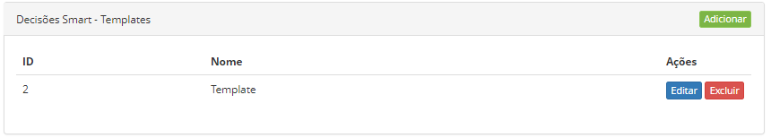
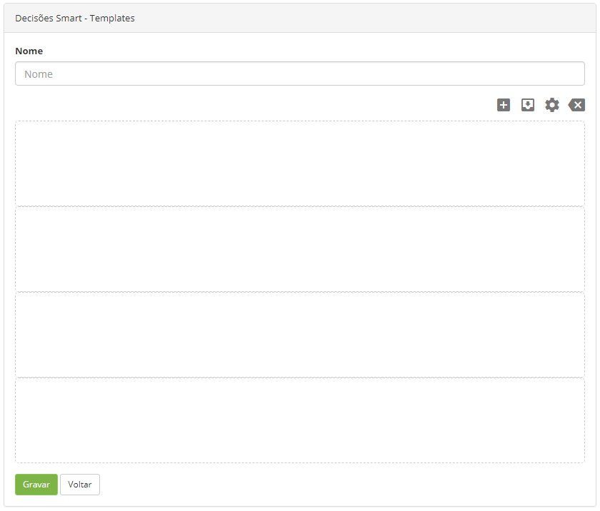
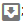
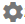

title: Smart decisions template registration
Description: The "Smart Decisions - Templates" feature aims to create templates to be used in the creation of dashboards in the main screen of the system.

# Smart Decisions template registration

The "Smart Decisions - Templates" feature aims to create templates to be used in
the creation of dashboards in the main screen of the system.

How to access
-------------

1.  Access the main menu **System > Settings > Smart Decisions - Templates**.

Preconditions
-------------

1.  Not applicable.

Filters
-------

1.  Not applicable.

Items list
----------

1.  The following cadastral fields are available to the user to make it easier
    to identify the desired items in the default listing of the
    functionality: **ID** and **Template**.

2.  There are action buttons available to the user for each item in the listing,
    they are: *Edit* and *Delete*.

**Figure 1 - Smart decisions items list**

Filling in the registration fields
----------------------------------

1.  After that, the **Templates** screen appears;

2.  Click the *Add* button. Once this is done, the **Template Master** screen
    will be displayed, as shown in the figure below:

**Figure 2 - Template registration**

3.  To create a template, proceed as follows:

-   **Name**: enter the name of the template;

-   To add a widget to the dasboard, click the icon ;

-   To save changes to the dashboard, click the icon ;

-   To change the format of the dashboard, click the icon ;

-   To undo what was done on the dashboard, just click the icon .

4.  After the template is created, click the *Save* button to perform the operation.

!!! tip "About"

    <b>Product/Version:</b> CITSmart | 8.00 &nbsp;&nbsp;
    <b>Updated:</b>09/11/2019 – Anna Martins
