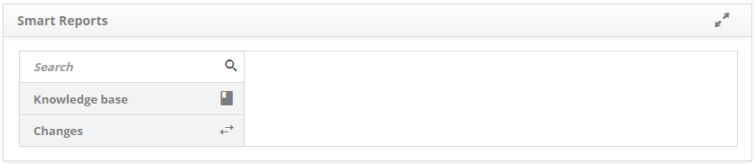

title: Smart reports printing

Description: This functionality is intended to provide the ease of issuance of
reports built by Smart Report Builder.

# Smart reports printing

This functionality is intended to provide the ease of issuance of reports built
by Smart Report Builder.

How to access
-------------

1.  Access the Smart Reports feature by navigating the main
    menu **Reports > Smart Reports > Smart Reports**.

Preconditions
-------------

1.  Not applicable.

Filters
-------

1.  The following filter allows the user to restrict the participation of items
    in the standard feature list, making it easier to find the desired items:

-   Search.

**Figure 1- Reports search screen**

Items list
----------

1.  Not applicable.

Filling in the registration fields
----------------------------------

1.  Not applicable.

A quick vision of the module's main functionality
-------------------------------------------------

**Figure 2 - Smart reports**

1.  Reports are presented by category;

2.  Click a *Category*, and then click the *Report* you want to send.

>   !!! note "NOTE"

Reports built by Smart Report Builder are displayed in this [Smart Reports][1]) screen.

!!! tip "About"

    <b>Product/Version:</b> CITSmart | 8.00 &nbsp;&nbsp;
    <b>Updated:</b>09/11/2019 – Anna Martins
    
[1]:/pt-br/citsmart-platform-7/additional-features/reports/create/smart-reports/configuration/generate-report.html
