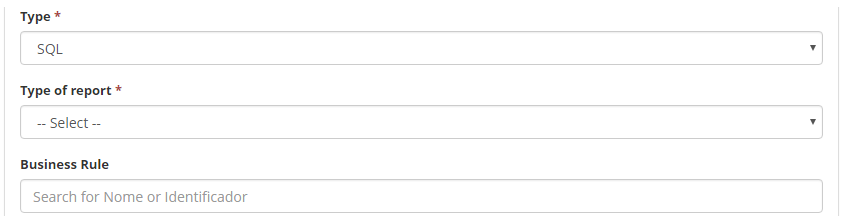

title: Smart Report generator
Description: This functionality is intended to provide the ease of custom reporting with the required functionality data, without the need for further updates or additional software.

# Smart Report generator

This functionality is intended to provide the ease of custom reporting with the
required functionality data, without the need for further updates or additional
software.

How to access
-------------

1.  Access the main menu **Reports > Smart Reports > Smart Report
    Generator**.

Preconditions
-------------

1.  Have a sub report registered.

Filters
-------

1.  The following filter enables the user to restrict the participation of items
    in the standard feature listing, making it easier to find the desired items:

-   Name

2.  On the **Smart Reports** screen, a filter field is displayed to perform the
    search for certain records, as shown in the figure below:

**Figure 1 - Smart report search screen**

3.  To search for a specific record, enter the name of the report. After that,
    the given record will be displayed according to the filter entered.

Items list
----------

1.  The following cadastral fields are available to the user to facilitate the
    identification of the desired items in the standard feature listing: ID,
    Name, Category, Type of query and Type of report;

2.  There are action buttons available to the user for each item in the listing,
    they are: *Edit* and *Delete*.

**Figure 2 - Smart report listing**

3.  To check and / or change the report log data, click the *Edit* button and
    after that you will be directed to the registration screen displaying the
    contents of the selected record.

4.  To import a report (.citreport file), click the *Import* button.

Filling in the registration fields
----------------------------------

1.  Click the *New* button (as the previous figure). Once this is done,
    the **Smart Report Construction** screen will be displayed, as shown in the
    following figure:

!!! info "IMPORTANT"

    The D3 library [https://d3js.org/][1] can be used to create
    JSP-type reports.

**Figure 3 - Smart Report construction screen**

2.  Fill out the fields as instructed:

-   **Identification**: enter the identification of the report you want to
    create;

-   **Description**: enter the name of the report you want to create;

-   **Category**: select the category in which the report will belong;

-   **Type**: select the query type of the report:

   !!! warning "ATTENTION"

     In order to create a Sub Report it should already be registered and the
     "Query Type" should be SQL.

   -   **SQL**: use this type to create report that returns the database
    information through a Query. Selecting this type will display the "Designer"
    and "SQL" tabs and the "Business Rule" field, selecting this option will
    display new fields, as shown below:

**Figure 4 - Fields screen when select SQL Type**

   -   **RhinoScript**: use this type to create a report that returns the database
    information through a script. Selecting this type will display the
    "RhinoScript" tab;

   -   **JSP**: use this type to create report with dynamic content. Selecting this
    type will display the "JSP" tab where you can enter the JSP code.

-   **Report Type**: select the type of report you want to create:

!!! warning "ATTENTION"

    To create a Sub Report (Drill) the "Report Type" should be " Pie Chart"or" Bar Chart ".

   -   **Template**: use this type to create a report with the desired design and
    structure. To create the report with this type, simply select the type,
    inform RhinoScript or SQL in the referring field, inform the FreeMarker
    (template framework) in the "Template" and the parameters if necessary;

   -   **Line chart**: use this type to create a report that displays the
    information in the line chart;

   -   **Pie chart**: use this type to create a report that displays the pie chart
    information;

   -   **Bar chart**: use this type to create a report that displays information in
    bar chart, when selecting the option "pie" or "bar", new fields will be
    presented, as shown below:

**Figure 5 - Fields screen when select "Pie chart" or "Bar chart"**

   -   **Data table**: use this type to create a report that includes all the data
    of a given table;

   -   **Cube**: use this type to create a query that allows you to cross-reference
    information to provide data to the report;

   -   **HTML return**: use this type to create report with HTML.

-   **Module where it will be displayed**: choose an option where the report
    will be displayed;

   -   **N/A**: select this option if you want the report not to be displayed in
    any module;

   -   **General**: select this option to display the report in one or more
    modules, where you want the report to be displayed;

   -   **Specific**: select a single module where you want the report to be
    displayed.

-   **Groups**: inform the group that will be allowed to view the report;

-   On the "**Parameters**" tab, enter the parameters for the selected query
    type and report.

3.  After the report has been built, click the *Save* button to register, in
    this case the date, time and user will be stored automatically for a future
    audit.

!!! info "IMPORTANT"

    The created reports will be displayed in the Smart Reports screen, where
    you can view the relevant data for each report.

Exporting Smart Report
----------------------

1.  To export a report, you must first query the desired report as described in
    "Checking Smart Report Records".

2.  After the query, just click the *Export* button.

[1]:https://d3js.org/

!!! tip "About"

    <b>Product/Version:</b> CITSmart | 8.00 &nbsp;&nbsp;
    <b>Updated:</b>09/11/2019 – Anna Martins
