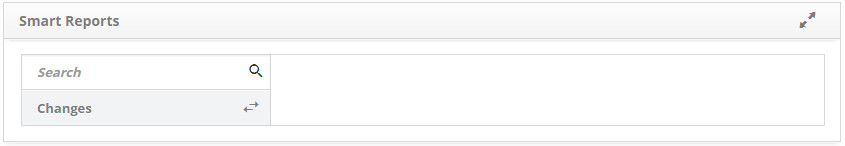

title: Smart Reports
Description: Smart Reports

# Smart Reports

How to access
-------------

To access the feature click on the main menu **Reports > Smart Reports > Smart
Reports**.

Precondition
------------

1.  No applicable.

Filters
-------

1. The following filter enables the user to restrict the participation of items
    in the standard feature listing, making it easier to find the desired items:

   -   Category.

**Figure 1 - Smart Reports**

2. Reports are presented by category;

3. Click a category and then click the report you want to issue.

!!! note "NOTE"

     Reports built by the Smart Report Neuro are displayed in this Smart
     Reports screen.

Items list
----------

1.  No applicable.

Filling in the basic fields
---------------------------

1.  No applicable.

!!! tip "About"

    <b>Product/Version:</b> CITSmart | 7.00 &nbsp;&nbsp;
    <b>Updated:</b>09/11/2019 - Anna Martins
