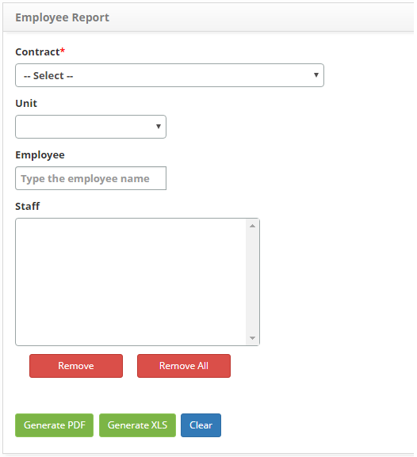

title: Report generation – Personnel management
Description: This report aims to present the information of the employees per unit.

# Report generation – Personnel management

This report aims to present the information of the employees per unit.

How to access
-------------

1.  Access the Contributor Unit Report feature by navigating through the main
    menu **Reports > Personnel Management > Collaboration Unit Report**.

Preconditions
-------------

1.  No applicable.

Filters
-------

1.  he following filters enables the user to restrict the participation of
    items in the standard feature listing, making it easier to find the desired
    items:

    -   **Contract**: select the desired contract;

    -   **Unit**: select the unit that you want to check your respective employees;

    -   **Employee**: enter the name of the collaborator (s);

    -   **Staff**: the collaborator (s) chosen in the previous field will be listed;

2. The **Employee Report Generation by Unit** screen will be displayed, as
    shown in the following figure:

    

     **Figure 1 - Employee report generation screen**

3. Set the filters as needed;

!!! info "IMPORTANT"

     If an employee is not informed, the report will be generated containing
     the information of all active employees of the respective unit (s), related
     to the informed contract.

4. If you want to remove some collaborator, just select it and click
    the *Remove *button. But if you want to remove all employees, just click
    directly on the *Remove All* button;

5. Click the *Generate PDF* button to generate the report in PDF format.

6. Click the *Generate XLS* button to generate the report in Excel format.

Items list
----------

1.  No applicable.

Filling in the registration fields
----------------------------------

1.  No applicable.

!!! tip "About"

    <b>Product/Version:</b> CITSmart | 8.00 &nbsp;&nbsp;
    <b>Updated:</b>07/22/2019 – Anna Martins

