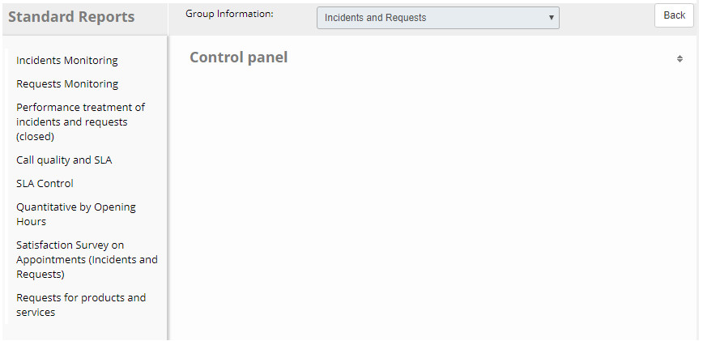
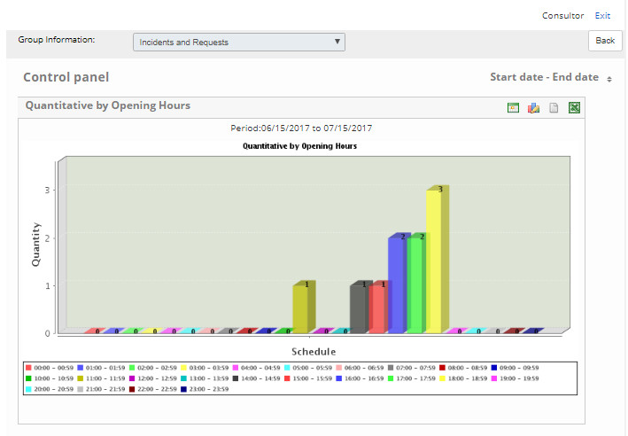
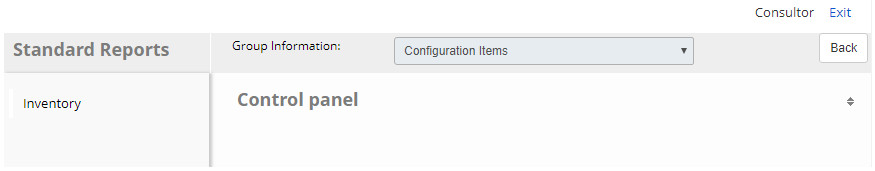
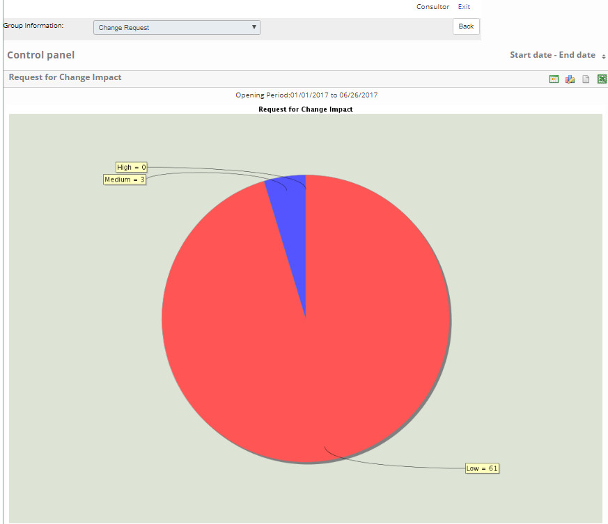
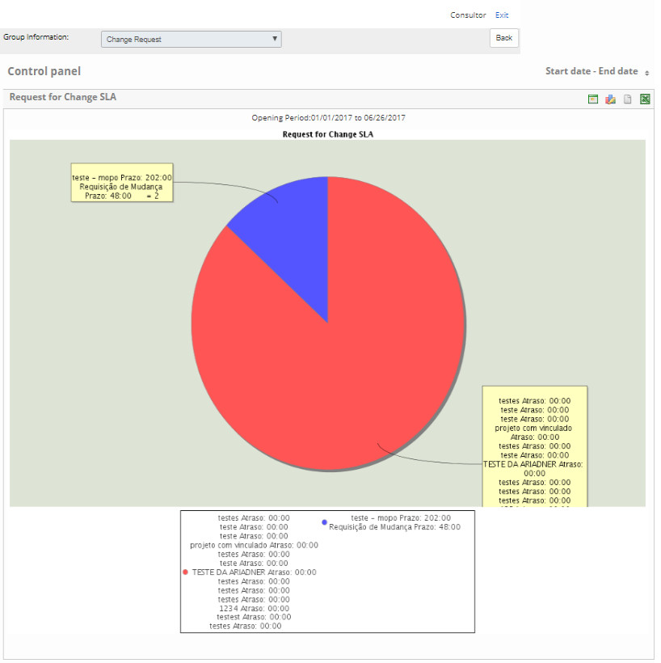

.title: Graphics and reporting panel
Description: Graphics and reporting panel

# Graphics and reporting panel

How to access
-------------

1.  Access the Graphs and Reports panel functionality by navigating in the main
    menu **Reports > Incidents/Request Management > Charts and
    Reports**.

Selecting information group
---------------------------

1.  The **Graphs and Reports Panel** screen is displayed, in which graphs and
    reports can be generated according to the chosen filters.

**Figure 1 - Graphs and reports panel**

2.  Select the reporting group for the report:

-   Incidents and Requests;

-   Configuration Items;

-   Service Catalog;

-   Changes;

-   Change Request.

Button captions
---------------

1.  In the area of representation of the graphs contains four icons, in which it
    allows the visualization of a different form of it.

-   The icon  when clicked generates a table with information.

-   The clickable icon  displays the graphics options (3D Pizza, 2D Pizza, 3D Bar, 2D Bar, 3D
    Line and 2D Line) so you can select the shape of the chart you want to
    view;

-   Clicking icon  generates report in ".pdf" format;

-   The icon  when clicked generates the report in Excel format ".xls".

Incidents and requests
----------------------

On the** Graphs and Reports Pane**, select the **Incidents and
Requests** information group. The graphs and reports in the group will be
presented for their generation, as shown in the figure below:

**Figure 2 - Graphs and incidents and requests reporting panel**

!!! note "NOTE"

    The following topics will be covered on how to generate graphs and reports
    for incidents and requests.

Incident monitoring
-------------------

To check the incident information, follow the steps below:

1.  In the Incidents and Requests and Graphs dashboard, click on the **Incidents
    Monitoring** report;

2.  You will see a screen containing filters where you can define them as needed
    to generate the report. After defining the filters, click
    the *Generate* button.

3.  Incident graphs will be presented according to the filters defined,
    according to the example shown in the figure below:

**Figure 3 - Incident monitoring charts**

Request monitoring
------------------

To check the service request information, follow the steps below:

1.  In the Incidents and Requests and Graphs dashboard, click on the **Requests
    Monitoring** report;

2.  You will see a screen containing filters where you can define them as needed
    to generate the report. After defining the filters, click
    the *Generate* button.

3.  The graphs of service requests will be presented according to the defined
    filters, according to the example shown in the figure below:

**Figure 4 - Service Request Monitoring Charts**

Incident and request capture performance (closed)
-------------------------------------------------

1.  To verify the performance in capturing incidents and service requests,
    proceed as described below:

-   In the Incidents and Requests and Graphs dashboard, click on
    the **Performance treatment of incidents and requests (closed)** report;

-   You will see a screen containing filters where you can define them as needed
    to generate the report. After defining the filters, click
    the *Generate* button.

-   The report will be presented according to the defined filters, according to
    the example shown in the figure below:

**Figure 5 - SLA Control Chart**

-   The Incidents and Requests Capture report shows the time taken to capture
    closed requests. The capture time is the time elapsed between the beginning
    of the SLA and the execution of the first task that counts SLA.

-   The Incidents and Requests Capture Performance report shows a summary table
    with the percentage of requests captured on a per-priority basis.

-   In the representation area of the report there are four icons, in which you
    can see a different form of it.

Quality of service and SLA
--------------------------

To verify the quality of service and SLA of the incidents and requests, proceed
according to the steps described below:

1.  In the incident and request graphics and reports panel, click on the **Call
    quality and SLA** report;

2.  You will see a screen containing filters where you can define them as needed
    to generate the report. After defining the filters, click
    the *Generate* button.

3.  The report will be presented according to the defined filters.

SLA control
-----------

To check the SLA information, follow the steps below:

1.  In the Incidents and Requests and Graphs dashboard, click on the **SLA
    Control** report;

2.  You will see a screen containing filters where you can define them as needed
    to generate the report. After defining the filters, click
    the *Generate* button.

3.  The SLA control chart will be displayed according to the filters defined,
    according to the example shown in the figure below:

**Figure 6 - SLA control chart**

Quantitative by opening hours
-----------------------------

To check the number of registered requests, follow the steps below:

1.  In the Incidents and Requests and Graphs dashboard, click on
    the **Quantitative by Opening Hours** report;

2.  You will see a screen containing filters where you can define them as needed
    to generate the report. After defining the filters, click
    the *Generate* button.

3.  The "quantitative by opening hours" graph will be displayed according to the
    filters defined, according to the example shown in the figure below:

**Figure 7 - Quantitative chart by opening hours**

Satisfaction survey on attendance (incidents and requests)
----------------------------------------------------------

To verify the satisfaction survey information, proceed as described below:

1.  In the Incidents and Requests and Graphs dashboard, click on
    the **Satisfaction Survey on Appointments (Incidents and Requests)** report;

2.  You will see a screen containing filters where you can define them as needed
    to generate the report. After defining the filters, click
    the *Generate* button.

3.  The graph of satisfaction survey about attendances (incidents and requests)
    will be presented according to the defined filters, according to the example
    shown in the figure below:

**Figure 8 - Satisfaction survey graph**

Product and service requests
----------------------------

To check product and service request information, follow the steps below:

1.  In the Incidents and Requests and Graphs dashboard, click on the **Requests
    for Products and Services** report;

2.  You will see a screen containing filters where you can define them as needed
    to generate the report. After defining the filters, click
    the *Generate* button.

3.  The report of requests for products and services will be presented according
    to the defined filters.

Configuration item
------------------

On the **Chart and Report Panel** screen, select the **Configuration
Item** information group. The existing report in the group for generation of the
same will be presented, as shown in the figure below:

**Figure 9 - Configuration item reporting and graphics panel**

!!! note "NOTE"

    The next topic will discuss how to generate the report for the
    configuration item.
   
Inventory
---------

To check the inventory information for the ICs, follow the steps below:

1.  In the graphics and reports for configuration items panel, click on
    the **Inventory** report;

2.  You will see a screen containing filters where you can define them as needed
    to generate the report. After defining the filters, click
    the *Generate* button.

3.  The inventory report will be displayed according to the filters you have
    defined.

Services catalog
----------------

On the **Chart and Report Panel** screen, select the **Service
Catalog** information group. The existing report in the group for generation of
the same will be presented, as shown in the figure below:

**Figure 10 - Graphs and reports catalog catalog**

!!! note "NOTE"
   
    The next topic will be discussed on how to generate the report for the
    service catalog.

Service report
--------------

To check the service information, follow the steps below:

1.  In the services catalog graphics and reports pane, click on the **Service
    Report**;

2.  You will see a screen containing filters where you can define them as needed
    to generate the report. After defining the filters, click
    the *Generate* button.

3.  The services report will be presented according to the defined filters,
    according to the example shown in the figure below:

**Figure 11 - Service report**

Changes
-------

On the **Chart and Report Panel** screen, select the **Changes** information
group. The graphs and reports in the group will be presented for their
generation, as shown in the figure below:

**Figure 12 - Changes**

!!! note "NOTE"

    In the next few topics, you'll learn how to generate graphs and reports for
    changes.

Impacts of changes (RFC x CI)
-----------------------------

To check the IC impact information for changes, proceed as described below:

1.  This report gives the user the capability to check the CIs used in a given
    change and how they are affected. In the graphs panel and change reports,
    click on the **Impacts of Changes (RFC x IC)** report;

2.  You will see a screen containing filters where you can define them as needed
    to generate the report. After defining the filters, click
    the *Generate* button.

3.  The changes impact report will be presented according to the defined
    filters, according to the example shown in the figure below:

**Figure 13 - Changes Impact Report**

Unauthorized CI updates
-----------------------

To check for unauthorized IC update information, proceed as described below:

1.  This report gives the user the capability to check the CIs that were not
    authorized to perform updates. In the graphics and reports for configuration
    items pane, click on the **Updates CI unauthorized** report;

2.  You will see a screen containing filters where you can define them as needed
    to generate the report. After defining the filters, click
    the *Generate* button.

3.  You will be presented with the report of unauthorized IC updates according
    to the defined filters, according to the example shown in the figure below:

**Figure 14 - Reporting of unauthorized IC updates**

Request for change
------------------

On the **Chart and Report Panel** screen, select the **Change
Request** information group. The graphs and reports in the group will be
presented for their generation, as shown in the figure below:

**Figure 15 - Request for change**

!!! note "NOTE"

    In the next few topics, you'll learn how to generate the charts and
    reports for the change request.

Change request by impact
------------------------

To verify the change change request information, proceed as described below:

1.  In the Change Request Chart and Reports pane, click on the **Changes x
    Impact** report;

2.  You will see a screen containing filters where you can define them as needed
    to generate the report. After defining the filters, click
    the *Generate* button.

3.  The impact change request graph will be displayed according to the defined
    filters, as shown in the figure below:

**Figure 16 - Requests for impact changes report**

SLA change request
------------------

To verify the change request information by SLA, proceed as described below:

1.  In the change request graphics and reports panel, click on the **Changes X
    SLA** report;

2.  You will see a screen containing filters where you can define them as needed
    to generate the report. After defining the filters, click
    the *Generate* button;

3.  The change request graph for SLA will be presented according to the defined
    filters, according to the example shown in the figure below:

**Figure 17 - Requests for changes by SLA report**

Request for change by risk
--------------------------

To verify the change request information by risk, proceed as described below:

1.  In the change request graphics and reports panel, click on the **Changes x
    Risk** report;

2.  You will see a screen containing filters where you can define them as needed
    to generate the report. After defining the filters, click
    the *Generate* button;

3.  The risk change request graph will be displayed according to the defined
    filters, as shown in the figure below:

**Figure 18 - Requests for changes to risk report**

Service change request
----------------------

To verify the change request information per service, proceed as described
below:

1.  In the Change Request Chart and Reports panel, click on the **Changes X
    Service** report;

2.  You will see a screen containing filters where you can define them as needed
    to generate the report. After defining the filters, click
    the *Generate* button;

3.  The service request change graph will be displayed according to the defined
    filters, according to the example shown in the figure below:

**Figure 19 - Service change request report**

!!! tip "About"

    <b>Product/Version:</b> CITSmart | 7.00 &nbsp;&nbsp;
    <b>Updated:</b>09/12/2019 - Anna Martins
