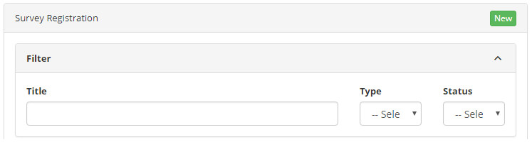
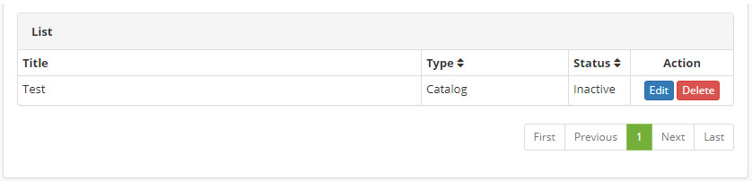
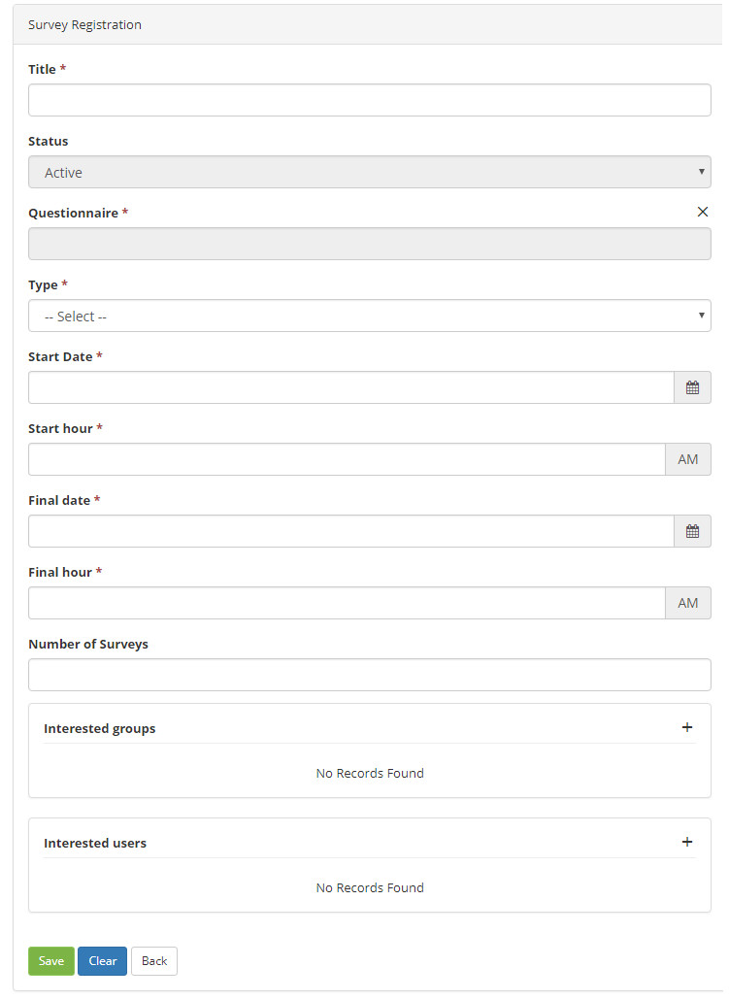

title: Satisfaction survey registration and search
Description: This feature enables the user to create and configure satisfaction surveys according to their needs.The survey form is constructed in the form of a Questionnaire.

# Satisfaction survey registration and search

This feature enables the user to create and configure satisfaction surveys
according to their needs.The survey form is constructed in the form of a
Questionnaire.

How to access
-------------

1.  Access the functionality: **General Registration > Survey Register.**

Preconditions
-------------

1.  User must have a Questionnaire registered in the system (see
    knowledge [Questionnaire Category registration and search][1]);

2.  Enter the content below into the parameter (see knowledge [Parameterization
    rules - system][2]):

-   Parameter 33: system URL.

Filters
-------

1.  The following filters enable the user to restrict the participation of items
    in the standard feature listing, making it easier to locate the desired
    items:

-   **Title**

-   **Type** (single choice)

-   **Situation** (single choice)

**Figure 1 - Survey search screen**

Items list
----------

1.  The following cadastral fields are available to the user to make it easier
    to identify the desired items in the standard feature
    listing: **Title**, **Type** and **Status**.

2.  There are action buttons available to the user in relation to each item in
    the listing, they are: *Edit* and *Delete*.

**Figure 2 - Survey listing screen**

Filling in the registration fields
----------------------------------

1.  Regardless of the type of record, the following fields must be completed:

**Figure 3 -Survey registration screen**

-   **Title**: the search must have a unique title in the system;

-   **Status**: possible values ​​are Active and Inactive;

-   **Questionnaire**: the system allows the link of the survey to occur to a
    registered Questionnaire;

-   **Type**: possible values ​​are Public, Global, Catalog, Service, Activity, or
    Satisfaction;

-   **Start date and Start hour**: restrict the initial time of the search
    application;

-   **Final date and Final hour**: restrict the final time of the
    application of the survey;

-   **Number of Surveys**: is an optional limiter, ie if it is in the interest
    of the search request to limit the number of applications, simply enter a
    number. Leaving this field blank means that only the end date/time will be
    used to terminate the search;

-   **Interested groups**: the system allows the search link to occur to a
    registered Questionnaire;

-   **Interested groups**: to define who is interested in the survey responses,
    the system allows the search link to occur to one or more registered groups;

-   **Interested users**: the system also allows the search link to occur to one
    or more interested Users, regardless of groups;

-   **Link**: this is an output-only field (no typing). Once the search is
    created (recorded) in this field the complete link appears, based on the URL
    of the System properly parameterized.

!!! note "NOTE"

    The button  ("Copy") is available to the right of the Link field, allowing
    the user to easily have the URL correctly mounted, by clicking on it the
    content is copied to the clipboard.

Searches of the 'public' type
-----------------------------

This type allows the participation of all users without any type of restriction,
even they do not even need to be authenticated in the system.  
In this mode, the System URL (parameterized) is provided to the target audience
to participate in the search.

Searches of the 'global' type
-----------------------------

This type restricts the participation of users to those that authenticate
themselves in the system, and can be accessed in two ways:

-   when they identify they will receive an automatic notification (including
    steps to respond)

-   in the Service Portal (menu on the left side) in the option "Active
    campaigns"

1.  When selecting this type some new fields will appear to fill:

-   **Target groups**: to define who will respond to the survey, the system
    allows the search link to occur to one or more registered groups

-   **Target users**: the system also allows the search link to occur to one or
    more Users who will respond, regardless of their groups

-   **Use system notification**: possible values are: Yes or No. When you
    indicate Yes, other fields will appear for filling:

-   **Process**: the system allows the link of the survey to occur to a
    registered Process

-   **Confirmation required**: possible values are: Yes or No

-   **Status**: possible values are Active and Inactive

-   **Start date and Start hour**: restrict the initial timing of
    notifications

-   **Final date and Final hour**: restrict the final timing of
    notifications

-   **Short description**: notification subject for the target audience

-   **Notification description**: body of the notification with a text that will
    guide the audience

Searches of the 'catalog' type
------------------------------

This type is intended for evaluation with the client about the effectiveness of
the catalog deployed for him

1.  When you select this type a new field will pop up to fill:

-   **Catalog**: the system allows the search link to occur to a registered
    Catalog

2.  The chosen catalog must be available in the Service Portal, as the new tab
    "Active campaigns" will appear, besides the fixed tabs (Services and
    Knowledge).

Searches of the 'service' type
------------------------------

This type is intended for evaluation with the client about the effectiveness of
a service deployed for him

1.  When you select this type a new field will pop up to fill:

-   **Service**: the system allows the search link to occur to a Service of a
    registered Catalog

2.  The chosen service must be available in the Service Portal, as the new tab
    "Active campaigns" will appear, in addition to the fixed tabs (Requests,
    Knowledge and Evaluations).

Searches of the 'activity/satisfaction' type
--------------------------------------------

This type is another option of customer satisfaction survey (besides the system
default) on the outcome of a request or incident attendance.

1.  When you select this type a new field will pop up to fill:

-   **Interested groups**: to define who is interested in the survey responses,
    the system allows the search link to occur to one or more registered groups

-   **Interested users**: the system also allows the search link to occur to one
    or more interested Users, regardless of groups

-   **Activity**: the system allows the search link to occur to an Activity of a
    registered service

2.  The original satisfaction survey form of the system has not been deleted,
    continues to function normally.

!!! info "IMPORTANT"

    In the Process field, all ITIL processes and the default "Survey" can be
    related. The CITSmart notification strategy requires linking each survey to
    a process when notification is per process, in this case the system checks
    if the user has access to the process to receive the notification, this
    avoids unnecessary notifications. There is still no registration screen for
    these processes, there should be direct intervention in the database (only
    authorized users).

 !!! note "NOTE"

    As the client can develop his own questionnaires with infinite
    possibilities of fields and logic, the development of reports that retrieve
    data from these surveys is an effort that necessarily requires a specialized
    consultancy to be planned and contracted.

General rules
-------------

1.  Prior to the initial moment configured, any attempt to respond to the search
    will cause a message telling you the exact time for the release.

2.  When answering a survey the system prevents the same user from re-filling
    the answers.

!!! tip "About"

    <b>Product/Version:</b> CITSmart | 7.00 &nbsp;&nbsp;
    <b>Updated:</b>09/12/2019 - Anna Martins

