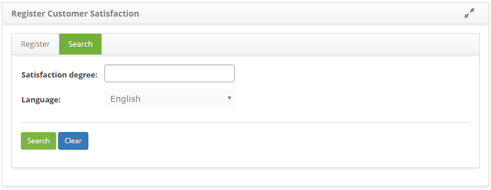

title: Degree of satisfaction registration and search
Description: The purpose of this functionality is to allow the configuration of the degree of satisfaction of the service attendance.

# Degree of satisfaction registration and search

The purpose of this functionality is to allow the configuration of the degree of
satisfaction of the service attendance.

How to access
-------------

1.  Access the satisfaction level feature by navigating through the main
    menu **System > Customer Satisfaction**.

Preconditions
-------------

1.  Not applicable.

Filters
-------

1.  The following filters enables the user to restrict the participation of
    items in the standard feature listing, making it easier to find the desired
    items:

    -  Satisfaction degree;

    -  Language.

2.  On the **Satisfaction Degree Record** screen, click on the *Search* tab, the
    respective search screen will be displayed as shown in the figure below:

**Figure 1 - Satisfaction degree search screen**

3.  Conduct the search on the degree of satisfaction;

   -   Enter the description of the degree of satisfaction, select the language and
    click the *Search* button. After that, the record will be displayed
    according to the data entered;

   -   If you want to list all the records, just click directly on
    the *Search* button.

Items list
----------

1.  The following cadastral fields are available to the user to make it easier
    to identify the desired items in the standard feature
    listing: **Satisfaction degree and ID**.

**Figure 2 - Satisfaction degree list screen**

2.  After searching, select the desired record. Once this is done, it will be
    directed to the registration screen displaying the contents of the selected
    registry;

3.  To change the data of the record of degree of satisfaction, simply modify
    the desired information and click the *Save* button.

Filling in the registration fields
----------------------------------

1.  The **Satisfaction Level Registration** screen will be displayed, as shown
    in the figure below:

**Figure 3 - Satisfaction degree registrationn screen**

2.  Fill in the fields as directed below:

   -  **Satisfaction degree**: define the degree of satisfaction of the service
    attendance;

   -  **Evaluate**: report evaluation regarding the degree of satisfaction;

   -  **Language**: enter the system language.

3.  After completing the fields, click the *Save* button to register, where the
    date, time and user will be saved automatically for a future audit.

!!! tip "About"

    <b>Product/Version:</b> CITSmart | 8.00 &nbsp;&nbsp;
    <b>Updated:</b>09/12/2019 – Anna Martins
