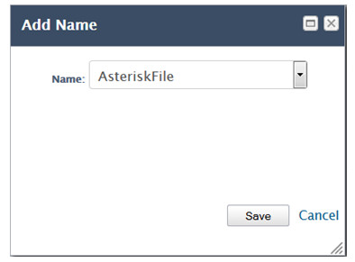

title: Asterisk integration configuration manual and VoIP service
Description: This document is intended to guide the configuration and use of the Attendance (VoIP) functionality
# Asterisk integration configuration manual and VoIP service

This document is intended to guide the configuration and use of the Attendance (VoIP) functionality that integrates CITSmart with 
the Asterisk PBX framework.

Asterisk
--------

Asterisk is a PABX software that uses the concept of free software (GPL), created by Digium Inc. and a growing user base. Asterisk 
runs on Linux platform and other Unix platforms with or without hardware connecting the public telephone network, PSTN (Public 
Service Telephony Network).

Asterisk enables real-time connectivity between PSTN networks and VoIP networks.

For this functionality to be available in CITSmart it was necessary to join it with Asterisk technology.

Depending on how the PBX has been implemented, CITSmart will be able to obtain the source and destination information for the 
connections in the following ways:

-   Extension to extension;

-   Extension to service queue;

-   PSTN external number for extension to service queue;

-   Static and dynamic agent.

CITSmart-Asterisk integration
----------------------------------

The integration of CITSmart with Asterisk allows alerting the attendant about an incoming call, the collaborator who originated the 
call and allowing the registration of a new service request, assigning this collaborator identified as the requestor.

Configuring JBOSS 7 log
------------------------------

In order to not display the Asterisk INFO messages, which are constants, in the JBoss LOG, follow the steps below:

1.  Enter the JBoss application server, click Administration Console as shown in the figure below:

    

    **Figure 1 - JBoss 7 application server**

2.  The JBoss 7 application server console administration screen will be displayed.

3.  Add the console handler for asterisk;

    -  Click Profile > Core > Logging > Handler > Console and the Add button as indicated in the figure below:

    
    
    **Figure 2 - Inserting console Handler**

    - A window will appear to inform the data of the console handler asterisk, inform them as shown in the figure below:

    
    
    **Figure 3 - Console Handler registration**

    - After entering the data, click the *Save* button;

    - Click on AsteriskConsole you just added and edit your information;

    
    
    **Figure 4 - Console Handler edition**

    - Check the Auto flush field and click the *Save* button as indicated in the figure below:

    
    
    **Figure 5 - Console Handler information edition**

    
    
    **Figure 6 - Console Handler for Asterisk**

4. Register the file handler for asterisk (this setting defines the handler that will create the LOG file for asterisk);

    - Click File and then click the *Add* button;

    
    
    **Figure 7 - Insert the file Handler**

    - A window will be displayed to inform the file handler data for asterisk, inform them as shown in the figure below:

    
    
    **Figure 8 - File Handler master file**

    - After entering the data, click the *Save* button;

    - Click AsteriskFile that you just added and edit your information;

    
    
    **Figure 9 - File Handler editing**

    - Check the Append and Auto flush fields and click the *Save* button as indicated in the image below:

    
    
    **Figure 10 - Editing file Handler information**

    
    
    **Figure 11 – File Handlers for Asterisk**

5. Configure the LOG categories;

    - Click Log Categories and then click the *Add* button to add a category;

    
    
    **Figure 12 - Inserting LOG categories**

    - A window will appear to inform the data of the category, inform them as shown in the figure below:

    
    
    **Figure 13 - LOG category master**

    - After entering the data, click the *Save* button;

    
    
    **Figure 14 - LOG category**

    - Click the Handlers tab and then the *Add* button;

    
    
    **Figure 15 - Adding LOG category Handlers**

    - A window will appear to inform the category handler. Add the AsteriskConsole and AsteriskFile handler;

    
    
    **Figure 16 - Adding the AsteriskConsole Handler**

     
     
    **Figure 17 - Addition of the AsteriskFile Handler**

    
   
    **Figure 18 - LOG category for Asterisk**

6. After that, close the JBoss 7 application server console administration page and restart it.

Configuring CITSmart parameters
--------------------------------------

To perform VoIP functionality, you must configure the system parameters:

1. Fill in the parameters according to related knowledge "Parameterization rules - Telephony".

!!! warning "WARNING"

    CITSmart will only issue a call alert for configured service queues.

Using VoIP functionality
-----------------------------------

To work with the VoIP functionality, it is necessary to register the extension to be used for the service, according to the steps 
described below:

1. From the CITSmart home screen, click Call, as shown in the image below:

    
    
    **Figure 19 - Attendance functionality (VoIP)**

2. The Extension window containing a field is displayed, which tells you the extension number to be used for the service;

    
    
    **Figure 20 - Extension configuration screen**

3. Enter the extension number and click the *Save* button to perform the operation.

4. After entering the extension number, the system will monitor it, when a call occurs, ie when a call is directed to the 
configured extension number, a window will be displayed showing the telephone number and the person's name That is linking, as 
shown in the image below:

    
    
    **Figure 21 - Connection warning screen**

    !!! note "NOTE"

        It is necessary that the person that is calling already has a registration in CITSmart, with the referring data.

5. If the attendant wants to register a service/incident request, simply click on the Register new request button that will open a 
window for a new request to be created;

!!! note "NOTE"

     In order to register the service request, the requestor, that is, the person requesting the service must be registered in the 
     system and linked to the same contract as the attendant.

**Figure 22 - Service request/incident recording screen**

See also
-----------

[Parameterization rules - Telephony][1].

[1]:/en-us/citsmart-platform-7/plataform-administration/parameters-list/parametrization-telephony.html

!!! tip "About"

    <b>Product/Version:</b> CITSmart | 8.00 &nbsp;&nbsp;
    <b>Updated:</b>09/06/2019 – Larissa Lourenço
