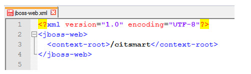
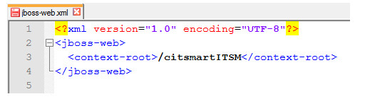
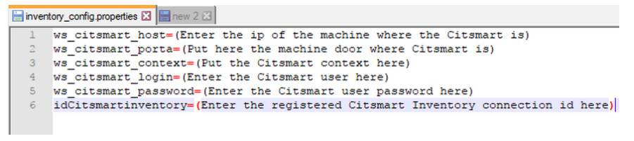
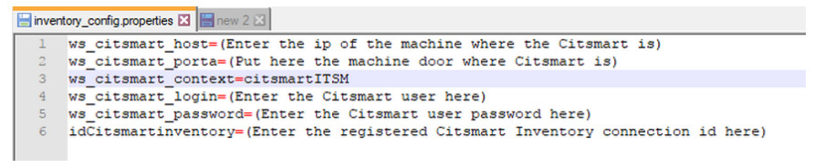
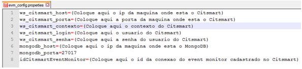
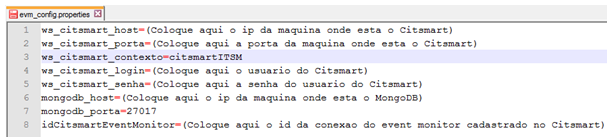
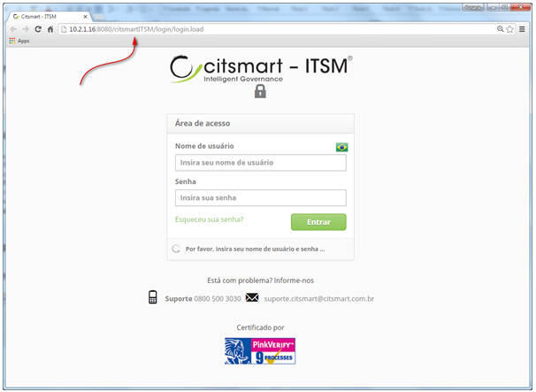

title: Context change guide
Description: This document aims to provide guidelines to carry out the change of context of the CITSmart ITSM.

# Context change guide

This document aims to provide guidelines to carry out the change of context of the CITSmart ITSM.

CITSmart ITSM deploy file (.war)
-----------------------------------

!!! note "NOTE"

    It is necessary to change the file "jboss-web.xml" (* .war / WEB-INF / jboss-web.xml) before uploading the application.

Configure the CITSmart ITSM deploy file as directed below:

1. Open the ".war" file of CTSmart ITSM, for example: citsmartITSM-JB7.war;

2. Enter the WEB-INF directory and open the jboss-web.xml file. Once this is done, the script will be displayed as shown in the 
figure below:

    

    **Figure 1 - Script**

3. Change the "citsmart" context the way you want it. The figure below illustrates an example of the modified context:

    
   
    **Figure 2 - Script**

4. After the change, save the file.

After configuring the jboss-web.xml file, and if you were using the Inventory and / or EVM - Event Monitor modules, you should make 
a change to the JBoss application server configuration file (evm_config.properties and inventory_config.properties). If you are not 
using these modules, you can upload the system normally.

Inventory
---------

If you are using the Inventory module, change the JBoss application server configuration file as directed below:

1. Open the JBoss inventory_config.properties configuration file (\standalone\configuration\inventory_config.properties). Once this 
is done, the script will be displayed as shown in the figure below:

    
    
    **Figure 3 - Inventory properties**

2. In the "ws_citsmart_context" line, inform the new context of the CITSmart ITSM, as shown in the figure below:

    
    
    **Figure 4 - Inventory properties**

3. After the change, save the file.

EVM - Event Monitor
------------------

If you are using the EVM - Event Monitor module, change the JBoss application server configuration file as directed below:

1. Open the JBoss evm_config.properties configuration file (\standalone\configuration\evm_config.properties). Once this is done, 
the script will be displayed as shown in the figure below:

    
    
    **Figura 5 - Propriedades do EVM**

2.  Na linha “**ws_citsmart_contexto**”, informe o novo contexto do CITSmart ,
    conforme exemplo ilustrado na figura abaixo:

    
    
    **Figura 6 - Propriedades do EVM**

3.  Após a alteração, salve o arquivo.

Novo contexto
------------

Após realizada a configuração para alteração do contexto, ao subir o sistema
será apresentado o novo contexto conforme exemplo ilustrado na figura abaixo.

    
**Figura 7 - Novo contexto**

!!! tip "About"

    <b>Product/Version:</b> CITSmart | 8.00 &nbsp;&nbsp;
    <b>Updated:</b>07/26/2019 – Anna Martins
