title: On-premise installation guide (ITSM)
Description: This practical guide aims to demonstrate the step-by-step installation of the CITSmart Enterprise tool.

# On-premise installation guide (ITSM)

This practical guide aims to demonstrate the step-by-step installation of the CITSmart Enterprise tool.

## Preconditions

1. The **https** protocol is mandatory, but the Administrator can choose a self-signed certificate.

2. Here is the minimum version of each Database Management System that is compatible with the solution:

    - PostGreSQL (9.2+)

    - Microsoft SQL Server (2008+)

    - ORACLE (10g+)

    - MongoDB (3.4.5)

3. Here is the minimum version of each browser compatible with the solution:

    - Internet Explorer (10+)

    - Mozilla Firefox (50+)

    - Google Chrome (50+)

4. The following is the version of each basic software that is compatible with the solution:

    - GNU / Linux operating system with a kernel of 3.10+

    - JBoss (7.1.2)

    - Apache Solr (6.4.2)

    - Java (1.7.0.80+)

    - JMS Apache ActiceMQ (5.14.5+)

5. The installation of CITSmart ITSM is an automated process and its main premise is that the integrity of the result can only be 
guaranteed if the installation is complete and successful, from its beginning to its end. In the event of any crash, shutdown or 
crash in the operating environment during the installation process, when this installation is triggered again the following 
message will appear for the team responsible for the installation.("**IMPORTANT NOTICE: We have identified that some type of 
problem occurred in a previous execution of this same Citsmart installation process, which may have caused damage to the database. 
Therefore, as a precaution, the current database file can no longer be used. We recommend that, manually, the team responsible for 
this installation replaces that database with a new one and restarts the installation process.") The most detailed steps are 
these**:

    - Terminate this installation process;

    - Delete (manually) the database file;

    - Create the database file again;
    
    - Rerun the installation process.

## Minimum requirements

   - The Jboss 7.1.2 **application server** running environment and the Apache JMS server ActiceMQ must have the following minimum requirements:

|                           Requirement                         |                     Specification                    |
|:-------------------------------------------------------------:|:----------------------------------------------------:|
|                          Operational System                   |1 x GNU/Linux RedHat or Debian (including derivatives) |
|                            Memory                             |                       16 GB RAM                      |
|                             Disk                              |                        120 GB                        |
|                         Processors                            |                       4 (vCPU)                       |
|                 Read/Write on Disk (I/O)                      |                      > 150 MB/s                      |
|                              Network                          |                      > 100 Mbps                      |
|Jumps to solutions (Databases, EVM, INV, MongoDB, WMI collector)|                Same network, no jumps               |


**Table 1 - Minimum requirements**

- The **database server running** environment must have the following minimum requirements:

|                          Requirement                        |                     Specification                    |
|:-----------------------------------------------------------:|:----------------------------------------------------:|
|                       Operational System                    | 1 x GNU/Linux RedHat or Debian (including derivatives) |
|                           Memory                            |                         4 GB                         |
|                            Disk                             |                        120 GB                        |
|                        Processors                           |                       2 (vCPU)                       |
|                Read/ Write on Disk (I/O)                    |                      > 150 MB/s                      |
|                             Network                         |                      > 100 Mbps                      |
|Jumps to solutions (ISTM, EVM, INV, MongoDB, WMI collector)  |                Same network, no jumps                |

**Table 2 - Minimum requirements**

- The execution environment of the **non-relational database server** MongoDB should have as minimum requirements:

|                          Requirement                       |                     Specification                    |
|:----------------------------------------------------------:|:----------------------------------------------------:|
|                   Operational System                       | 1 x GNU/Linux RedHat or Debian (including derivatives) |
|                           Memory                           |                         4 GB                         |
|                            Disk                            |                        120 GB                        |
|                        Processors                          |                       2 (vCPU)                       |
|               Read/ Write on Disk (I/O)                    |                      > 150 MB/s                      |
|                            Network                         |                      > 100 Mbps                      |
|Jumps to solutions (Bancos, EVM, INV, ITSM, WMI collector)  |                Same network, no jumps                |

**Table 3 - Minimum requirements**

- The execution environment of the **Apache Solr index server** must have as minimum requirements:

|                          Requirement                        |                     Specification                    |
|:-----------------------------------------------------------:|:----------------------------------------------------:|
|                       Operational System                    | 1 x GNU/Linux RedHat or Debian (including derivatives) |
|                           Memory                            |                         4 GB                         |
|                            Disk                             |                        120 GB                        |
|                        Processors                           |                       2 (vCPU)                       |
|                Read/ Write on Disk (I/O)                    |                      > 150 MB/s                      |
|                         Network                             |                      > 100 Mbps                      |
|Jumps to solutions (ISTM, EVM, INV, MongoDB, WMI collector)  |                Same network, no jumps                |

**Table 4 - Minimum requirements**

- The execution environment of the **ms-windows server for collections via WMI** must have as minimum requirements:

|                        Requirement                     |      Specification     |
|:------------------------------------------------------:|:----------------------:|
|             Operational System                         |       1 x Windows      |
|                       Memory                           |          8 GB          |
|                       Disk                             |          80 GB         |
|                      Processors                        |        8 (vCPU)        |
|             Read/ Write on Disk (I/O)                  |       > 150 MB/s       |
|                      Network                           |       > 100 Mbps       |
|Jumps to solutions (Databases, EVM, INV, ITSM, MongoDB) | Same network, no jumps |

**Table 5 - Minimum requirements**

## Software and download

!!! info "IMPORTANT"

     We recommend RedHat, Cent / OS, Debian or Ubuntu.

!!! Abstract "KNOW MORE"

     All our files mentioned in this document can be downloaded by accessing the download area of CITSmart Corporation
     ([http://files.citsmart.com](http://files.citsmart.com/))

To run CITSmart Enterprise, we will download the required packages according to the product procedure.

### Jboss Application Server

Download the package according to your database (in the manual we will use the package with PostgreSQL):

   - Jboss (PostgreSQL) : jboss-7.1.2_postgres.tar.gz

   - Jboss (Oracle): jboss-7.1.2_oracle.tar.gz

   - Jboss (MSSQL): jboss-7.1.2_mssql.tar.gz

   - Java JDK (qualquer banco): jdk1.7.0_80_x64.tar.gz

### JMS Apache ActiveMQ Server

   - Apache ActiveMQ 5.14.5: apache-activemq-5.14.5.tar.gz

   - Java JDK: jdk1.7.0_80_x64.tar.gz

### MongoDB Database Server

   - To find the download according to your distribution: <https://www.mongodb.com/download-center#community>

   - To download MongoDB for Ubuntu Server LTS 16.04:
   <https://fastdl.mongodb.org/linux/mongodb-linux-x86_64-ubuntu1604-3.4.5.tgz>

### PostgreSQL / Oracle / MSSQL Database Server

CITSmart Enterprise is compatible with PostgreSQL or higher and will be downloaded at the time of package configuration.

It is recommended that Oracle or MSSQL installations be performed according to information and best practices of each 
manufacturer:

- *Oracle:* <https://docs.oracle.com/cd/E11882_01/server.112/e10897/toc.htm>

- *MSSQL:* <https://docs.microsoft.com/en-us/sql/database-engine/install-windows/install-sql-server>.

### Apache Solr Indexing Server

- Solr

- Knowledge Base Settings:
  http://files.citsmart.com/base_conhecimento_configs.zip

## Package configuration

!!! note "NOTE"

     We will use the / opt directory to install all packages for CITSmart Enterprise ITSM. GNU / Linux with minimal installation 
     must be configured on the 4 machines. In the examples we used Ubuntu Server LTS 16.04. If you want another distribution, use 
     the commands.

With the finished downloads we can start the installation of the CITSmart Enterprise ITSM solution.

### Jboss Application Server

1. We must unzip the JAVA JDK package in the / opt directory and create two symbolic links for / usr / bin. We recommend that your 
environment does not have any JAVA installed. Run java -version and check out the java version.

    ```sh
    tar -xvzf jdk-1.7.0_80-linux-x64.tar.gz -C /opt/
    ln -s /opt/jdk1.7.0_80/bin/java /usr/bin
    ln -s /opt/jdk1.7.0_80/bin/keytool /usr/bin
    java -version
    java version "1.7.0_80"
    Java(TM) SE Runtime Environment (build 1.7.0_80-b15)
    Java HotSpot(TM) 64-Bit Server VM (build 24.80-b11, mixed mode)
    ```

2. Extract Jboss to the / opt directory.

3. In the example below we use Jboss with the configured PostgreSQL.

    ```sh
    tar -xvzf jboss-7.1.2_postgres.tar.gz -C /opt/
    ```

4.  Now we must configure the standalone-full.xml file.

    **Some configurations will only be possible after installing all components of the solution**.

    ```java
    <!-- SET TRUE TO ENABLE EVM -->
    <property name="citsmart.evm.enable" value="false"/>
    <!-- SET TRUE TO ENABLE INVENTORY -->
    <property name="citsmart.inventory.enable" value="false"/>
    <!-- SET MONGODB IP -->
    <property name="mongodb.host" value="IP_MONGODB"/>
    <!-- SET MONGODB PORT -->
    <property name="mongodb.port" value="PORT_MONGODB"/>
    <!-- SET MONGODB USER -->
    <property name="mongodb.user" value="USER_MONGODB"/>
    <!-- SET MONGODB PASSWORD -->
    <property name="mongodb.password" value="PASSWD_MONGODB"/>
    <!-- SET CITSMART IP -->
    <property name="citsmart.host" value="127.0.0.1"/>
    <!-- SET CITSMART PORT -->
    <property name="citsmart.port" value="8080"/>
    <!-- SET CITSMART CONTEXT -->
    <property name="citsmart.context" value="citsmart"/>
    <!-- SET CITSMART ADMINISTRATOR LOGIN -->
    <property name="citsmart.login" value="consultor"/>
    <!-- SET CITSMART ADMINISTRATOR PASSWORD -->
    <property name="citsmart.password" value="password"/>
    <!-- SET CITSMART INVENTORY ID -->
    <property name="citsmart.inventory.id" value="inventory_local"/>
    <!-- SET CITSMART EVM ID -->
    <property name="citsmart.evm.id" value="evm_local"/>
    ```

5. The necessary configuration sections are demonstrated below and will be explained in the "**CITSmart Parameters**" section.

6. For the database we will need two bases, called CITSMART_NAME_DB and CITGRP_NAME_DB.

7. There are **4 datasource** entries for CITSMART_NAME_DB.

    ```sh
    <!-- SET YOUR DATABASE INFORMATION - CHANGE IP_DB, PORT_DB, CITSMART_NAME_DB, CITGRP_NAME_DB, USER_DB,      PASSWD_DB -->
    <connection-url>jdbc:postgresql://IP_DB:PORT_DB/CITSMART_NAME_DB</connection-url>
    <driver>postgres</driver>
    <pool>
    <min-pool-size>10</min-pool-size>
    <max-pool-size>1000</max-pool-size>
    <prefill>true</prefill>
    <flush-strategy>FailingConnectionOnly</flush-strategy>
    </pool>
    <security>
    <user-name>USER_DB</user-name>
    <password>PASSWD_DB</password>
    ```

8.  There are 9 datasource entries for CITGRP_NAME_DB.

    ```sh
    <!-- SET YOUR DATABASE INFORMATION - CHANGE IP_DB, PORT_DB, CITSMART_NAME_DB, CITGRP_NAME_DB, USER_DB, PASSWD_DB -->
    <connection-url>jdbc:postgresql://IP_DB:PORT_DB/CITGRP_NAME_DB</connection-url>
    <driver>postgres</driver>
    <pool>
    <min-pool-size>10</min-pool-size>
    <max-pool-size>1000</max-pool-size>
    <flush-strategy>IdleConnections</flush-strategy>
    </pool>
    <security>
    <user-name>USER_DB</user-name>
    <password>PASSWD_DB</password>
    ```

### JMS Apache ActiveMQ Server

Unzip ActiveMQ and JAVA in the / opt directory and create the symbolic JAVA link.

```sh
tar -xvzf apache-activemq-5.14.5.tar.gz -C /opt/
tar -xvzf jdk-1.7.0_80-linux-x64.tar.gz -C /opt/
ln -s /opt/jdk1.7.0_80/bin/java /usr/bin
```

### MongoDB Database Server

1. After downloading MongoDB from version 3.4.5 for its correct distribution, decompression should be done for the / opt 
directory.

    ```sh
    tar -xvzf mongodb-linux-x86_64-ubuntu1604-3.4.5.tgz -C /opt/
    ```

2. We should create a directory for the base and start MongoDB. Note that it will come up with unrestricted access permissions.

    ```sh
    mkdir -p /data/db
    cd /opt/mongodb-linux-x86_64-ubuntu1604-3.4.5/bin/
    ./mongod
    <mensagens de acesso irrestrito>
    ```

3. With MongoDB started, open another terminal, access the MongoDB bin directory and create the citsmart database by setting your 
user name and password.

4. The return "**Successfully added user**" should be noted.

5. Type exit to exit the MongoDB console.

    ```sh
    cd /opt/mongodb-linux-x86_64-ubuntu1604-3.4.5/bin/
    ./mongo
    ```
    ```
    <mensagens de acesso irrestrito>
    use admin
    db.createUser({
    user: "admin",
    pwd: "yourpassword",
    roles:[
    { role: "root", db: "admin" },
    { role: "dbOwner", db: "citsmart" }
    ]
    })
    ```

6. Return to the previous terminal and end the mongodb process with a CTRL + C.

### PostgreSQL/ Oracle/ MSSQL database server

1. PostgreSQL can be installed directly from the distribution repository if it is equal to or greater than version 9.2.

2. In the manual we are using the Ubuntu Server LTS 16.0.4 that has version 9.5 in the repository.

    ```sh
    apt-get update
    apt-get install postgresql-9.5
    ```

3. After installing PostgreSQL we need to create the database, user and password.

    ```sh
    systemctl start postgresql
    su – postgres
    $ psql
    postgres=# create user citsmart with password 'yourpassword';
    <mensagem CREATE ROLE>
    postgres=# create database citsmartdb with owner citsmart encoding 'UTF8' tablespace pg_default;
    <mensagem CREATE DATABASE>
    postgres=# create database citgrpdb with owner citsmart encoding 'UTF8' tablespace pg_default;
    <mensagem CREATE DATABASE>
    postgres=# alter role citsmart superuser;
    <mensagem ALTER ROLE>
    postgres=#exit
    ```

    !!! info "IMPORTANT"

        Observe the return of the commands by analyzing the correct execution.

4. Now we will configure **/etc/postgresql/9.5/main/pg_hba.conf** to allow the Jboss connection to the database and citsmart user. 
At the end of the file change the lines:   

    ```sh
    Default:
    host all all 127.0.0.1/32 md5
    Updated:
    host CITSMART_NAME_DB USER_DB IP_JBOSS/32 md5
    host CITGRP_NAME_DB USER_DB IP_JBOSS/32 md5
    ```

5. Time to open listening in the **/etc/postgresql/9.5/main/postgresql.conf** file.
6. After the settings, a restart in postgresql.

    ```sh
    Default is commented:
    #listen_addresses = 'localhost'
    Updated:
    listen_addresses = '0.0.0.0'
    systemctl restart postgresql
    ```

### Apache Solr indexing server

1. Install the unzip package according to your distribution.

2. Unzip JAVA and Solr to / opt /.

    ```sh
    apt-get install unzip
    unzip -x solr-6.4.2.zip -d /opt/
    tar -xvzf jdk-8u131-linux-x64.tar.gz -C /opt
    ln -s /opt/jdk1.8.0_131/bin/java /usr/bin/
    java -version
    java version "1.8.0_131"
    Java(TM) SE Runtime Environment (build 1.8.0_131-b11)
    Java HotSpot(TM) 64-Bit Server VM (build 25.131-b11, mixed mode)
    ```

3. Create a user to run Solr with false shell and permission in the Solr directory for it and start.

    ```sh
    useradd -s /bin/false solr
    chown -R solr /opt/solr-6.4.2/
    sudo -u solr /opt/solr-6.4.2/bin/solr start
    ```

4. Unzip the file to knowledge base settings and run the collection creation.

    ```sh
    unzip -x base_conhecimento_configs.zip -d /opt/solr-6.4.2/
    cd /opt/solr-6.4.2
    sudo -u solr /opt/solr-6.4.2/bin/solr create -c base_conhecimento -d base_conhecimento_configs -s 2 -rf 2
    ```

5. Note the return of the command with "Creating new core 'knowledge_base' and 'status': 0.

## CITSmart parameters

!!! warning "WARNING"

    All parameters must be configured before the solution is fully started.

- ***False or true to enable / disable EVM. Default: false.***

       *\<property name="citsmart.evm.enable" value="false"/\>*

- ***False or true to enable / disable INV. Default: False.***

       *\<property name="citsmart.inventory.enable" value="false"/\>*

- ***Configure the MongoDB IP according to the MongoDB server network.***

       *\<property name="mongodb.host" value="IP_MONGODB"/\>*

- ***Configure the MongoDB PORT according to your installation. Default: 27017.***

       *\<property name="mongodb.port" value="PORT_MONGODB"/\>*

- ***Set the MongoDB USER accordingly. Default: admin.***

       *\<property name="mongodb.user" value="USER_MONGODB"/\>*

- ***Set the MongoDB PASSWORD accordingly. Default: yourpassword.***

       *\<property name="mongodb.password" value="PASSWD_MONGODB"/\>*

- ***Configure Jboss IP according to your network. Default: 127.0.0.1.***

       *\<property name="citsmart.host" value="127.0.0.1"/\>*

- ***Configure the Jboss PORT according to your network. Default: 8080.***

       *\<property name="citsmart.port" value="8080"/\>*

- ***Configure the citsmart deploy context. Default: citsmart.***

       *\<property name="citsmart.context" value="citsmart"/\>*

- ***Configure the citsmart deploy context. Default: consultor.***

       *\<property name="citsmart.login" value="consultor"/\>*

- ***Set the cpmmart PASSWORD. Default: password.***

       *\<property name="citsmart.password" value="password"/\>*

- ***INV ID for creation in citsmart. Default: inventory_local.***

       *\<property name="citsmart.inventory.id" value="inventory_local"/\>*

- ***EVM ID for creation in citsmart. Default evm_local.***

       *\<property name="citsmart.evm.id" value="evm_local"/\>*

- ***DataSource of the standalone-full.xml***

       *\<connection-url\>jdbc:postgresql://IP_DB:PORT_DB/CITSMART_NAME_DB\</connection-url\>*

       *\<connection-url\>jdbc:postgresql://IP_DB:PORT_DB/CITGRP_NAME_DB\</connection-url\>*

       *\<user-name\>USER_DB\</user-name\>*

       *\<password\>PASSWD_DB\</password\>*

- ***IP_DB: PostgreSQL database server network configuration***

- ***PORT_DB: Default 5432 (PostgreSQL).***

- ***CITGRP_NAME_DB: Default: citgrpdb.***

- ***CITSMART_NAME_DB: Default: citsmartdb.***

- ***USER_DB: Base Access User. Default: citsmart.***

- ***PASSWD_DB: Database user password. Default: yourpassword.***

## Batch processing configuration (quartz.properties file)

### Cluster environment

The following are the steps that must be taken to configure the CITSmart ITSM batch routine for the clustered environment.

!!! warning "WARNING"

    Never use the batch processing routine in a clustered environment, without synchronizing the server time. Therefore, do not 
    perform the settings without first having the servers running with this active synchronization.

1. Add the quartz.properties file available in the version deploy and corresponding to the database used, directly in the 
"configuration" folder of the standalone directory or JBoss domain, depending on the installation you want. Edit this file and 
make the following settings:

    - Verify that the *org.quartz.jobStore.driverDelegateClass* property corresponds to the installation database:

       - Postgresql = *org.quartz.impl.jdbcjobstore.PostgreSQLDelegate*

       - Oracle = *org.quartz.impl.jdbcjobstore.oracle.OracleDelegate*

       - Microsoft SQL Server = *org.quartz.impl.jdbcjobstore.MSSQLDelegate*

    - Change the org.quartz.jobStore.dataSource property so that it is exactly the same as the pool-name that was entered in the 
    JBoss configuration file: standalone.xml or domain.xml;

    - If the environment is clustered the org.quartz.jobStore.isClustered property must be **true**;

    - Change the *org.quartz.dataSource.citsmart.jndiURL* property to the same jndi-name URL present in the JBoss configuration 
    file.

2. Below is an image illustrating the locations of the ***quartz.properties*** file that should be evaluated:

    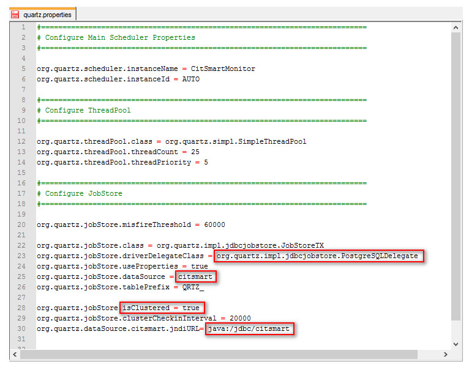

    **Figure 1 - File quartz.properties**

3. In the JBoss **standalone.xml** or **domain.xml** configuration file, include the ***org.quartz.properties*** property in the 
**system-properties** tag as follows:

    ```sh
    <system-properties>
    <property name="org.apache.tomcat.util.http.Parameters.MAX_COUNT" value="2000"/>
    <property name="mongodb.host" value="localhost"/>
    <property name="mongodb.port" value="27017"/>
    <property name="mongodb.user" value="admin"/>
    <property name="mongodb.password" value="admin"/>
    <property name="citsmart.evm.enable" value="true"/>
    <property name="citsmart.inventory.enable" value="false"/>
    <property name="esper.threads" value="4"/>
    <property name="org.quartz.properties" value="${jboss.server.config.dir}/quartz.properties"/>
    </system-properties>
    ```

### Standalone environment

The following are the steps that must be taken to configure the CITSmart ITSM batch processing routine in a standalone 
environment.

1. Add the ***quartz.properties*** file available in the version deploy to standalone environment, directly in the "configuration" 
folder of the standalone directory of JBoss.

2. In the JBoss ***standalone.xml*** configuration file, include in the ***system-properties*** tag the 
***org.quartz.properties*** property, as indicated below:

    ```java
    \<system-properties\>

    \<property name="org.apache.tomcat.util.http.Parameters.MAX_COUNT"
    value="2000"/\>

    \<property name="mongodb.host" value="localhost"/\>

    \<property name="mongodb.port" value="27017"/\>

    \<property name="mongodb.user" value="admin"/\>

    \<property name="mongodb.password" value="admin"/\>

    \<property name="citsmart.evm.enable" value="true"/\>

    \<property name="citsmart.inventory.enable" value="false"/\>

    \<property name="esper.threads" value="4"/\>

    \<property name="org.quartz.properties"
    value="\${jboss.server.config.dir}/quartz.properties"/\>

    \</system-properties\>
    ```

3. Configure the **citsmart.cfg** file. The default configuration of CITSmart ITSM does not use the database to store quartz Jobs, 
so it becomes necessary to load them in memory during startup. To do this, it is necessary to add in the **citsmart.cfg** file the 
parameter: START_PROCESSAMENTOS_BATCH = TRUE

## CITSmart enterprise deploys download

With the deploys in hand, move them to the deployments directory of Jboss.

```sh
cp <deploy 1>.war /opt/jboss-7.1.2/standalone/deployments/
cp <deploy 2>.war /opt/jboss-7.1.2/standalone/deployments/
cp <deploy 3>.war /opt/jboss-7.1.2/standalone/deployments/
<Continue to conform to the deploys available for your subscription>
```

### Creating directories for installation

Create the directories below to be configured in the 3 steps of web installation.

```sh
EDM:
mkdir /opt/citsmart/ged
Knowledge base:
mkdir /opt/citsmart/kb
Twin words:
mkdir /opt/citsmart/twinwords
Knowledge Base Attachments:
mkdir /opt/citsmart/attachkb
Upload:
mkdir /opt/citsmart/upload
```

### Self-signed certificate generation SSL

!!! info "IMPORTANT"

    A self-signed certificate will be generated for Jboss. If you have a certificate it is important to use it.

1. Connect to the Jboss server.

    ***Deleting old aliases***.

    ```sh
    /opt/jdk1.7.0_80/bin/keytool -keystore /opt/jdk1.7.0_80/jre/lib/security/cacerts -delete -alias GRPv1
    ```

    ***Creating new alias with DNS (example sub.example.com)***:

    ```sh
    /opt/jdk1.7.0_80/bin/keytool -genkey -alias GRPv1 -keyalg RSA -keystore /opt/jboss-                 7.1.2/standalone/configuration/GRPv1.keystore -ext san=dns:sub.example.com -validity 3650 -storepass 123456
    ```

    ***Creating IP aliases for the Jboss server (example 10.2.1.82)***:

    ```sh
    /opt/jdk1.7.0_80/bin/keytool -genkey -alias GRPv1 -keyalg RSA -keystore /opt/jboss-  7.1.2/standalone/configuration/GRPv1.keystore -ext san=ip:10.2.1.82 -validity 3650 -storepass 123456
    ```

    ***Exporting certificate to .cer extension:***:

    ```sh
    /opt/jdk1.7.0_80/bin/keytool -export -alias GRPv1 -keystore /opt/jboss-7.1.2/standalone/configuration/GRPv1.keystore -    validity 3650 -file /opt/jboss-7.1.2/standalone/configuration/GRPv1.cer
    ```

    ***Adding Certificate in Java Cacerts***:

    ```sh
    /opt/jdk1.7.0_80/bin/keytool -keystore /opt/jdk1.7.0_80/jre/lib/security/cacerts -importcert -alias GRPv1 -file /opt/jboss-7.1.2/standalone/configuration/GRPv1.cer
    ```

    ***Now***:

    ```sh
    <!-- SET YOUR SSL OPTIONS
    <connector name="https" protocol="HTTP/1.1" scheme="https" socket-binding="https" secure="true">
    <ssl name="citsmart-ssl" key-alias="GRPv1" password="123456" certificate-key-file="${jboss.server.config.dir}/GRPv1.keystore"/>
    </connector>
    -->
    ```

    ***Remove the “<!-- SET YOUR SSL OPTIONS” and “-->”***:

    ```sh
    <connector name="https" protocol="HTTP/1.1" scheme="https" socket-binding="https" secure="true">
    <ssl name="citsmart-ssl" key-alias="GRPv1" password="123456" certificate-key-file="${jboss.server.config.dir}/GRPv1.keystore"/>
    </connector>
    ```

2. After certificate generation, uncomment in jboss **/opt/jboss-7.1.2/standalone/configuration/standalone-full.xml**.

### Starting solutions following dependencies

You can create the daemons according to the standard of your company or start the solutions in the terminal.

***PostgreSQL Database Server***

```sh
systemctl postgresql start
```

***MongoDB Database Server***

```sh
systemctl postgresql start
```
***Apache Solr Indexing Server***

```sh
sudo -u solr /opt/solr/bin/solr start
```

***JMS Apache ActiveMQ Server***

```sh
/opt/apache-activemq-5.14.5/bin/activemq start
```

***Jboss Application Server***

```sh
/opt/jboss-7.1.2/bin/standalone.sh -Djboss.bind.address=0.0.0.0
```


### Access to CITSmart Enterprise

   - To access the CITSmart Enterprise ITSM, we must access the IP or DNS followed by the port and context.

   **URL example: https://10.2.1.82:8080/citsmart**

   - The IP is the address of the machine where Jboss is running. Instead of IP you can use a DNS address. IP 10.2.1.82 is an 
   example of ip used to create this environment.

   - The citsmart context is the CITSmart Enterprise ITSM standard.

   **First Access: Enter the URL

   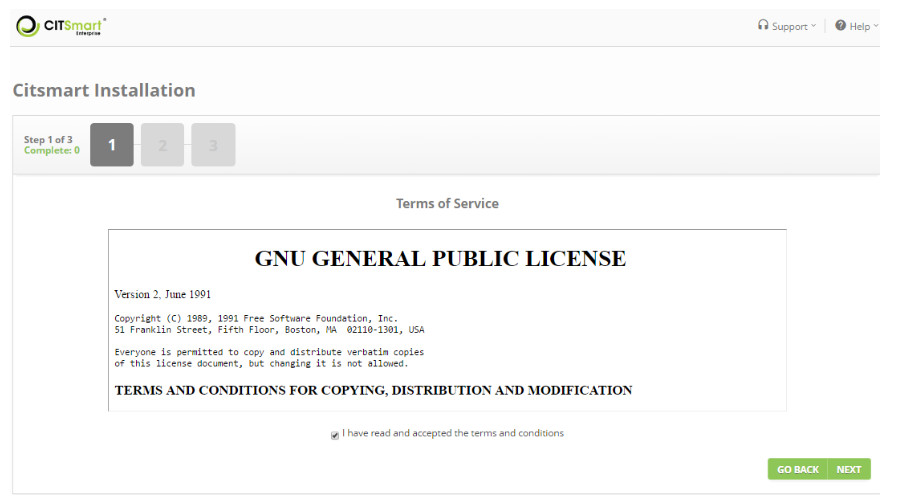

   **Figure 2 - Installation start screen**

1. Accept the term of use and click *Next*;

    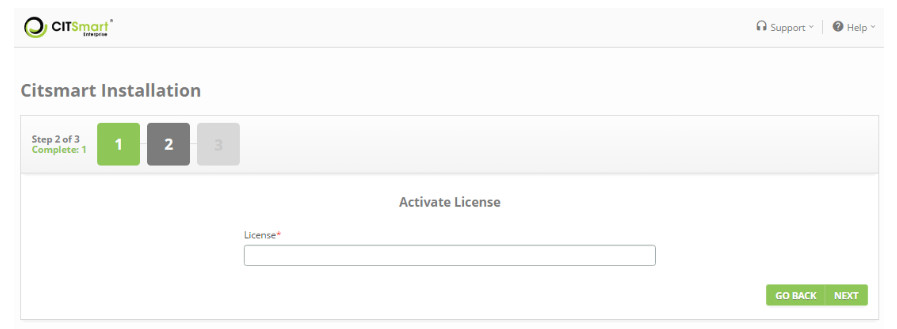

    **Figure 3 - License activation screen**

2. Enter the license and click *Next*.

    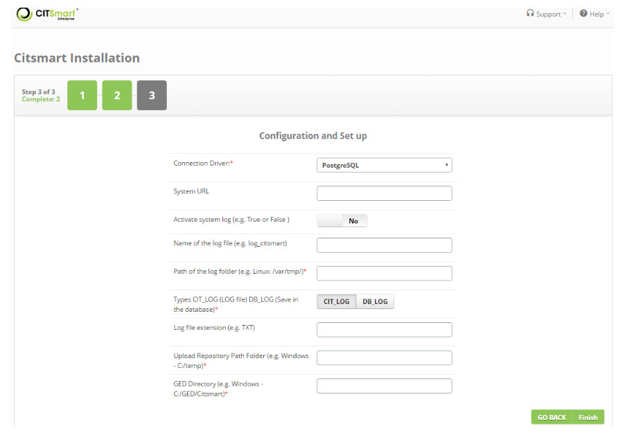

    **Figure 4 - Configuration screen**

3. Configure the system parameters, informing each attribute its value and click *Finish*;

    - **32 - DB - database SCHEMA name - (eg: Postgres - public)**;

    - **33 - System access URL**: Enter the system URL;

    - **52 - Enable system logging (Ex: 'true' or 'false')**: Set whether to enable the audit LOG on the system;

    - **55 - Log file name (Ex: log_citsmart)**: Enter the name for the LOG file. The LOG files will be written with name as 
    defined in this parameter;

    - **54 - Path of the folder that will be the LOG file (Ex: Linux - /var/tmp/)**: Inform the directory to store the LOG 
    files;

    - **53 - Types: 'CIT_LOG' (log file), 'DB_LOG' (writes to the database)**: Set the type of LOG. If the selected LOG type is 
    'CIT_LOG', the LOG file in the directory (defined in the previous parameter) will be saved. If 'DB_LOG' is selected, the LOG 
    file will be saved to the database;

    - **56 - Extension of the log file (Ex: txt)**: enter the extension of the LOG file: txt;

    - **44 - Directory Upload repository path (Ex: Windows - C: / temp)**: enter the default directory to store the files that 
    will be uploaded;

    - **18 - GED Directory (Ex: Windows - C: / gedCitsmart)**: Enter the directory for manipulation of the Electronic Document 
    Management (GED) files.

    - **363 - Help URL (eg https://help.citsmart.com/citsmart)**: please report exactly the content 
    https://help.citsmart.com/citsmart) so that this new installation can take advantage of the User's Guide ( the product help).

    !!! note "NOTE"

        If a separate file server is used, include the server access link in the directory path.
        
4. After the installation process is completed, the CITSmart Enterprise login screen will appear, as shown in the image below:
        
    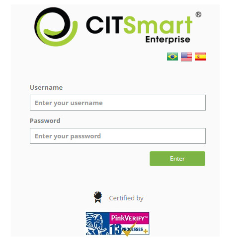

    **Figure 5 - Login screen**

5. Enter the system access cNetworkntials (login: admin, password: citsmart) and click the *Enter* button. Once this is done, the 
CITSmart Enterprise home screen will be displayed, as shown in the image below:

    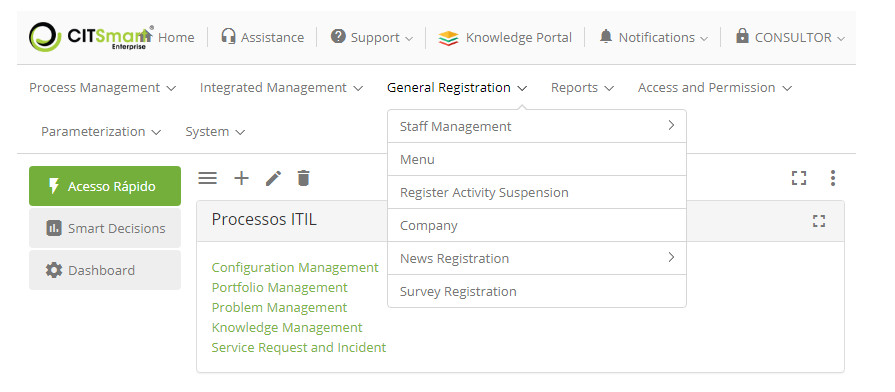

    **Figure 6 - System home screen**

Using postfix in cents7 for sending e-mails from CITSmart (Community version only)
--------------------------------------------------------------------------------------------------------

#### Preconditions

1. Have root access on the server.

#### Installing and configuring the postfix

Follow the steps:

1. Update system: **yum update –y**;

2. Installation of the centos packages: **yum -y install postfix cyrus-sasl-plain mailx**;

3. Restart the system: **systemctl restart postfix**;

4. Enable system boot: **systemctl enable postfix**;

5. Enter on the directory: **cd /etc/postfix**:

6. Make a copy of the files: **cp main.cf main.cf.original**;

7. Clear all content from: **rm –rf /etc/postfix.main.cf**;

8. After deleting the files we added these settings:

    ***vim /etc/postfix/main.cf**

    **myhostname = hostname.example.com**

    **relayhost = [smtp.gmail.com]:587**

    **smtp_use_tls = yes**

    **smtp_sasl_auth_enable = yes**

    **smtp_sasl_password_maps = hash:/etc/postfix/sasl_passwd**

    **smtp_tls_CAfile = /etc/ssl/certs/ca-bundle.crt**

    **smtp_sasl_security_options = noanonymous**

    **smtp_sasl_tls_security_options = noanonymous***

9. Enter the postfix directory: **cd /etc/postfix**;

10. Create the Password File: **touch sasl_passwd**;

11. Add the following content: **vim
    /etc/postfix/sasl_passwd[smtp.gmail.com]:587 seuemail :sua senha**;

12. Permission user owner for postfix: **chown root:postfix
    /etc/postfix/sasl_passwd\* ;**

13. Permission for the owner group: **chmod -Rvf 640 /etc/postfix/sasl_passwd ;**

14. Validate the settings. After executing this command if it does not give an error it means that the settings are 
correct: **postmap/etc/postfix/sasl_passwd ;**

15. Restart postfix: **systemctl restart postfix** ;

16. Test the submission with the command: **echo "This is a test." \| mail -s "test
    message" seuemail**;

17. View the upload logs: **tail -f /var/log/maillog**;

18. Note the line Status = sent 250.2.0.0 OK means that the e-mail was sent correctly to the recipient:

    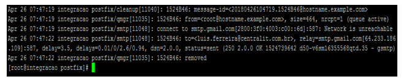

    **Figure 7 - Status=sent 250.2.0.0 OK**

19. Configure the CITSmart parameters:

   - 10, 11, 12, 13, 14, 199 and 269 (see knowledge [Parameterization rules - e-mail](1)).

20. In this way, CITSmart Enterprise ISTM uses the local server as a relay for sending e-mails.

Using postfix on ubuntu for sending e-mails from CITSmart (for Community version only)
----------------------------------------------------------------------------------------------------

#### Preconditions

1. Have admin access to Postfix and ensure trust between servers.

### Postfix installation and configuration

Follow the steps:

1. Update system: **apt update && apt upgrade -y**;

2. Installing Ubuntu Server packages 16.04: **apt-get install postfix mailutils libsasl2-2 ca-certificates libsasl2-modules -y**;

3. Choose the **Internet site** option;

4. Place **hostname**;

5. Edit the postfix settings add the line and below it, put the rest of the settings:

    **vim /etc/postfix/main.cf**

    **relayhost = [smtp.gmail.com]:587**

    **smtp_sasl_auth_enable = yes**

    **smtp_sasl_password_maps = hash:/etc/postfix/sasl_passwd**

    **smtp_sasl_security_options = noanonymous**

    **smtp_tls_CAfile = /etc/postfix/cacert.pem**

    **smtp_use_tls = yes**

6. Create password and db files put valid e-mail and password that replace example@gmail.com by e-mail. Then enter the password 
and e-mail. Enter the directory: **cd / etc / postfix / sasl** and then create the file: **touch sasl_passwd**;

7. Edit: **vim sasl_passwd**;

8. Put the real e-mail soon after followed colon and the password:**[smtp.gmail.com]:587 exemplo@gmail.com:123**;

9. Create the postfix hash and database, after running this command if it does not show error means that the settings have been 
added correctly: **postmap /etc/postfix/sasl/sasl_passwd**;

10. Add root user by creating the owner and its permissions: **chmod 400 -Rvf /etc/postfix/sasl/sasl_passwd**;

11. Create the chain certificate:**cat /etc/ssl/certs/thawte_Primary_Root_CA.pem | sudo tee -a /etc/postfix/cacert.pem**:

   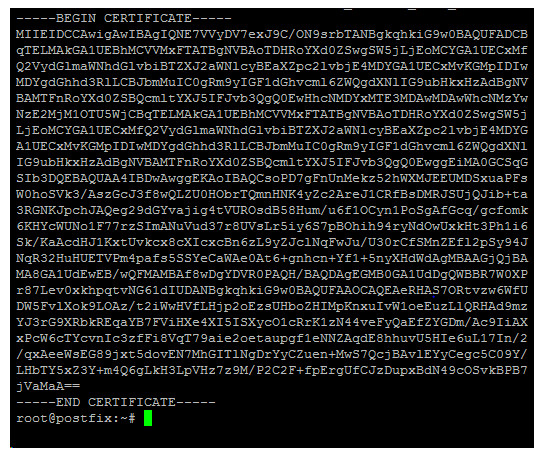

   **Figure 8 - Certificate generated**

12. Testing the sending of e-mail replace, by my e-mail that has been assigned: echo "**Test Email message cerbody" | mail -s "Email test subject" test@example.com**;

13. Check if the e-mail was actually sent: **tail -f /var/log/mail.log**:

   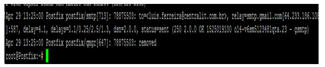

   **Figure 9 - Observe status=sent 250.2.0.0 OK**

14. Configure the CITSmart Enterprise ISTM parameters:

   - 10, 11, 12, 13, 14, 199, 269 (see knowledge [Parameterization rules - e-mail)](1)

15. In this way, CITSmart uses the local server as a relay for sending e-mails.

Procedures for updating version of this product
------------------------------------------------------

#### Preconditions

In order to carry out the process of updating Citsmart you must perform the security procedures which are:

- Visions Backup;

- Application Backup;

- Server Backup.

!!! note "NOTE"

     As of version 7.2.2.0, parameter 363 became essential for automatic link your instance to the User Guide (the product help). 
     It should be filled in with: https://help.citsmart.com/citsmart: https://help.citsmart.com/citsmart

Backup visions
-----------------

1. In the main menu, position the mouse in the **System > Visions and Meta data > Visions Maintenance**;

2. A View screen will be displayed;

    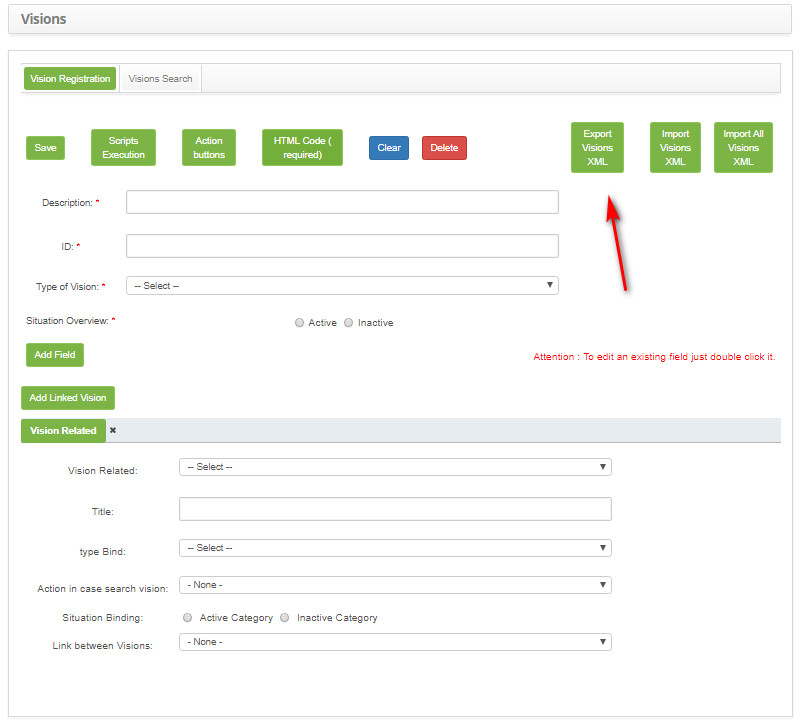

    **Figure 10 - Export visions**

3. Click the "Export Views XML" button;

4. A window will appear to select the views to be exported;

    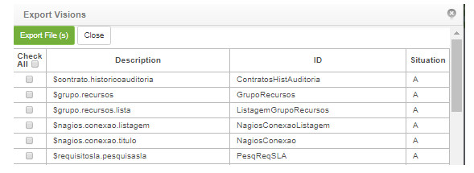

    **Figure 11 - Export visions**

5. Select all views by checking the "Mark all" option and click the "Export File (s)" button.

6. A window will be displayed for exporting (downloading) the view file;

7. Download the visions file;

8. The file will be saved to the default download location on the computer.

Application backup 
-------------------

Back up the application as described below:

- Enter the JBoss deployments folder (\ standalone \ deployments);

- Copy the project "citsmart _ ***. War" to a safe place.

Server backup 
------------------

It is recommended that you back up the Citsmart database and use virtual machine snapshot practice to speed up the rollback 
process as it is a safe practice and available on all virtualization platforms available on the market.

If you have any questions regarding the database backup, please contact the Citsmart support team.

Integration backup
---------------------

It is recommended to check for integrations and to back up the independent base of each. Consult backup guidance directly from the 
service owner.

Possible integrations:

- Nagios;

- Zabbix;

- Asterisk;

- Solr;

- MongoDB.

Checklist
---------

To perform the update of the version, proceed according to the routines described below:

1. Download the files: Citsmart Software, Citsmart help and updated documentation, according to the steps below:

2. Access the site, log in and click on the "Downloads" tab;

    - A page will be displayed containing the download links for the files needed to update the Citsmart software that are:

       - Version documentation;

       - Citsmart version updated.

3.  Download all of the above files;

    - A window will appear for downloading the file. Documentations in .pdf format and the update file (.zip);

4. Download the file;

    - The file will be saved to the default download location on the computer;

5. After the download is complete, open the folder in which the file is stored and unzip the file.

6. Stop JBoss (This routine is required due to the various routines done at the time JBoss is started);

7. In the JBoss deployments folder (\ standalone \ deployments), copy the citsmart _ ***. War file to a backup directory, if it is 
necessary to go back to the version, this file will be needed;

8. Copy the file (citsmart _ ***. War), which has been downloaded and uncompressed to the JBoss deployments folder (jboss-as-7.1.1.Final \ standalone \ deployments)

9. Delete the "tmp /" folders in the directory (jboss-as-7.1.1.Final \ standalone \ deployments);

10. Start JBoss;

11. Perform the update validation as per the next topic.

   !!! warning "WARNING"

        Run the step 11 validation correctly, as the system will be locked to users until this step has been performed.

Update validation
------------------------

1. It is necessary for the Administrator to perform the validation of the update so that the system operates correctly.

2. After logging in to the system, you will be presented with a screen for validating the update;

3. Click the *Validate Update* button to complete the update;

    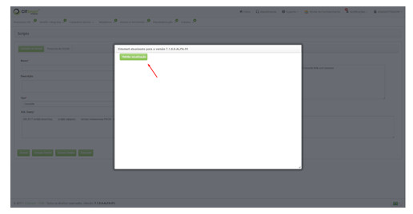

    **Figure 12 - Validating the update**

4. If there is any inconsistency during the execution of automatic scripts in the system, a screen will be displayed, where the 
scripts will be indicated with inconsistency, as follows:

    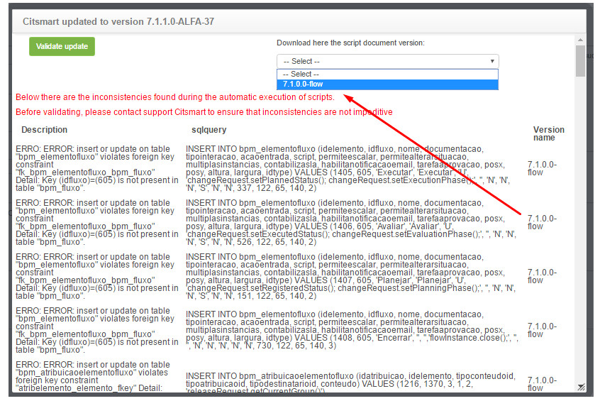

    **Figure 13 - Scripts**

5. To perform the script handling with inconsistency, select the desired version in the Download the version script document here 
field to view the script;

    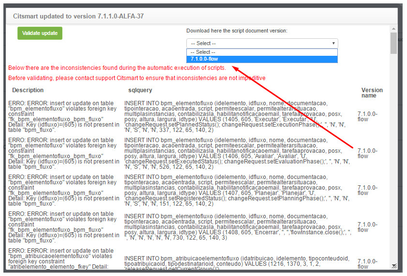

    **Figure 14 - Version choice**

6. After selecting the desired version, a window will appear showing the scripts;

    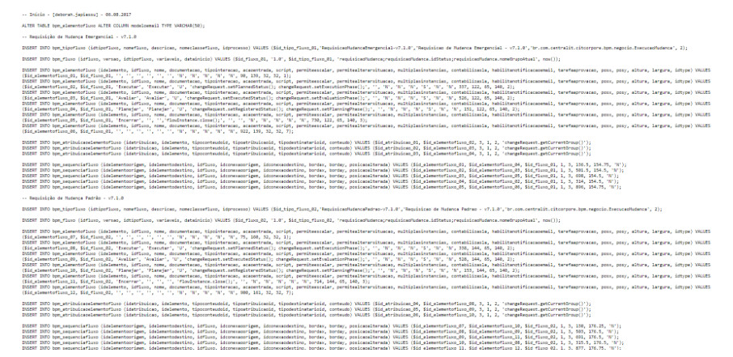

    **Figure 12 - Script details**

7. Copy the indicated scripts and run it in the database;

8. After you run the scripts in the database, click the Validate Update button to validate the system update. If you did not 
perform the update validation, the system will be blocked for users until it is validated;

9. Once this is done, the system update will be validated successfully and can be used normally.

    !!! info "IMPORTANT"

        If you need to do Rollback, you must import the views. The views reflect the code of the current version, when returning 
        to an earlier version the views should also come back.

Reindex index
---------------------------

1. Perform the indexing of knowledge base indexes, through the Citsmart Platform, according to the steps described below:

2. From the main menu, position the mouse in the **System > Settings > Knowledge Management (Indexing)**;

3. The Index screen will be displayed;

    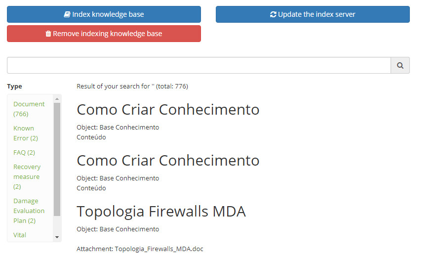

    **Figure 16 - Indexing screen**

4. Click the "Remove knowledge base indexing" button and wait for removal;

5. Click the "Index Knowledge Base" button and wait to list the knowledge.

Importing the SMS certificate from the e-mail server for the JRE
-----------------------------------------------------------

To carry out the installation of the SMS certificate, proceed according to the routines described below:

1. Install the OPENSSL:

    - https://slproweb.com/products/Win32OpenSSL.html

2. Save the certificate:

    - C:\\OpenSSL-Win64\\bin\>openssl s_client -connect smtp.prf.gov.br:587
        -starttls smtp \> smtp.txt

3. Create the smtp.cer file:

    - Open the smtp.txt file. It will be presented a certificate chain followed by a server certificate.

    - Copy the bit starting with BEGIN CERTIFICATE and END CERTIFICATE into a smtp.crt file. By opening this file, is possible to 
    verify the certificate properties and their fingerprints

    **Contents example:**

    -----BEGIN CERTIFICATE-----
    MIIFBjCCA+6gAwIBAgIBAzANBgkqhkiG9w0BAQUFADCBjDELMAkGA1UEBhMCQlIx
    CzAJBgNVBAgTAkRGMRIwEAYDVQQHFAlCcmFzw61saWExDDAKBgNVBAoTA1BSRjEO
    MAwGA1UECxMFRElURUwxDzANBgNVBAMTBlBSRi1DQTEPMA0GA1UEKRMGUFJGLUNB
    MRwwGgYJKoZIhvcNAQkBFg1jYUBwcmYuZ292LmJyMB4XDTE0MDIyNTIyNDcyMFoX
    DTI0MDIyMzIyNDcyMFowgZ4xCzAJBgNVBAYTAkJSMQswCQYDVQQIEwJERjESMBAG
    A1UEBxQJQnJhc8OtbGlhMQwwCgYDVQQKEwNQUkYxDjAMBgNVBAsTBURJVEVMMRcw
    FQYDVQQDEw5teDMucHJmLmdvdi5icjERMA8GA1UEKRMIY2hhbmdlbWUxJDAiBgkq
    hkiG9w0BCQEWFXBvc3RtYXN0ZXJAcHJmLmdvdi5icjCCASIwDQYJKoZIhvcNAQEB
    BQADggEPADCCAQoCggEBAMqLX1/yDGC9cFWovRljsGPr7tk8sdPccgx1UH+TkL8h
    n8TxJIjgO40MNsUdsIVL+xO7aulIWmWhB9bNQDmCuCjBeXnp3vND8OFXThKXBd64
    OxVzLHhG9DpIK+9i28jRhcjBNTNVrMKLAGiUFYWw2luKYl6HE96ftovn1UUm013b
    n7SZXDF0fUKWObOPl1UIQKh1Yy/+h5B8hAhcqNlSVZGGkTAdTGe/NcTjqyGTuwIB
    WUVPPO24WfqvgDukP68gT5e6D2REis7GSR+pcxpwH242iFCFQli4ATt1kvmglCQ5
    OjXO+/1s7tt4u8FYzBXk2KiDqtajnqZT+AoLnMsRpDcCAwEAAaOCAV0wggFZMAkG
    A1UdEwQCMAAwEQYJYIZIAYb4QgEBBAQDAgZAMDQGCWCGSAGG+EIBDQQnFiVFYXN5
    LVJTQSBHZW5lcmF0ZWQgU2VydmVyIENlcnRpZmljYXRlMB0GA1UdDgQWBBSOtZGL
    2GmIO5K6xH5l7TwhPLDQfTCBwQYDVR0jBIG5MIG2gBScCoQRvlGi++0ILaLpd0zU
    6gJu5KGBkqSBjzCBjDELMAkGA1UEBhMCQlIxCzAJBgNVBAgTAkRGMRIwEAYDVQQH
    FAlCcmFzw61saWExDDAKBgNVBAoTA1BSRjEOMAwGA1UECxMFRElURUwxDzANBgNV
    BAMTBlBSRi1DQTEPMA0GA1UEKRMGUFJGLUNBMRwwGgYJKoZIhvcNAQkBFg1jYUBw
    cmYuZ292LmJyggkAsb36xutVAGkwEwYDVR0lBAwwCgYIKwYBBQUHAwEwCwYDVR0P
    BAQDAgWgMA0GCSqGSIb3DQEBBQUAA4IBAQBH76r7YW7pch2ck6S1BQlJOQpI6SlK
    pntOPzn98vvkzaRTKdYDronGGy2RZ21ced6+Zyh34Vv2CQMpCY7N5wH1/XFJNP0G
    MIydH/SAOY6stJH4CRadLa0Lb5Q5dKTB5BfJAwNRqkkQLMGFDWw6r4MEJpSgP6QL
    QTDcJcIvmjnRdbzddA6IspUG0sSs8wE4QUksRJyFfwAFrQ+7cMcpbcWSn8+gVOTg
    p5+eRgCCjBzl4E7DcLIgB10izTgQqik06WbTlcSXr2NqZRcrJaULxPT7GL8WCP8W
    4NkW/oi8jSORUHd8YoOZKOO7v6s4+9WlT8tf7YrcyuRuo1e4l+NzevJ8
    -----END CERTIFICATE-----    


4. Import the cacerts file from the jre/lib/security folder:

    - keytool -import -keystore cacerts -file smtp.cer

    !!! note "NOTE"

        In Windows, is necessary to copy the cacerts file to a folder that does not require administrator permission or open the 
        console in administrator mode.

5. Restart the server.

See also
-----------

[CITSmart Event Monitor connection](2);

[Citsmart Inventory Connection Setup](3);

[Inventory component installation guide](4);

[Central authentication service (CAS) installation guide - version 3.0 (ITSM)];

[EVM component installation guide].


[1]:/pt-br/citsmart-platform-7/plataform-administration/parameters-list/parametrization-email.html
[2]:/pt-br/citsmart-platform-7/additional-features/add-ons/event-monitor-connection.html
[3]:/pt-br/citsmart-platform-7/processes/event/inventory-connection-setup.html
[4]:/pt-br/citsmart-platform-7/additional-features/add-ons/inventory-installation.html
[5]:#
[6]:#

!!! tip "About"

    <b>Product/Version:</b> CITSmart | 8.00 &nbsp;&nbsp;
    <b>Updated:</b>09/09/2019 – Larissa Lourenço
