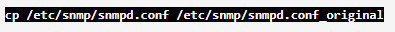

title:  Inventory component installation guide
Description: This document is intended to provide guidance for the installation and configuration of CITSmart Inventory. 
# Inventory component installation guide

This document is intended to provide guidance for the installation and configuration of CITSmart Inventory.

Inventory routine
----------------------

The Inventory routine when running locates the assets and configuration items on the network and writes or updates the information 
obtained from each hardware in the configuration items database.

The Inventory application captures the data through the SNMP port (161) and/or the Capture Agent Citsmart.Net (port 7103, developed 
by Central IT). Initially, Inventory performs a "ping" command to verify that the machine is active. If you can perform the 
command, try to access the SNMP port of the configuration item. If access to the port is not successful, Inventory tries to access 
through the capture agent.

!!! note "NOTE"

    The settings for CITSmart Inventory are performed in CITSmart ITSM in the menu ITIL Processes → Event Management → Inventory 
    Connections.
    
Capture Agent Citsmart.Net can be used as a capture "centralizer", to which the Inventory capture requests for all other machines 
in a network would be directed. You can also perform Inventory without the Ctsmart.Net Capture Agent. In this case, it is necessary 
to configure the "SNMP" service of each machine. On the other hand, the Capture Agent Citsmart.Net can also be installed 
individually on each machine (in this case eliminating the need to configure the SNMP port of each machine).

Here are the explanatory design of the inventory routine
----------------------------------------------------------------

**Figure 1 - CITSmart agent execution routine**

**Figure 2 - CITSmart inventory execution routine**

Detailing of components and technologies
----------------------------------------------

- **CITSmart server**: This is the server where the Citsmart system runs, that is, Java application server (usually JBOSS or 
compatible) with the Citsmart application installed.
-  **CITSmart Inventory Collection Server (Windows)**: This is a Windows server with Agent Server installed with service that 
collects information from other remote Windows stations. The CITSmart Server conversation with this server is done through TCP / IP 
Protocol, TCP connection, through port 7103. Due diligence must be made in the firewalls for this communication process to work 
correctly. You must also assign a user and password with network administration permissions to run the Windows Service, because 
this component will access remote machines using the WMI feature provided by the Windows platform.
- Windows Management Instrumentation (WMI) is Microsoft's implementation of WBEM, an industry initiative that aims to establish 
standards for accessing and sharing management information across an enterprise network. WMI supports WBEM and provides integrated 
support for the CIM (Common Information Model) model, the data model that describes objects in a management environment.
- WBEM - Web-Based Enterprise Management is a set of management systems and technologies developed to unify the management of 
distributed computing environments.
- **CITSMART.NET agent**: It is a component of the CITSmart solution, which runs on Windows machines (it is the same component that 
runs on the Inventory Collection Server, the difference being that it runs locally with Local System Account policies - without 
network access permissions And other equipment).
- **SNMP**: The Simple Network Management Protocol (SNMP) is an application-layer protocol for typical IP network management that 
facilitates the exchange of information between network devices such as cards And computers (switches) and printers. For SNMP to 
work in both Windows and Linux environments, you need to install the components / packages and enable permissions.
- **CMDB**: It is a repository of information related to all components of CITSmart ITSM. It contains the details of the 
configuration (IC) items in the IT infrastructure.
- **Citsmart Inventory**: Application responsible for inventorying assets and configuration items on the network and sending the 
data obtained to CITSmart to store in the database.
- CITSmart ITSM store in the database.
- **MongoDB**: Document-oriented database, different from traditional databases that follow the relational model. It is large data 
storage and higher speed. Used for queue control and communication between applications.

Initial settings
-------------------------

To run the Inventory routine you must perform the settings described in the topics below.

CITSMART.NET and SNMP capture agent
-------------------------------------

*CITSMART.NET Capture Agent**: It's a component of the CITSmart solution, which runs on Windows machines (it's the same component 
that runs on the Inventory Collection Server, the difference being that it runs locally with Local System Account policies - 
without access permissions To the network and other equipment)

1. Install the CITSmart Agent. To perform this installation, it can be downloaded by accessing the downloads area of CITSmart 
Corporation. (http://files.citsmart.com).

When you finish installing the Agent, **do not forget** to start the service in Windows. In the case of the Inventory Collection 
Server, use a user and password with Windows Network Administration permissions (only so remote collection will be done).

If the Agent is already installed and you want to uninstall it to install a new version, just proceed as follows:

- In "Control Panel" > "Administrative Tools" → "Services", click Stop in the agCITSmart.NET Service;;
- Under "Control Panel" > "Programs and Features", locate the AgentCITSmart.NET software and choose the Uninstall option;
- If the service is still installed, simply enter a command window (DOS Prompt) and enter the **sc delete agCITSmart.NET** command. 
After that, refresh the Windows services window.
    
*SNMP*: The Simple Network Management Protocol (SNMP) is an application-layer protocol for typical IP network management that 
facilitates the exchange of information between network devices such as cards And computers (switches) and printers. For SNMP to 
work in both Windows and Linux environments, you need to install the components/packages and enable permissions.

Installing/configuring SNMP in the windows environment
----------------------------------------------------------

To install / configure the SNMP service in the Windows environment, proceed as described below:

1. Open the Windows features screen **Control Panel > Programs and Features > Enable or disable Windows features**;

    
    
    **Figure 3 - Windows resource screen**
    
2. Check if the **SNMP Protocol** feature is active, that is, if it is selected, if it is not, select it and click *OK* to activate 
the SNMP protocol, as indicated in the figure below;

    
    
    **Figure 4 - Windows feature activation screen**
    
3. Once this is done, open the Windows services screen to configure SNMP;

    
    
    **Figure 5 - Windows services search**
    
4. After opening the Windows services screen, right-click on the SNMP service, and then click **Properties** as shown in the figure 
below;

    
    
    **Figure 6 - Windows services screen**
    
5. The SNMP Service Properties screen will be displayed. Click the **Security** tab, check **Accept SNMP packets from any host** 
and click *Add* to create a new community, as indicated in the figure below;

    
    
    **Figure 7 - SNMP service properties screen**
    
6. The screen for entering the data for the new community will be displayed. Enter the **public** name for the community and remain 
with the **Read Only** option for community rights and click *Add* as indicated in the figure below;

    
    
    **Figure 8 - SNMP service community configuration screen**
    
7. Once this is done, the new community will be displayed on the SNMP Service Properties screen, as shown in the figure below;

    
    
    **Figure 9 - SNMP service configuration**
    
8. To configure the SNMP Service, simply click on the *Ok* button.
    
Installing/configuring SNMP in the Linux environment
--------------------------------------------------------

To install / configure SNMP in the Linux environment, proceed as described below:

*Installing SNMP on the CentOS Operation System*

1. Run the following command to install the net-snmp package:

    
    
2. The following command will back up the original SNMP configuration file:

    
    
*Configuring the snmpd.conf file*

1. Edit the file /etc/snmp/snmpd.conf;

    - The following command will back up the original SNMP configuration file:
    
        - Community configuration
        
        - If this line does not exist you should create it, but if it exists, leave it as shown below:
        
    
    
2. Group setup

    - If these lines do not exist you should create them, but if they exist, leave them in agreement as shown below:
    
    
    
    
    
3. SNMP tree configuration

    - If this line does not exist you should create it, but if it exists, leave it as shown below:
   
    
    
4. Group access setup

    - If this line does not exist you should create it, but if it exists, leave it as shown below:
    
    
    
5. The complete configuration should look similar to the one below:

    
    
6. Restart the SNMP service with the following command:

    
    
7. Após “restartar” o SNMP, realize o teste local com o objetivo de verificar se o SNMP está rodando:

    
    
8.  The test should return the following result:

    
     
Firewall rule configuration - release ICMPV4 on windows
--------------------------------------------------------------------

To release Ping in Windows 7 it is necessary to enter the Firewall in "Input Rules" and activate the rule "File and Printer Sharing 
(Request for Eco - ICMPv4-In)"

**Figure 10 - Windows firewall with advanced security**

MongoDB installation
------------------------

Install MongoDB via the link: [https://www.mongodb.org/][2].

For details on installing and configuring services, check the documentation through the link:
[https://docs.mongodb.com/manual/administration/install-community/][3].

Application configuration
------------------------------

*Application server*

!!! info "IMPORTANT"

    It is not necessary to make settings in ".properties" files.
    
To configure CITSmart Inventory, proceed as follows:

1. Download JBoss for ITSM Community 6.0+ and ITSM Enterprise 7.0.0+, called **jboss-as-7.2.Final - Citsmart**;

2. Download JBoss for Inventory, called **jboss-as-7.1.Final - Inventory**;

3. Copy the latest versions of the CITSmart ITSM and CITSmart Inventory applications (files with .**war** extension) to the 
**deployments** folder of their JBoss instances;

4. Change the **standalone-full.xml** file for the respective instances of Jboss:

!!! note "NOTE"

    These downloads may be executed by accessing the downloads area of CITSmart Corporation (http://files.citsmart.com);
    
!!! warning "WARNING"

    The JBoss configuration files are located in the configuration (jboss \ standalone \ configuration) folder of each JBoss 
    instance, provided by Central IT.
    
Standalone-full.xml (CITSmart)
---------------------------------

Change the following section of this file, as indicated below.

**standalone-full.xml (CITSmart Inventory)**

Change the following section of this file, as indicated below.

!!! warning "WARNING"

    In the property tag of the above settings <property name="citsmart.login" value=""/>, referring to the standalone-full.xml 
    section (CITSmart Inventory), in the property "name" the value that is usually the login of the user, since the version 7.2.2.0 
    is necessary to inform the context.
    
Connection registration
---------------------------

After the JBoss instances of each application are initialized, access the ITSM CITSmart at the address: 
http: // <ip> [: <port>] / citsmart, then do the configuration of the registry mentioned below:

CITSmart Inventory Connections Register

1. Access the menu **ITIL Processes > Event Management > Inventory Connections**;

    
    
    **Figure 11 - CITSmart Inventory connection registration**
    
2. Record all the properties pertaining to the CITSmart Inventory connection, according to the IP and port where the CITSmart 
Inventory JBoss is installed.

3. If you want to use Citsmart Inventory for event generation, the option "Add connection to Citsmart Event Monitor" must be 
checked and a connection selected.

!!! note "NOTE"

    The "Inventory Identifier" field corresponds to the "citsmart.inventory.id" "standalone-full.xml" property of the application 
    server where CITSmart Inventory is installed. 
    
!!! note "NOTE"

    The "Capture Agent Server IP" field refers to the IP of the server where the Capture Agent is installed for the machine 
    information.
    
!!! warning "WARNING"

    If CIT Smart Inventory integration with OCS Inventory is adopted, it is mandatory to observe the instructions contained in the 
    [CITSmart Inventory Connection Setup knowledge][4].

[1]:https://pt.wikipedia.org/wiki/Very_Large_Database
[2]:https://www.mongodb.com/
[3]:https://docs.mongodb.com/manual/administration/install-community/
[4]:/pt-br/citsmart-platform-7/processes/event/inventory-connection-setup.html

!!! tip "About"

    <b>Product/Version:</b> CITSmart | 7.00 &nbsp;&nbsp;
    <b>Updated:</b>09/11/2019 - Larissa Lourenço
